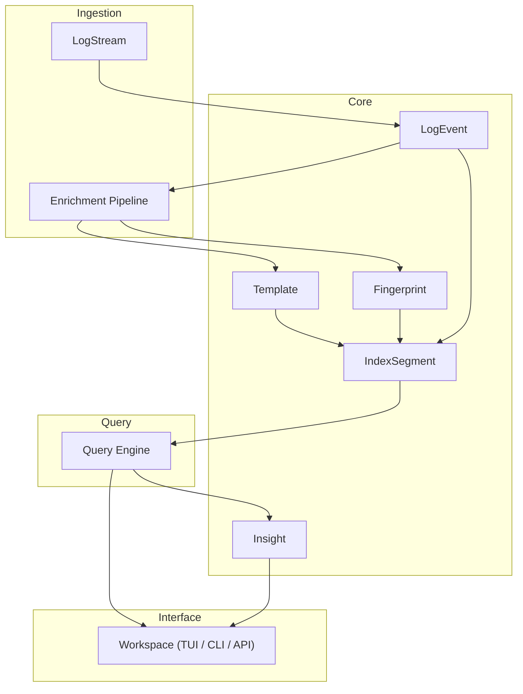
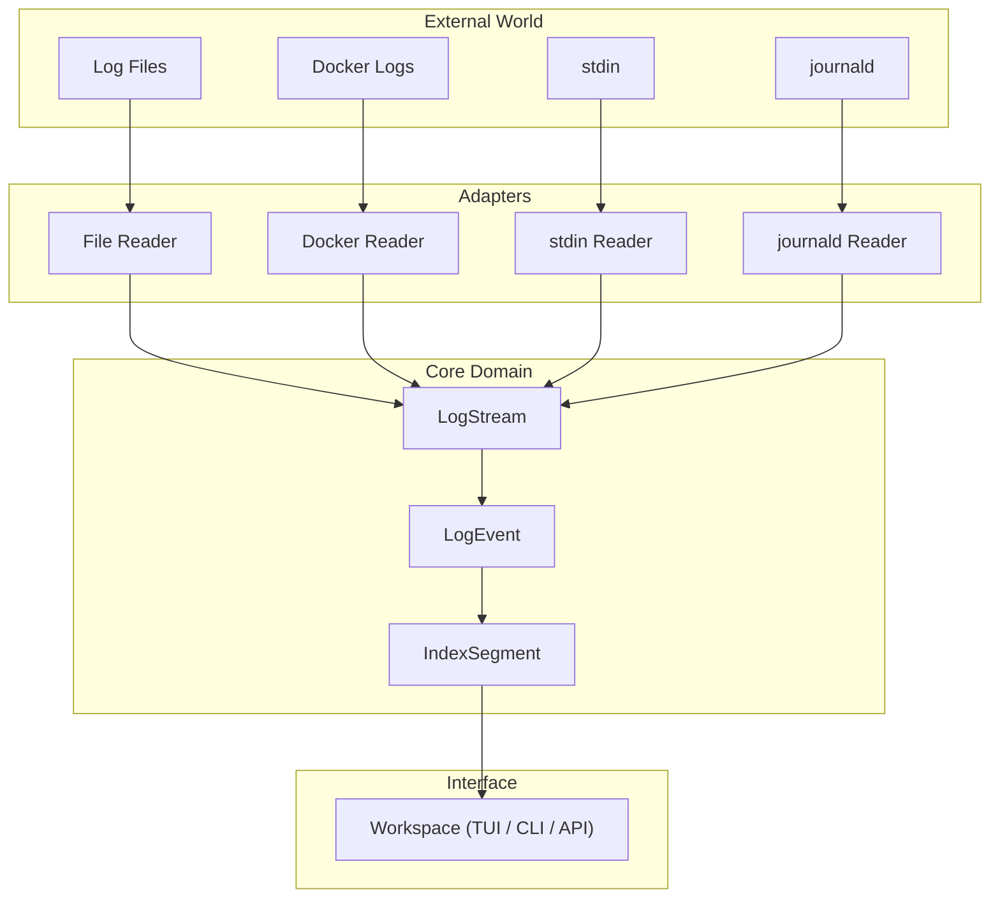
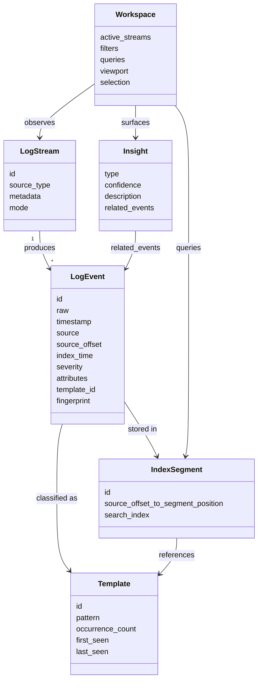
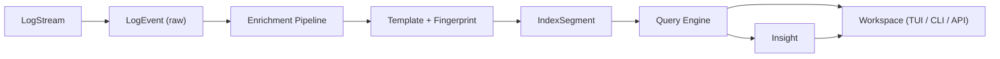

# RFC-0000 — Domain Model

**Status:** Accepted
**Author:** carvalhosauro
**Version:** 1.0

---

# 1. Introduction

This document defines the domain model for **Lode**.

Its goal is to establish a ubiquitous language for the project, ensuring that all components share the same concepts and responsibilities.

This document does not specify implementation details. Its focus is to describe the main domain concepts and how they relate to one another.

---

# 2. What is Lode

Lode is a log investigation system that treats logs as analyzable events rather than raw text.

Its responsibility is to turn continuous or batch log streams into structured, queryable events enriched with templates, fingerprints, and insights.

The logical application flow is:

```text
LogStream
        │
        ▼
LogEvent (raw)
        │
        ▼
Enrichment Pipeline
        │
        ▼
Template + Fingerprint
        │
        ▼
IndexSegment
        │
        ▼
Query Engine
        │
        ▼
Workspace (TUI / CLI / API)
```

Each component has well-defined responsibilities and must remain decoupled from the others. The raw log is never lost, and the source never alters the semantics of an event.

---

# 3. Architecture Overview

## 3.1 Component Layers



## 3.2 External Integration



---

# 4. Architectural Principles

Lode follows these architectural principles:

- Event-driven (logs are events, not files)
- Incremental (never reprocess everything by default)
- Deterministic (same input produces the same model)
- Observable (everything can be inspected through internal events)
- Append-first (the structure favors continuous writes)
- Source-preserving (the raw log is never lost)
- Stream-agnostic (the source does not change the semantics of an event)
- Decoupled components
- Separation between ingestion, indexing, query, and visualization

---

# 5. Domain Model

## 5.1 Relationships



## 5.2 LogStream

Represents an origin of continuous or batch events.

Examples of `source_type`:

- file
- docker
- stdin
- journald

Responsibilities:

- identify the stream
- declare its source type and metadata
- declare its mode (`batch`, `tail`, or `hybrid`)

A LogStream has no parsing logic and no business rules.

## 5.3 LogEvent

The fundamental unit of the system.

Fields:

- `id`
- `raw`
- `timestamp`
- `source`
- `source_offset`
- `index_time`
- `severity`
- `attributes`
- `template_id`
- `fingerprint`

Properties:

- `raw` is immutable — owned bytes never exposed as `&mut`; the type system enforces it
- `timestamp` may be absent or ambiguous
- `attributes` are derived
- `template_id` is inferred, never provided
- `source_offset` is the position in the origin stream (RFC-0001); `index_time` is assigned by Storage at commit (RFC-0002), monotonic per segment.

## 5.4 Template

A semantic grouping of similar events.

Fields:

- `id`
- `pattern`
- `occurrence_count`
- `first_seen`
- `last_seen`

Templates are derived and may evolve over time.

## 5.5 IndexSegment

An immutable unit of indexing.

Responsibilities:

- store processed events
- map `source_offset` → `segment_position`, where `segment_position` is the storage-internal physical position of an event within the segment and is never the event's identity
- maintain search indexes

A segment is append-only and immutable after flush.

## 5.6 Insight

Represents an automatic discovery.

Fields:

- `type`
- `confidence`
- `description`
- `related_events`

Types include:

- spike detection
- anomaly
- rare event
- new pattern emergence

## 5.7 Workspace

The active state of an investigation.

It contains:

- active streams
- filters
- queries
- viewport
- current selection

The Workspace is ephemeral state and is not part of the persistent domain.

---

# 6. Processing Flow

Each ingestion cycle follows exactly the same flow:

1. A LogStream emits a raw line.
2. A LogEvent is created with its `raw` value preserved.
3. The Enrichment Pipeline derives attributes, timestamp, and severity.
4. The event is classified, producing a `template_id` and a `fingerprint`.
5. The event is written to an append-only IndexSegment.
6. The Query Engine reads segments to answer queries.
7. Insights are generated from query results and patterns.
8. The Workspace presents events, queries, and insights to the user.
9. Internal events are emitted for observability.



Each step has a single responsibility and must not assume the responsibilities of others.

---

# 7. Responsibilities and Dependencies

## 7.1 Component Responsibilities

| Component    | Responsibility                                  |
| ------------ | ----------------------------------------------- |
| LogStream    | Represent an origin of events                   |
| LogEvent     | Represent a single analyzable log event         |
| Enrichment   | Derive attributes, timestamp, and severity      |
| Template     | Group semantically similar events               |
| IndexSegment | Store processed events and search indexes       |
| Query Engine | Answer queries over indexed events              |
| Insight      | Represent an automatic discovery                |
| Workspace    | Hold the active investigation state             |

## 7.2 Allowed Dependencies

Dependencies between components must strictly follow this flow:

```text
LogStream
        │
        ▼
LogEvent
        │
        ▼
Enrichment Pipeline
        │
        ▼
Template + Fingerprint
        │
        ▼
IndexSegment
        │
        ▼
Query Engine
        │
        ▼
Workspace
```

Reverse dependencies are not allowed.

For example:

- The Query Engine does not read streams directly.
- The Enrichment Pipeline does not render the Workspace.
- A LogStream does not know about templates or indexes.
- The Workspace does not mutate raw events.

This separation reduces coupling and makes testing, maintenance, and system evolution easier.

---

# 8. Contract

The Domain Model is not directly executable, but it defines conceptual contracts:

```rust
fn create_event(stream: &LogStream, raw: Vec<u8>) -> Result<LogEvent, LodeError>;

fn enrich(event: LogEvent) -> Result<LogEvent, LodeError>;

fn classify(event: LogEvent) -> Result<LogEvent, LodeError>;

fn derive_template(event: &LogEvent) -> Result<TemplateId, LodeError>;
```

---

# 9. Concurrency

Each LogStream is processed in isolation.

Events may be ingested concurrently.

IndexSegments are append-only and immutable after flush.

Template updates are eventually consistent.

---

# 10. Failure Handling

Failures are local and do not propagate global state.

Examples:

- invalid parsing → event marked as `unparsed`
- invalid timestamp → `timestamp: None`
- template mismatch → fallback to a raw fingerprint

Supervision and retry belong to the Execution Runtime (RFC-0012); recovery and degraded-mode semantics belong to RFC-0013.

---

# 11. Observability

The Domain Model emits internal events:

- `domain.event.created`
- `domain.event.enriched`
- `domain.template.assigned`
- `domain.insight.generated`

These events do not alter the processing flow; they only provide observability (RFC-0009 / RFC-0011).

---

# 12. Extensibility

Lode is designed to evolve by adding new components without modifying the application core.

Future extension examples:

- new `source_type` values in LogStream
- new Insight types
- new enrichers in the pipeline
- new template classifiers
- new indexes in the IndexSegment

Every extension must respect the contracts defined in the specific RFCs.

---

# 13. Out of Scope

This RFC does not define:

- Ingestion mechanics (RFC-0001)
- Storage implementation (RFC-0002)
- Template mining algorithm (RFC-0003)
- Query language (RFC-0004)
- Insight engine heuristics (RFC-0005)
- Enrichment & severity model (RFC-0017)
- TUI / rendering layer (RFC-0008)
- Runtime supervision (RFC-0012)
- Failure handling & recovery (RFC-0013)
- Security & access model (RFC-0015)
- Configuration & CLI (RFC-0016)

These topics are specified in their own RFCs.

---

# 14. Decisions

## DEC-001 — Logs are Events, not Text

Every log is modeled as a structured LogEvent, even when parsing fails.

## DEC-002 — Raw Log is Immutable

The `raw` field can never be altered or discarded.

## DEC-003 — Templates are Derived, not Ingested

Templates are always inferred from events, never provided externally.

## DEC-004 — Indexing is Segment-Based

Indexing is done in immutable segments, allowing append-only evolution.

## DEC-005 — Workspace is Ephemeral State

The Workspace is not part of the persistent domain; it is only investigation state.

## DEC-006 — Cross-stream Time Ordering is Partial

The system never assumes perfect global ordering across distinct streams.

---

# 15. Glossary

| Term         | Definition                                                        |
| ------------ | ----------------------------------------------------------------- |
| LogStream    | An origin of continuous or batch log events                       |
| LogEvent     | The fundamental analyzable unit derived from a raw log line       |
| Enrichment   | The pipeline that derives attributes, timestamp, and severity     |
| Template     | A semantic grouping of similar events                             |
| Fingerprint  | A stable identifier used when no template matches                 |
| IndexSegment | An immutable, append-only unit of indexing                        |
| Query Engine | The component that answers queries over indexed events            |
| Insight      | An automatic discovery produced from events and patterns          |
| Workspace    | The ephemeral state of an active investigation                    |
