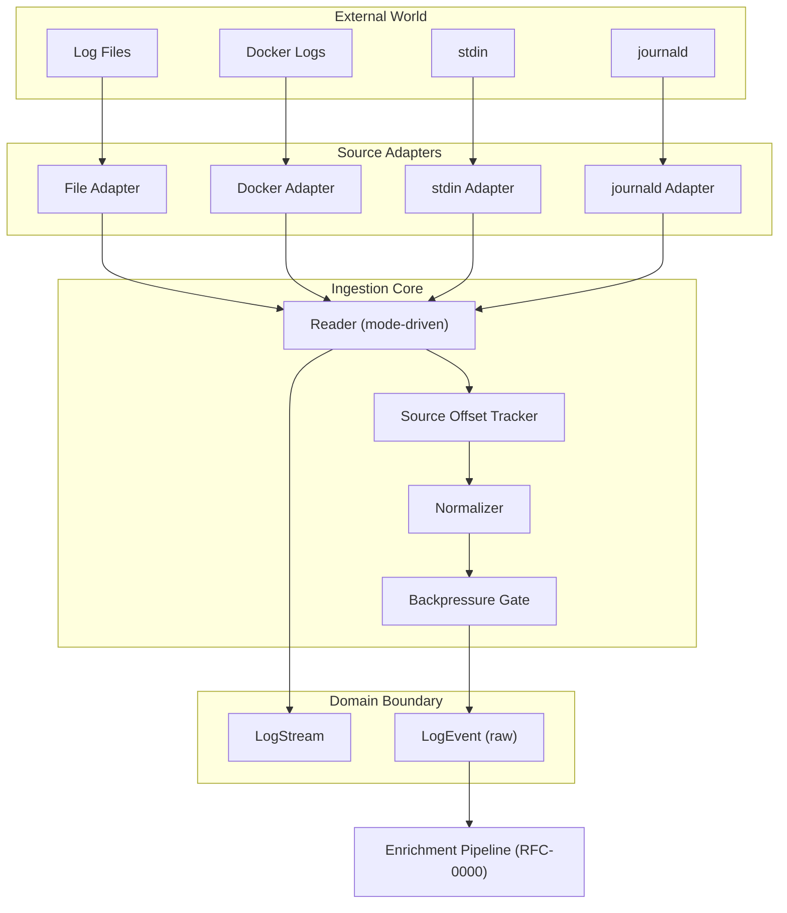
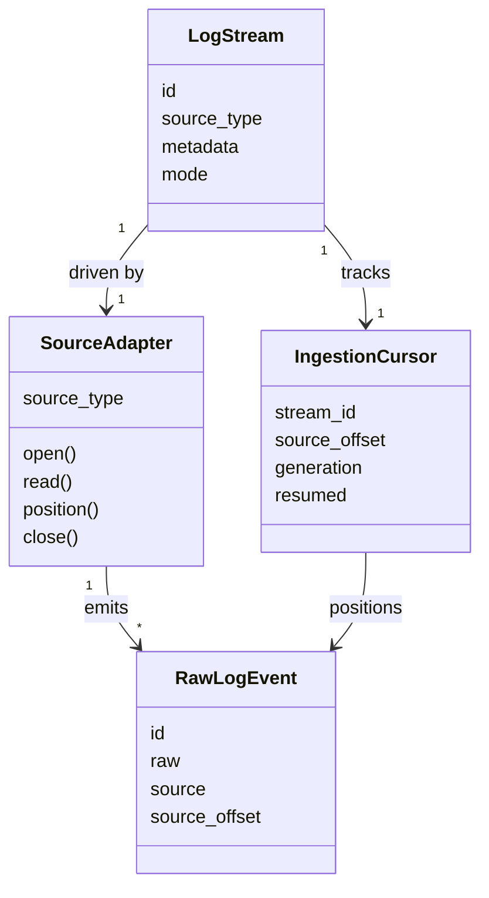
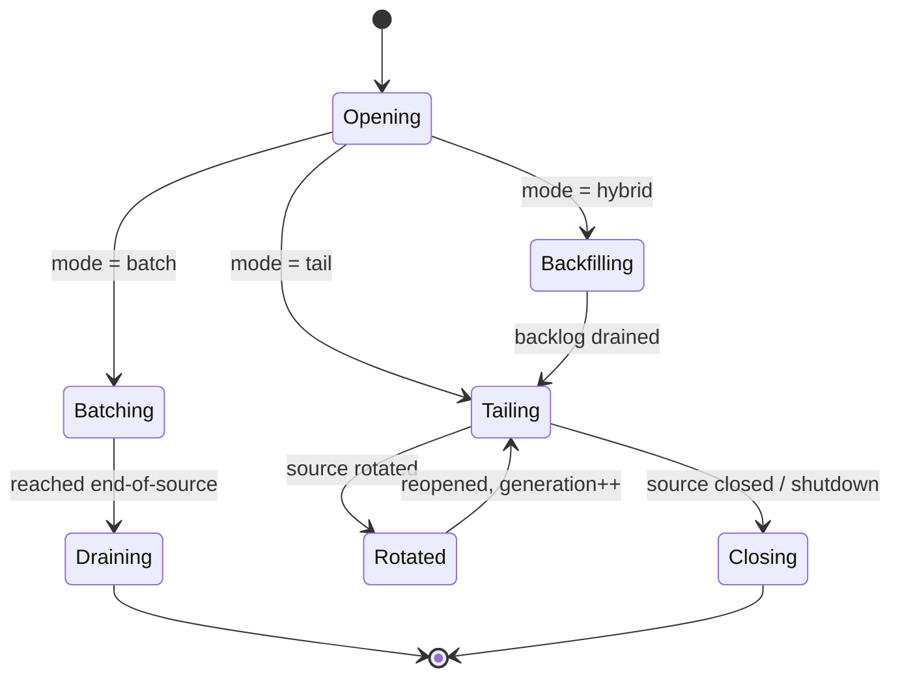
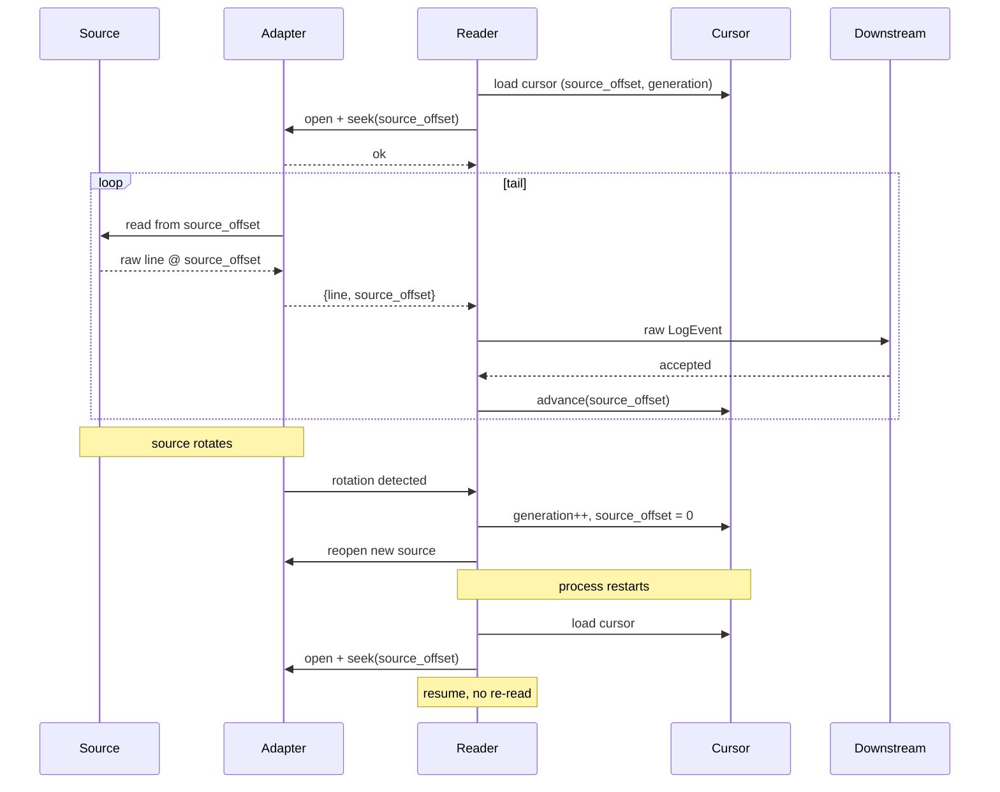
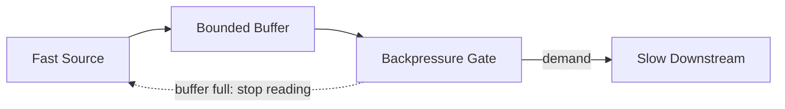

# RFC-0001 — Ingestion Model

**Status:** Draft
**Author:** carvalhosauro
**Version:** 1.0

---

# 1. Introduction

This document defines the **Ingestion Model** for **Lode**.

Its goal is to specify how data enters the system: how external sources become `LogStream`s, how raw lines become `LogEvent`s, and how Lode keeps reading a moving source without losing data.

Ingestion is the first stage of the application flow. It produces raw `LogEvent`s and nothing more.

This document does not define enrichment, classification, indexing, or querying. It describes contracts, responsibilities, and data flow at the ingestion boundary, not implementation details.

---

# 2. Purpose / Motivation

Logs arrive from heterogeneous, unreliable, moving sources. Files rotate. Containers restart. Pipes close. A naive reader loses data on every one of these events.

Ingestion exists to make the boundary between the outside world and the Lode domain explicit and safe.

Problems it prevents:

- Data loss on rotation, truncation, or restart.
- A fast source overrunning a slow downstream.
- Source-specific behavior leaking into the core domain.
- Re-reading already-ingested data after a resume.
- Mutating or interpreting raw content during ingestion.

Ingestion guarantees one thing above all: every raw line that crosses the boundary becomes exactly one `LogEvent` with its `raw` preserved.

---

# 3. Architecture Overview

## 3.1 Ingestion Layers



## 3.2 Position in the System

Ingestion sits between the external world and the Enrichment Pipeline. It owns the adapter contract, the read loop, `source_offset` tracking, and backpressure. It hands raw `LogEvent`s to the next stage and stops there.

---

# 4. Principles

Ingestion follows these design principles:

- Source-preserving (the raw line is copied verbatim into `LogEvent.raw`).
- Non-interpreting (ingestion never parses, enriches, or classifies).
- Resumable (every source can be resumed from its last known `source_offset`).
- Lossless under pressure (a slow downstream throttles the source, it never drops raw data).
- Adapter-isolated (source-specific logic lives only in adapters).
- Mode-driven (read behavior is governed by `LogStream.mode`).
- Stream-agnostic core (the core read loop does not know its source type).
- Crash-contained (failure of one stream never affects another).

---

# 5. Core Concepts / Model

## 5.1 Ingestion Concepts



## 5.2 LogStream (ingestion view)

The origin of events, as defined in RFC-0000. Ingestion consumes two fields:

- `source_type` ∈ {file, docker, stdin, journald} — selects the adapter.
- `mode` ∈ {batch, tail, hybrid} — selects the read behavior.

Ingestion does not extend `LogStream`. It only reads it.

## 5.3 Source Adapter

The source-specific boundary component. One adapter per `source_type`.

Responsibilities:

- open the underlying source.
- read raw lines or records.
- report its current position (`source_offset`).
- detect end-of-source, rotation, and truncation.
- close cleanly on shutdown.

An adapter never parses, never enriches, and never assigns a timestamp. It emits raw bytes plus a position.

## 5.4 Ingestion Cursor

The resumable position of a stream.

Fields:

- `stream_id`
- `source_offset` — last successfully ingested position in the origin stream.
- `generation` — incremented when the source rotates or is recreated.
- `resumed` — whether the current run continued from a persisted cursor.

The cursor (last committed `source_offset`) is persisted by Storage (RFC-0002), not by Ingestion; Ingestion resumes from the cursor Storage reports durable. It is the single source of truth for resume.

## 5.5 Raw LogEvent

The output of ingestion. It is a `LogEvent` (RFC-0000) populated only with the fields ingestion can know:

- `id`
- `raw` — the verbatim line, immutable.
- `source`
- `source_offset`

Fields `timestamp`, `index_time`, `severity`, `attributes`, `template_id`, and `fingerprint` are left absent. They are derived later by the Enrichment Pipeline and downstream RFCs.

## 5.6 Ingestion Modes

Mode is declared on `LogStream.mode` and governs the read loop.

- **batch** — read from the current `source_offset` to end-of-source, then stop. Finite. Used for archived or completed files.
- **tail** — read new data as it appears, indefinitely. Infinite. Used for live sources (stdin, journald, active containers).
- **hybrid** — batch the existing backlog first, then switch to tail without a gap. Used for an active file that already has history.



---

# 6. Processing Flow

## 6.1 Tail and Resume

Tail-mode ingestion must survive rotation, truncation, and restart without loss or duplication.

1. The stream resolves its `IngestionCursor` (persisted `source_offset` and generation).
2. The adapter opens the source and seeks to `source_offset`.
3. The reader pulls available raw lines from `source_offset` forward.
4. Each line becomes a raw `LogEvent` with its `source_offset` recorded.
5. The cursor advances only after the event passes the backpressure gate.
6. On rotation, `generation` increments, `source_offset` resets to 0, and reading continues on the new source.
7. On truncation (source shorter than `source_offset`), the reader treats it as a new generation from `source_offset` 0.
8. On restart, the persisted cursor is loaded and the flow resumes at step 2.



## 6.2 Rotation, Truncation, Resume Semantics

- **Source offset tracking** — `source_offset` is the position of the next unread byte/record in the origin stream. It advances only after a successful, accepted event.
- **Rotation** — the underlying source is replaced (e.g. logrotate). Detected via identity change. The old generation is drained, a new generation starts at `source_offset` 0.
- **Truncation** — the source becomes shorter than the tracked `source_offset`. Treated as a fresh generation from `source_offset` 0; already-ingested events are not re-emitted.
- **Resume** — on restart, the persisted cursor restores `(source_offset, generation)`. Reading continues exactly where it stopped. No re-read, no gap.

## 6.3 Backpressure

Backpressure is conceptual and demand-driven. The downstream pulls; the source does not push.

1. The reader holds a bounded buffer of raw events.
2. The downstream requests events when it has capacity.
3. When the buffer is full, the reader stops requesting from the adapter.
4. A live source (tail) blocks or buffers at the OS/source level; a finite source (batch) simply pauses reading.
5. Raw data is never dropped to relieve pressure — the source is slowed instead.



A slow downstream propagates back to the source as reduced read rate, never as data loss.

---

# 7. Contract

Ingestion is not directly executable, but it defines conceptual contracts:

```rust
fn open_stream(stream: &LogStream) -> Result<Box<dyn SourceAdapter>, IngestError>;

fn read_next(adapter: &mut dyn SourceAdapter, cursor: &IngestionCursor) -> Result<Option<(RawLogEvent, IngestionCursor)>, IngestError>;
// Returns Ok(Some((event, cursor))) on success, Ok(None) on end-of-source, Err on failure.

fn to_raw_event(stream: &LogStream, raw: Vec<u8>, source_offset: u64) -> Result<LogEvent, IngestError>;

fn advance(cursor: IngestionCursor, source_offset: u64) -> IngestionCursor;

fn detect_rotation(adapter: &dyn SourceAdapter) -> RotationState;
// RotationState: Rotated { new_generation: u64 } | Unchanged

fn resume(stream: &LogStream) -> Result<IngestionCursor, IngestError>;

fn close(adapter: Box<dyn SourceAdapter>) -> Result<(), IngestError>;
```

Every adapter implements the `SourceAdapter` trait regardless of `source_type`.

---

# 8. Concurrency

Each `LogStream` is ingested in isolation: one read loop per stream.

Streams ingest concurrently and share no read state.

`source_offset` advancement is serialized within a single stream so the cursor is always monotonic per generation.

The downstream pull model bounds memory per stream regardless of source speed.

---

# 9. Failure Handling

Ingestion failures are local to a single stream.

Examples:

- source unavailable on open → stream marked `failed`, others continue.
- transient read error → reader pauses and retries from the current `source_offset`.
- rotation mid-read → switch generation, continue without loss.
- malformed bytes → emitted as a raw `LogEvent`; ingestion never rejects content.

Crash of one stream's read loop does not affect any other stream. Retry policy and supervision belong to the Runtime (RFC-0012) and Recovery (RFC-0013).

---

# 10. Observability

Ingestion emits internal events:

- `ingest.stream.opened`
- `ingest.event.read`
- `ingest.cursor.advanced`
- `ingest.source.rotated`
- `ingest.backpressure.engaged`
- `ingest.stream.failed`

These events do not alter the read flow; they only provide observability (RFC-0009 / RFC-0011).

---

# 11. Extensibility

Ingestion evolves by adding adapters, never by changing the core read loop.

Future extension examples:

- new `source_type` values (e.g. syslog, kafka, http) as new adapters.
- new ingestion modes beyond batch/tail/hybrid.
- alternate cursor persistence strategies.

Every adapter must satisfy the contract in Section 7 (formalized as a trait in RFC-0014).

---

# 12. Out of Scope

This RFC does not define:

- Domain entities (RFC-0000)
- Storage and index segment layout (RFC-0002)
- Template mining and fingerprinting (RFC-0003)
- Query language and evaluation (RFC-0004)
- Timestamp parsing and ordering (RFC-0006)
- Runtime supervision and retry policy (RFC-0012)
- Failure recovery and degraded mode (RFC-0013)
- Adapter trait contracts in formal form (RFC-0014)

The Enrichment Pipeline that consumes raw `LogEvent`s is owned by RFC-0000 and downstream RFCs.

These topics are specified in their own RFCs.

---

# 13. Decisions

## DEC-001 — Ingestion Produces Only Raw Events

Ingestion populates `id`, `raw`, `source`, and `source_offset`. It never derives timestamp, index_time, severity, attributes, templates, or fingerprints.

## DEC-002 — Mode Lives on the Stream

Read behavior is governed by `LogStream.mode` (batch, tail, hybrid), not by the adapter or the reader.

## DEC-003 — Source Offset Advances Only After Acceptance

The cursor advances only after an event is accepted downstream, guaranteeing no data is skipped on crash.

## DEC-004 — Rotation and Truncation Use Generations

Source identity changes increment a `generation` counter and reset the `source_offset`, preserving correct resume semantics.

## DEC-005 — Backpressure Slows the Source, Never Drops Data

Under pressure, ingestion reduces read rate. Raw data is never discarded to relieve a slow downstream.

## DEC-006 — Adapters Are the Only Source-Specific Code

All source-specific behavior is confined to adapters. The core read loop is stream-agnostic.

---

# 14. Glossary

| Term             | Definition                                                            |
| ---------------- | --------------------------------------------------------------------- |
| Ingestion        | The stage that turns external sources into raw `LogEvent`s            |
| Source Adapter   | A source-specific component implementing the ingestion contract       |
| Ingestion Cursor | The persisted, resumable position of a stream (`source_offset` + generation) |
| Source Offset    | The position of the next unread byte/record in the origin stream      |
| Generation       | A counter incremented on rotation or truncation                       |
| Rotation         | Replacement of the underlying source (e.g. logrotate)                 |
| Truncation       | The source becoming shorter than the tracked offset                   |
| Tail             | Reading new data indefinitely as it appears                           |
| Backpressure     | Demand-driven throttling that slows a fast source for a slow consumer |
| Raw LogEvent     | A `LogEvent` populated only with the fields ingestion can know        |
