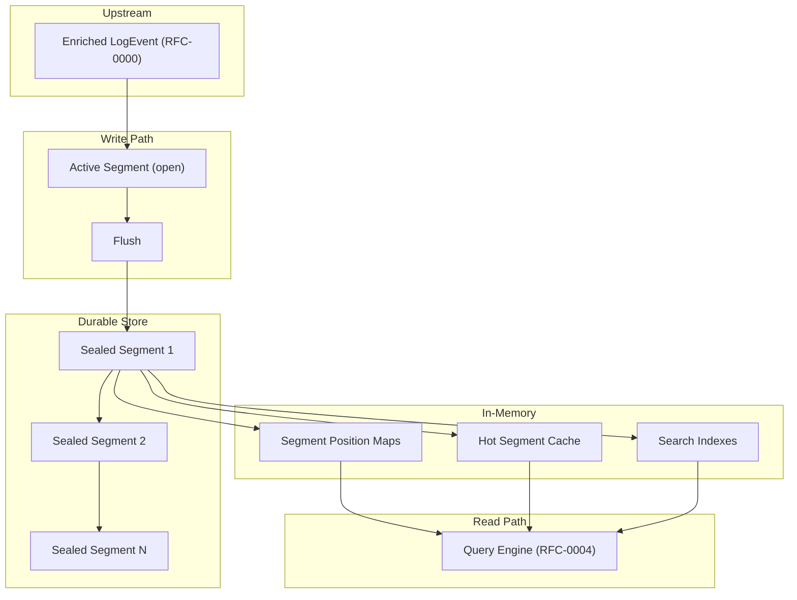
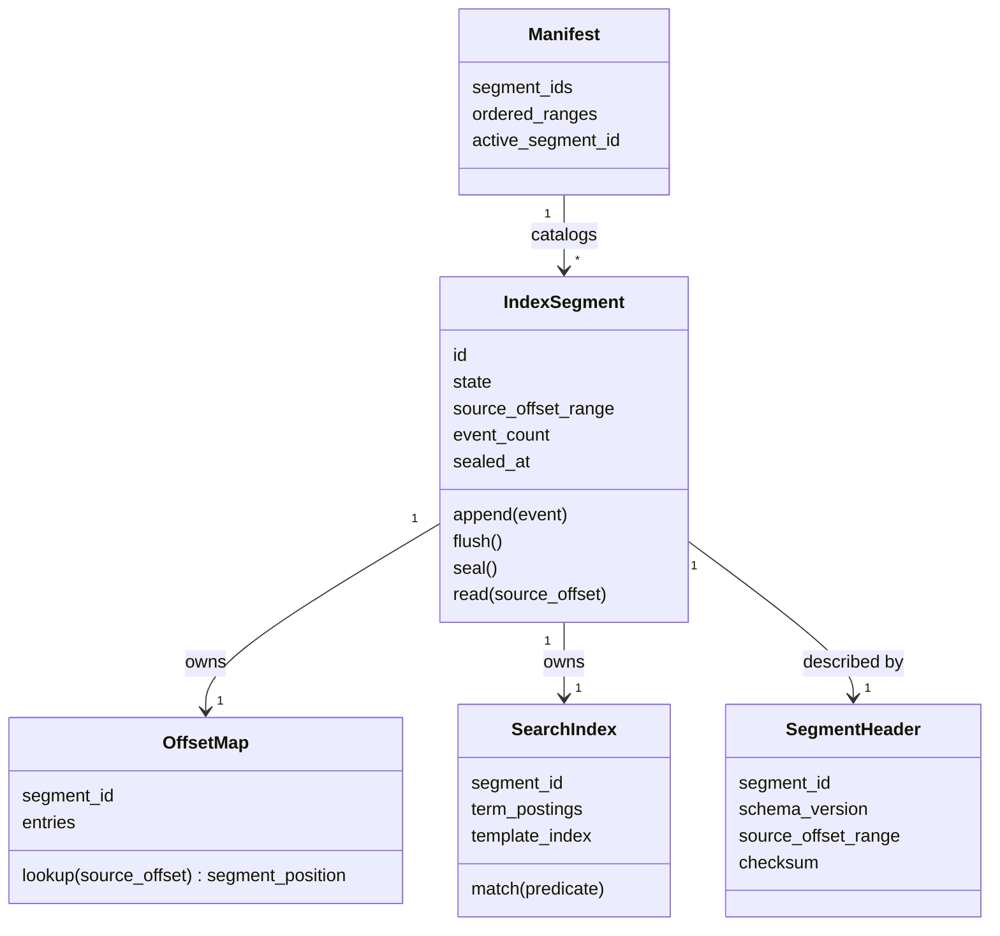
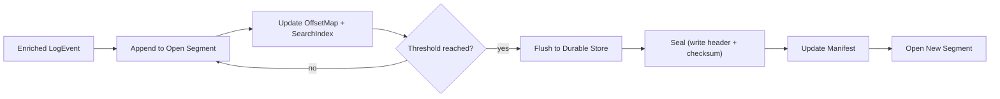
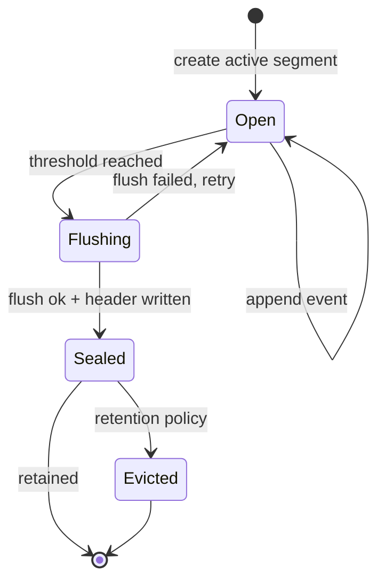

# RFC-0002 — Storage & Indexing Engine

**Status:** Draft
**Author:** carvalhosauro
**Version:** 1.0

---

# 1. Introduction

This document defines the **Storage & Indexing Engine** for **Lode**.

Its goal is to specify how processed `LogEvent`s are persisted and indexed: the `IndexSegment` as the unit of storage, its lifecycle, how segments are laid out, cached, and reopened after a cold start.

Storage is the durable backbone of the system. It stores what ingestion and enrichment produced and exposes it for reading.

This document does not define how data enters the system, how events are enriched or classified, or how queries are expressed. It describes the storage contract, the segment lifecycle, and the in-memory structures, not implementation details.

---

# 2. Purpose / Motivation

Lode analyzes large, continuous, append-heavy log volumes. A storage layer built on in-place mutation cannot keep up: it fragments, it requires locking, and it loses the natural append shape of logs.

Storage exists to give every other component a stable, immutable, queryable view of processed events.

Problems it prevents:

- Random-write contention on a write-heavy workload.
- Loss of the append-first nature of logs.
- Re-reading or reprocessing everything to answer a query.
- Mutation of already-indexed events.
- Unbounded memory growth from keeping all indexes hot.

Storage guarantees one thing above all: once a segment is sealed, its contents and its `segment_position` mappings never change.

---

# 3. Architecture Overview

## 3.1 Storage Layers



## 3.2 Position in the System

Storage sits between enrichment and query. It receives enriched `LogEvent`s, accumulates them into segments, seals segments into the durable store, and serves segment reads to the Query Engine. It defines no query language and reads no external sources.

---

# 4. Principles

Storage follows these design principles:

- Append-only (writes only ever append; nothing is updated in place).
- Immutable-once-sealed (a sealed segment never changes).
- Segment-based (the segment is the atomic unit of storage and indexing).
- Incremental (new data creates new segments, never rewrites old ones).
- Cache-bounded (memory for indexes and hot data is capped, not unbounded).
- Recoverable (sealed segments are self-describing and survive restart).
- Read-decoupled (the Query Engine reads segments without knowing how they were written).
- Deterministic (the same events produce the same segment contents).

---

# 5. Core Concepts / Model

## 5.1 IndexSegment Internals



## 5.2 IndexSegment

The immutable, append-only unit of storage, as introduced in RFC-0000.

Responsibilities:

- accumulate processed events while open.
- map each event's `source_offset` to its `segment_position` (the storage-internal physical position within the segment, never the event's identity).
- hold the search indexes for its events.
- become immutable once sealed.

A segment has a bounded `source_offset_range`. It is open exactly once and sealed exactly once.

## 5.3 Segment Lifecycle States

- **open** — the active segment; accepts appends.
- **flushing** — buffered data is being written to durable storage.
- **sealed** — closed, immutable; no further appends; available for read.

Only one segment per stream is open at a time. All other segments are sealed.

## 5.4 OffsetMap

The structure that maps an event `source_offset` to its `segment_position` within a segment.

Responsibilities:

- answer "what is the `segment_position` for `source_offset` N in this segment?".
- bound lookup to a single segment.

Offset maps for hot segments are kept in memory; for cold segments they are rebuilt or paged in on demand.

## 5.5 SearchIndex

The per-segment index used to accelerate query evaluation.

Responsibilities:

- map terms and templates to the events that contain them, within the segment.
- answer predicate matches without scanning every event.

A search index is sealed together with its segment and is never mutated afterward.

## 5.6 SegmentHeader

The self-describing prefix of a sealed segment.

Fields:

- `segment_id`
- `schema_version`
- `source_offset_range`
- `checksum`

The header makes a segment reopenable without external metadata, enabling cold start.

## 5.7 Manifest

The ordered catalog of all segments for a store.

Responsibilities:

- list sealed segments and their offset ranges.
- name the current active segment.
- provide the read order for cold start and query planning.

The manifest is the entry point on reopen.

---

# 6. Processing Flow

## 6.1 Write and Seal

1. An enriched `LogEvent` arrives from the pipeline.
2. It is appended to the current open segment.
3. The segment updates its offset map and search index in memory.
4. When the segment reaches its size or time threshold, it flushes buffered data to durable storage.
5. After a successful flush, the segment is sealed and its header and checksum are written.
6. The manifest is updated to record the sealed segment and to point at a new open segment.
7. Sealed segments become read-only inputs to the Query Engine.



## 6.2 Segment Lifecycle



## 6.3 Cold Start

On restart, in-memory structures are gone but sealed segments remain.

1. Load the manifest.
2. Read each sealed segment's header; verify checksum.
3. Restore the ordered set of segments and their offset ranges.
4. Rebuild or page in offset maps and search indexes lazily, hottest first.
5. Open a new active segment for incoming events.
6. Resume serving reads as segments come back online.

Cold start never reprocesses raw events; it reopens what was already sealed.

## 6.4 Compaction and Retention

Append-only storage grows monotonically, so reclamation is handled by producing new segments, never by editing old ones.

- **Retention** — segments whose offset range falls outside the retention window are evicted as whole units. Eviction removes a sealed segment; it never edits one.
- **Compaction** — several small or sparse sealed segments may be merged by writing a new sealed segment and atomically swapping the manifest. The inputs are then evicted. The original segments are never mutated.

Both operations preserve the immutability invariant: change happens by creating and swapping segments, not by rewriting them.

## 6.5 Index Time Assignment

Storage assigns `index_time` to each event at commit — the moment it is appended to the active segment. `index_time` is monotonic per segment and is distinct from the event's `timestamp` (event time, RFC-0006) and its `source_offset` (origin position, RFC-0001). It is the only time value Storage owns.

## 6.6 Ingestion Cursor Persistence

Storage owns a durable per-stream **ingestion cursor**: the last committed `source_offset` for each LogStream. It is the single source of truth for ingestion resume (RFC-0001) and runtime restart (RFC-0012), and is persisted with the segment store — never out-of-band.

- The cursor advances only after the segment containing those events is sealed, never before. A failed flush leaves the cursor at its last sealed value.
- On cold start, the cursor reflects exactly the events durably stored, so resume never double-reads nor skips.
- Events written to an unsealed active segment that is lost to a crash are simply re-read from the source, because the cursor never advanced past them.

---

# 7. Contract

Storage is not directly executable, but it defines conceptual contracts:

```rust
fn append(&mut self, event: LogEvent) -> Result<(), StorageError>;

fn flush(&mut self) -> Result<(), StorageError>;

fn seal(self) -> Result<SealedSegment, StorageError>;

fn read(&self, offset: u64) -> Result<LogEvent, StorageError>;

fn open_store(manifest: &Manifest) -> Result<Store, StorageError>;

fn reopen(header: &SegmentHeader) -> Result<SealedSegment, StorageError>;

fn compact(segments: Vec<SealedSegment>) -> Result<SealedSegment, StorageError>;

fn evict(segment: SealedSegment) -> Result<(), StorageError>;

fn record_cursor(&mut self, stream_id: &str, source_offset: u64) -> Result<(), StorageError>;

fn read_cursor(&self, stream_id: &str) -> Result<u64, StorageError>;
```

A `SealedSegment` exposes only `read`; it never accepts `append`.

---

# 8. Concurrency

Exactly one segment per stream is open for writing at a time; appends to it are serialized.

Sealed segments are immutable and therefore safe for unlimited concurrent reads with no locking.

Cold-start rebuilds and compaction run concurrently with reads, because they only produce new segments and swap the manifest atomically.

The Query Engine reads many segments concurrently without coordinating with the write path.

---

# 9. Failure Handling

Storage failures are contained to a single segment or operation.

Examples:

- flush failure → the segment stays open and the flush is retried; no partial seal is recorded.
- corrupt sealed segment (checksum mismatch on reopen) → the segment is quarantined; the rest of the store opens normally.
- crash mid-flush → on reopen, the manifest still points at the last consistent state; an unsealed segment is discarded or replayed.

A single bad segment never blocks reads of the others. Deep recovery and degraded mode belong to RFC-0013; supervision belongs to RFC-0012.

---

# 10. Observability

Storage emits internal events:

- `storage.segment.opened`
- `storage.segment.flushed`
- `storage.segment.sealed`
- `storage.segment.evicted`
- `storage.cache.hit`
- `storage.cache.miss`
- `storage.coldstart.completed`
- `storage.compaction.completed`

These events do not alter the storage flow; they only provide observability (RFC-0009 / RFC-0011).

---

# 11. Extensibility

Storage evolves by adding segment-level capabilities without changing the lifecycle.

Future extension examples:

- new index types inside a segment's search index.
- alternate on-disk layouts behind the same segment contract.
- pluggable cache eviction strategies.
- new compaction strategies.

The `schema_version` in the segment header lets new and old segment formats coexist. Every layout must satisfy the contract in Section 7 (formalized as a trait in RFC-0014).

---

# 12. Design Trade-offs

## 12.1 mmap vs Explicit File I/O

The choice of how a sealed segment is mapped into memory is conceptual and bounded by trade-offs, not fixed here.

- **Memory-mapped segments** — the OS pages segment data in on access. Cheap random reads for hot offsets, minimal copying, and natural cold-start laziness. The cost is less explicit control over what stays resident and reliance on OS paging behavior.
- **Explicit file reads** — the engine reads ranges on demand into its own buffers. Full control over caching and eviction, predictable memory accounting. The cost is more copying and bookkeeping.

Lode treats segments as immutable byte ranges with an offset map, so either strategy satisfies the contract. The decision is an implementation concern, deferred and isolated behind the segment read interface.

---

# 13. Decisions

## DEC-001 — The Segment Is the Unit of Storage

All persistence and indexing happens at segment granularity. There is no sub-segment in-place mutation.

## DEC-002 — Sealed Segments Are Immutable

Once sealed, a segment's events, offsets, and indexes never change. Change happens only by creating new segments.

## DEC-003 — Append-Only Write Path

The write path only ever appends to a single open segment. There are no random writes.

## DEC-004 — Retention and Compaction Operate on Whole Segments

Reclamation evicts or merges entire sealed segments and swaps the manifest; it never edits a segment in place.

## DEC-005 — Segments Are Self-Describing for Cold Start

A segment header carries enough metadata and a checksum to be reopened and verified without external state.

## DEC-006 — In-Memory Indexes Are a Bounded Cache

Offset maps and search indexes for hot segments are cached within a budget; cold ones are rebuilt or paged in on demand.

## DEC-007 — Storage Stores, It Does Not Query

Storage exposes segment reads. The query language and evaluation live in RFC-0004.

---

# 14. Glossary

| Term          | Definition                                                              |
| ------------- | ----------------------------------------------------------------------- |
| IndexSegment  | The immutable, append-only unit of storage and indexing                 |
| Open Segment  | The single active segment currently accepting appends                   |
| Sealed Segment| A closed, immutable segment available only for reading                  |
| OffsetMap     | The per-segment structure mapping an offset to an in-segment position   |
| SearchIndex   | The per-segment index that accelerates predicate evaluation             |
| SegmentHeader | The self-describing prefix that makes a segment reopenable              |
| Manifest      | The ordered catalog of all segments and the active segment              |
| Flush         | Writing buffered segment data to durable storage                        |
| Seal          | Closing a segment, making it immutable                                  |
| Cold Start    | Reopening sealed segments and rebuilding in-memory indexes on restart   |
| Compaction    | Merging small sealed segments into a new sealed segment                 |
| Retention     | Evicting whole sealed segments that fall outside the retention window   |
