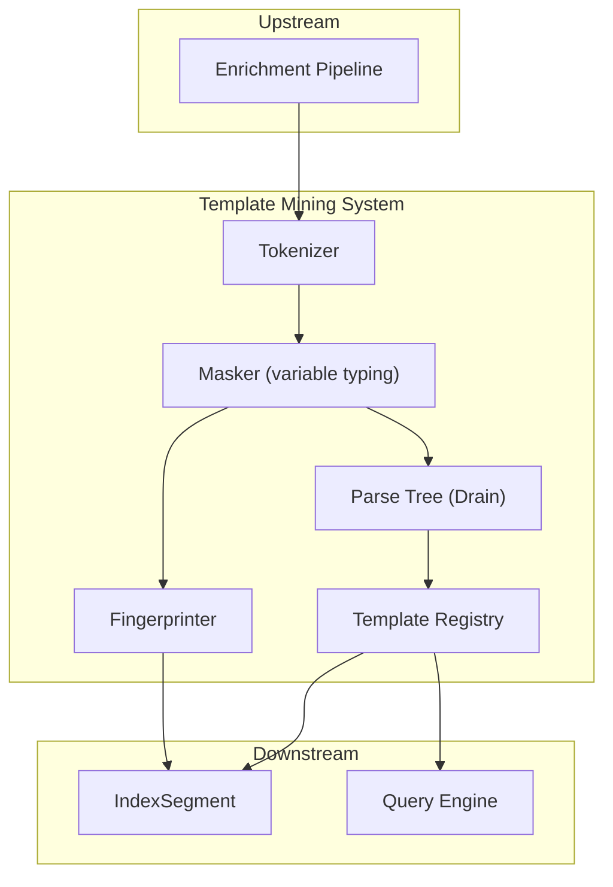
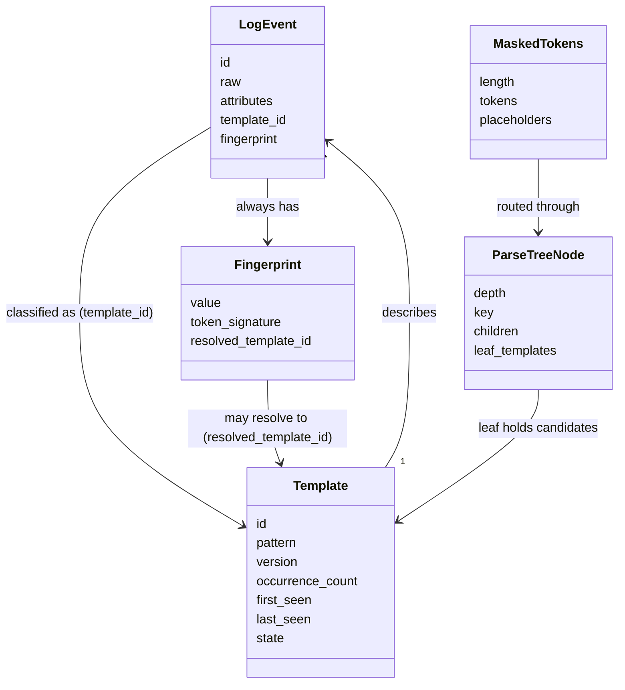
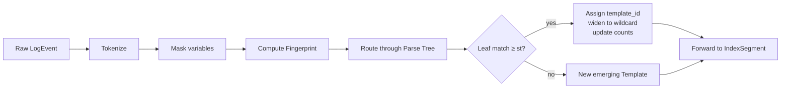
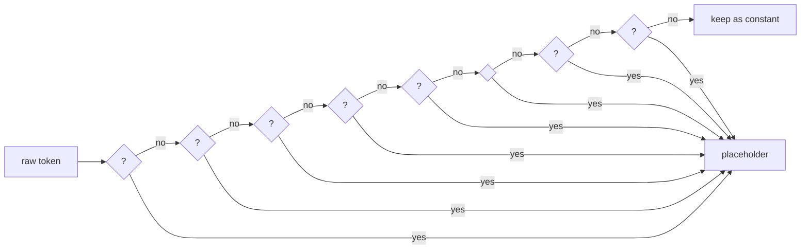
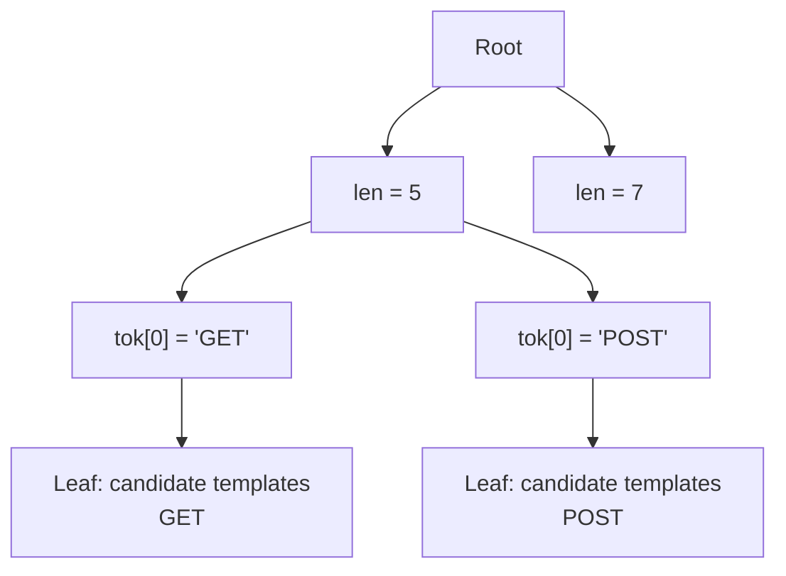
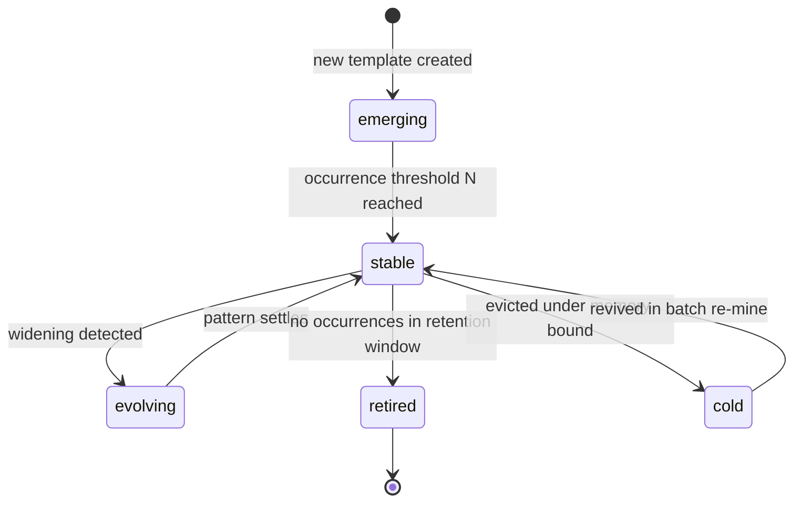
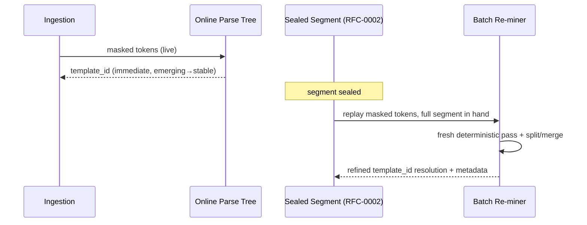

# RFC-0003 — Template Mining System

**Status:** Accepted
**Author:** carvalhosauro
**Version:** 1.1

---

# 1. Introduction

This document defines the **Template Mining System** for **Lode**.

Its goal is to specify how raw log events become reusable patterns: how similar events are grouped by structure, how dynamic templates emerge and evolve, and how a stable fingerprint is produced when no template matches.

This RFC specifies the **conceptual algorithm** (a masked, fixed-depth parse tree in the Drain family), its determinism and memory bounds, and the quality bar it must meet. It does not specify storage layout (RFC-0002), query semantics (RFC-0004), or the concrete source-level implementation.

---

# 2. Purpose / Motivation

Logs are repetitive. The same code path emits the same message shape thousands of times, differing only in variable parts (ids, durations, hosts).

Treating each line as unique wastes memory, defeats correlation, and hides structure. Template mining is what turns a flood of lines into a small set of recurring patterns plus their variable parts.

Template mining exists to:

- collapse structurally identical events into a single Template
- expose the *shape* of activity, not just its volume
- give every event a stable identity even when its template is unknown
- make pattern emergence, drift, and disappearance observable over time

This is **the** core differentiator: Lode understands log *structure*, not log *text*. The quality of this subsystem determines the quality of everything downstream — insights (RFC-0005) are computed per template, and query acceleration (RFC-0004) keys on `template_id`.

---

# 3. Architecture Overview

## 3.1 Position in the System

The Template Mining System sits between the Enrichment Pipeline and the IndexSegment. It consumes enriched LogEvents and assigns each a `template_id` and a `fingerprint`.



## 3.2 Sub-components

- **Tokenizer** — splits the raw event into structural tokens on whitespace and structural delimiters, preserving delimiters.
- **Masker** — replaces tokens that match typed variable patterns (numbers, IPs, UUIDs, …) with placeholders **before** clustering. The single largest quality lever.
- **Parse Tree** — a fixed-depth tree (Drain family) that routes a masked token sequence to a small bucket of candidate templates in near-constant time.
- **Template Registry** — holds known templates, their counts, temporal bounds, and lifecycle state.
- **Fingerprinter** — produces a stable identifier for an event whose structure does not yet match a template.

---

# 4. Principles

The Template Mining System follows these principles:

- Structural, not textual (group by shape, never by exact string)
- Derived (templates are inferred from events, never ingested)
- Incremental (mining happens during ingestion, not only in batch)
- Stable identity (every event always has a fingerprint)
- Source-preserving (mining never mutates the event's `raw`)
- Evolution-aware (templates widen, and — in batch — split, merge, and retire)
- **Deterministic** (same masked input in the same order, same parameters → identical templates and ids)
- **Bounded** (memory is capped by construction, never grows with unique-line count)
- Observable (every assignment and lifecycle change emits an event)

---

# 5. Core Concepts / Model

## 5.1 Relationships



## 5.2 Template

A semantic grouping of structurally similar events.

Fields:

- `id`
- `pattern` — the constant skeleton with typed placeholders and `<*>` wildcards
- `version` — incremented when the pattern changes (widen / split / merge)
- `occurrence_count`
- `first_seen`
- `last_seen`
- `state` — `emerging`, `stable`, `evolving`, `retired`, or `cold`

Properties:

- `pattern` is derived from observed events
- `occurrence_count` is eventually consistent
- a Template may evolve; evolution increments `version`, it never rewrites history

## 5.3 Masked Tokens

The intermediate representation produced before clustering.

Fields:

- `length` — token count (the first routing key)
- `tokens` — the ordered token list with variable tokens replaced by typed placeholders
- `placeholders` — the captured variable values, kept on the event's `attributes`, never discarded

The masked token sequence — not the raw line — is what the Parse Tree and Fingerprinter consume. Masking is applied to a copy; `raw` is never altered (RFC-0000, DEC raw-immutable).

## 5.4 Fingerprint

A stable identifier for an event, computed from its masked token signature.

Fields:

- `value` — the stable identifier (a hash of the masked token sequence)
- `token_signature` — the structural shape used to compute the value
- `resolved_template_id` — the template this fingerprint currently maps to, or absent

Properties:

- every LogEvent always has a fingerprint, even when no template matches
- the fingerprint is deterministic: the same masked structure yields the same value
- when a template later emerges that covers this structure, `resolved_template_id` is set
- the fingerprint is the fallback identity; the `template_id` is the preferred identity

## 5.5 Parse Tree Node

The working structure of the Drain tree.

Fields:

- `depth` — its layer (0 = root)
- `key` — the routing key at this node (token count at layer 1, a leading token at layers 2..d)
- `children` — child nodes keyed by the next routing token
- `leaf_templates` — at a leaf: the bounded bucket of candidate Templates

The Parse Tree is in-memory working state, rebuilt deterministically on cold start (RFC-0002) or batch re-mine.

## 5.6 Relation between Fingerprint and template_id

- `fingerprint` is always present and computed first, from the masked tokens.
- `template_id` is inferred and may be absent at the moment of ingestion.
- When the structure routes to a leaf template within similarity threshold, `template_id` is set directly.
- When it does not, the fingerprint stands alone until a Template emerges for that structure; at that point the fingerprint resolves to the new `template_id`.
- The fingerprint never changes for a given structure; only its resolution does.

---

# 6. Processing Flow

Each event passes through the same mining flow:

1. The enriched LogEvent arrives with its `raw` preserved.
2. The Tokenizer splits it into structural tokens.
3. The Masker replaces typed-variable tokens with placeholders, producing the masked token sequence; captured values land on `attributes`.
4. A Fingerprint is computed from the masked sequence.
5. The Parse Tree routes the sequence: by token count, then by leading tokens to a leaf.
6. Within the leaf, the most similar candidate Template is selected if similarity ≥ `st`.
7. On match → assign `template_id`, widen any differing constant positions to `<*>`, update `occurrence_count` / `last_seen`.
8. On no match → create a new `emerging` Template seeded by this masked sequence.
9. The event is forwarded to the IndexSegment with its `template_id` and `fingerprint`.
10. Assignment and lifecycle events are emitted for observability.



## 6.1 Tokenization and Masking

Masking happens **before** clustering and is the dominant quality lever: it turns `user 12 logged in` and `user 47 logged in` into the same masked sequence `user <NUM> logged in` immediately, with no clustering luck required.

A **rich built-in dictionary** is applied in most-specific-first order so a value is typed by its narrowest matching mask:



- Built-in masks: `<TS>` `<UUID>` `<IP>` `<URL>` `<EMAIL>` `<PATH>` `<HEX>` `<NUM>` (and optionally `<QUOTED>`).
- Masks are **pluggable**: a deployment may add, remove, or reorder masks via configuration (RFC-0016) or a plugin (RFC-0010).
- Masks are anchored on token boundaries and conservative, to bound over-masking; a token typed too aggressively is a precision loss, not a correctness loss.
- Masking is deterministic and pure: same token, same dictionary → same placeholder.

## 6.2 The Parse Tree (Drain)

Routing uses a fixed-depth tree, so lookup cost does not grow with the number of templates.



- **Layer 1** routes by token **count** (`length`). Messages of different length never collide.
- **Layers 2..d** route by the token at each leading position (leading tokens in logs are overwhelmingly constant). Depth `d` is fixed (default 4); a placeholder at a routing position routes under a single shared key.
- **Leaf** holds a bounded bucket of candidate Templates. Selection picks the candidate with highest **sequence similarity** `simSeq = (matching positions) / length`; a match requires `simSeq ≥ st` (default 0.5). No candidate clears the bar → a new Template is created in that leaf.
- **Update on match** is **widen-only** (see 6.4): differing constant positions become `<*>`. Routing-position tokens never widen (they are the tree structure).

## 6.3 Template Lifecycle



- **emerging** — newly created, low confidence, accumulating evidence.
- **stable** — recurring reliably past threshold `N`; the preferred identity for its events.
- **evolving** — its pattern is widening; a new `version` is forming.
- **retired** — not observed within the retention window; kept for historical queries, never assigned to new events.
- **cold** — demoted under the memory bound (6.6); its events keep fingerprint identity and it can be revived by batch re-mine.

## 6.4 Pattern Evolution

**v1 online mining is widen-only.** During ingestion the only evolution is widening a differing constant position to `<*>` (drift). This is deterministic, cheap, and cannot fragment history.

**Split and merge are deferred to batch re-mine** (6.5), where the full segment is available:

- **Split** — a wildcard position with a clear bimodal distribution of high-volume constants is divided into sibling templates.
- **Merge** — two templates differing only at one position are unified; the loser is retired, its fingerprints re-resolved to the survivor.

Every evolution increments `version` and emits a lifecycle event. Stored events keep the `template_id`/`version` they were assigned at ingest; evolution refines *future* resolution and template metadata, never the raw or the historical assignment record.

## 6.5 Hybrid Learning (Online + Batch)

Lode uses **both** paths, by the same masker, tree, and lifecycle rules:



- **Online (incremental)** — runs during ingestion. Each event is masked, routed, matched, or seeded as it arrives. Optimized for latency so the TUI shows structure live. Widen-only.
- **Batch (re-mine)** — when a segment seals, it is re-mined with the whole segment available: applies splits/merges, resolves fingerprints to templates that emerged later, and corrects early `emerging` noise. Batch writes refined resolution and metadata only; it never alters `raw` and is deterministic given the segment's fixed per-stream order.

## 6.6 Bounded Memory and Determinism

Memory is capped **by construction**, not by policy bolted on:

- depth `d` is fixed → tree height is constant;
- each leaf's candidate bucket is capped;
- total live templates are capped at `T_max`.

When `T_max` is exceeded, the **least valuable** template is demoted to `cold` (its events keep fingerprint identity; nothing is lost). "Least valuable" is a deterministic ordering: lowest `occurrence_count`, then oldest `last_seen`, then lowest `id` as the final tie-break. Eviction is therefore reproducible.

**Determinism invariant:** given the same masked token stream in the same per-stream order and the same parameters (`d`, `st`, `T_max`, masking dictionary, `N`), mining produces a **bit-identical** template set and the same `template_id` assignments. Cross-stream order is partial (RFC-0006), so determinism is defined per stream. This invariant is the basis of the test corpus (Section 12).

---

# 7. Contract

The Template Mining System defines these conceptual contracts:

```rust
fn tokenize(event: &LogEvent) -> Result<Vec<Token>, MineError>;

fn mask(tokens: Vec<Token>, dictionary: &MaskDictionary) -> Result<MaskedTokens, MineError>;

fn fingerprint(masked: &MaskedTokens) -> Result<Fingerprint, MineError>;

fn route(masked: &MaskedTokens) -> Result<LeafNode, MineError>;

fn match_template(leaf: &LeafNode, masked: &MaskedTokens, st: f64) -> Result<TemplateId, MatchError>;
// MatchError::NoMatch when no candidate clears the similarity threshold

fn mine(event: &LogEvent) -> Result<(Option<TemplateId>, Fingerprint), MineError>;

fn widen(template: &mut Template, masked: &MaskedTokens) -> Result<Template, MineError>;

fn re_mine(segment: &IndexSegment) -> Result<Vec<Template>, MineError>;
```

`mine` always returns a `Fingerprint`; `template_id` is `None` when no template matches yet. `re_mine` is the batch path; it may emit split/merge results.

---

# 8. Concurrency

Each LogStream is mined in isolation by a dedicated worker — an async task or OS thread that exclusively owns that stream's Parse Tree. No shared mutable tree state crosses stream boundaries.

The Template Registry is shared via `Arc<RwLock<TemplateRegistry>>` (or message-passing to a registry worker) and updated with eventually-consistent semantics; concurrent assignments to the same template are safe and additive.

Template creation is idempotent within a stream: the same masked structure converges to one Template.

Template counts are not transactional; they are accumulators (`Arc<AtomicU64>` or per-worker counts merged by the supervisor) that converge.

---

# 9. Failure Handling

Mining failures are local and never block ingestion.

Examples:

- tokenization or masking failure → event keeps `template_id = nil`, retains a raw fingerprint over the unmasked tokens
- no leaf match → fallback to fingerprint only, resolution deferred to batch
- registry unavailable → event passes through with fingerprint, resolution deferred to batch re-mine

Retry and supervision belong to the Execution Runtime (RFC-0012); recovery and degraded mode to RFC-0013.

---

# 10. Observability

The Template Mining System emits internal events:

- `mining.token.masked`
- `mining.template.assigned`
- `mining.template.emerged`
- `mining.template.widened`
- `mining.template.split` (batch)
- `mining.template.merged` (batch)
- `mining.template.retired`
- `mining.template.evicted`
- `mining.fingerprint.created`

These events do not alter the mining flow; they only provide observability (RFC-0009 / RFC-0011).

---

# 11. Tunables

Mining is governed by a small set of parameters, configured per stream or globally (RFC-0016):

| Parameter | Meaning | Default |
| --------- | ------- | ------- |
| `d` | Parse-tree depth (leading routing positions) | 4 |
| `st` | Minimum sequence similarity for a leaf match | 0.5 |
| `T_max` | Maximum live templates before eviction | bounded, configurable |
| `N` | Occurrences before `emerging` → `stable` | small constant |
| `masking dictionary` | Ordered set of typed variable masks | rich built-in (6.1) |

All parameters are fixed inputs to the determinism invariant: changing them changes the output, but a given configuration is fully reproducible.

---

# 12. Quality and Acceptance

Mining quality is **measured, not assumed**, against a golden corpus of standard log formats. This is the project's primary correctness gate and the source of its deterministic tests.

- **Golden corpus** — labeled samples of standard formats: nginx access/error, Apache, syslog (RFC 5424), JSON lines, journald export, Postgres, Redis, and Linux kernel. Each sample ships with its ground-truth template set. Public datasets (e.g. Loghub) seed the corpus.
- **Metric — Parsing Accuracy (PA)** — the fraction of messages assigned to the correct ground-truth template grouping (the standard log-parsing metric). Template-count delta is reported alongside.
- **Acceptance bar** — `PA ≥ 0.90` per standard format under that format's **effective parameters** (defaults plus any per-format overrides declared in the corpus manifest, per §13). Overrides used by the gate are part of the golden corpus definition and are themselves versioned.
- **Determinism test** — re-running mining over the same corpus in the same order yields a bit-identical template set and identical assignments. Any non-determinism is a defect.

The acceptance bar and the determinism test gate any change to the tokenizer, masking dictionary, or tree logic.

---

# 13. Extensibility

The Template Mining System is designed to evolve without breaking:

- new masks for new log dialects (built-in or via RFC-0010)
- alternative similarity functions behind the same `match` contract
- per-stream tuning of `d`, `st`, `T_max`, `N`
- custom classifiers contributed via the Plugin System (RFC-0010)

Every extension must respect the contracts in Section 7, the determinism invariant (6.6), and the rule that templates are derived.

---

# 14. Out of Scope

This RFC does not define:

- Domain entities (RFC-0000)
- Ingestion mechanics (RFC-0001)
- Storage, segment sealing, and index layout (RFC-0002)
- Query language and evaluation (RFC-0004)
- Insight heuristics built on patterns (RFC-0005)
- Time parsing and ordering (RFC-0006)
- Configuration surface for tunables and masks (RFC-0016)
- Plugin-contributed classifiers (RFC-0010)
- Runtime supervision (RFC-0012)
- Recovery and degraded mode (RFC-0013)

These topics are specified in their own RFCs.

---

# 15. Decisions

## DEC-001 — Templates are Derived, never Ingested

A Template is always inferred from observed events. No external source may declare a template.

## DEC-002 — Grouping is Structural, not Textual

Events are clustered by masked token structure, never by exact string equality.

## DEC-003 — Mask Before Clustering

Typed variable masking is applied before routing. It is the dominant quality lever and is deterministic. A rich built-in dictionary ships by default and is pluggable.

## DEC-004 — Fixed-Depth Parse Tree (Drain family)

Routing uses a fixed-depth tree keyed by token count then leading tokens. Lookup cost and tree height do not grow with template count.

## DEC-005 — Every Event has a Fingerprint

The fingerprint is computed for every event from its masked tokens and is the fallback identity when no template matches. `template_id` may be `nil` at ingest and resolve later.

## DEC-006 — Online is Widen-Only; Split/Merge is Batch

Online mining only widens constants to wildcards. Split and merge run in batch re-mine, where the full segment is available. This keeps the live path deterministic and cheap.

## DEC-007 — Hybrid Learning, One Model

Online and batch use the same masker, tree, and lifecycle rules. Batch refines resolution and metadata only; it never alters `raw` and is never retroactive on the historical assignment record.

## DEC-008 — Bounded by Construction

Memory is capped by fixed depth, bounded leaves, and `T_max`. Overflow demotes the least-valuable template to `cold` by a deterministic ordering; nothing is lost.

## DEC-009 — Determinism is a Tested Invariant

Same masked input, same order, same parameters → bit-identical templates and assignments (per stream). Verified continuously against the golden corpus.

## DEC-010 — Quality is Gated at PA ≥ 0.90

Mining must reach `PA ≥ 0.90` per standard format under the format's effective parameters before a change ships. Effective parameters = defaults + declared per-format overrides; an override is a corpus artifact, never code.

---

# 16. Glossary

| Term              | Definition                                                              |
| ----------------- | ----------------------------------------------------------------------- |
| Template          | A semantic grouping of structurally similar events                      |
| Fingerprint       | A stable, deterministic identifier over masked tokens; fallback identity|
| Masked Tokens     | Token sequence with typed-variable tokens replaced by placeholders      |
| Mask / Placeholder| A typed replacement for a variable token (`<NUM>`, `<IP>`, …)            |
| Parse Tree        | Fixed-depth (Drain-family) routing tree over masked tokens              |
| Sequence Similarity (`st`) | Fraction of matching positions required for a leaf match       |
| Tokenizer         | Splits a raw event into structural tokens                               |
| Template Registry | The store of known templates, counts, state, and temporal bounds        |
| Widening          | Turning a differing constant position into a `<*>` wildcard             |
| Pattern Evolution | Widening (online) and split / merge (batch) of a template over time     |
| Online Learning   | Incremental, widen-only mining during ingestion                         |
| Batch Re-mine     | Re-mining a sealed segment to split/merge and resolve fingerprints      |
| Cold Template     | A template demoted under the memory bound, revivable in batch           |
| Parsing Accuracy (PA) | Fraction of messages grouped as the ground-truth template           |
| Golden Corpus     | Labeled standard-format samples used to gate mining quality             |
