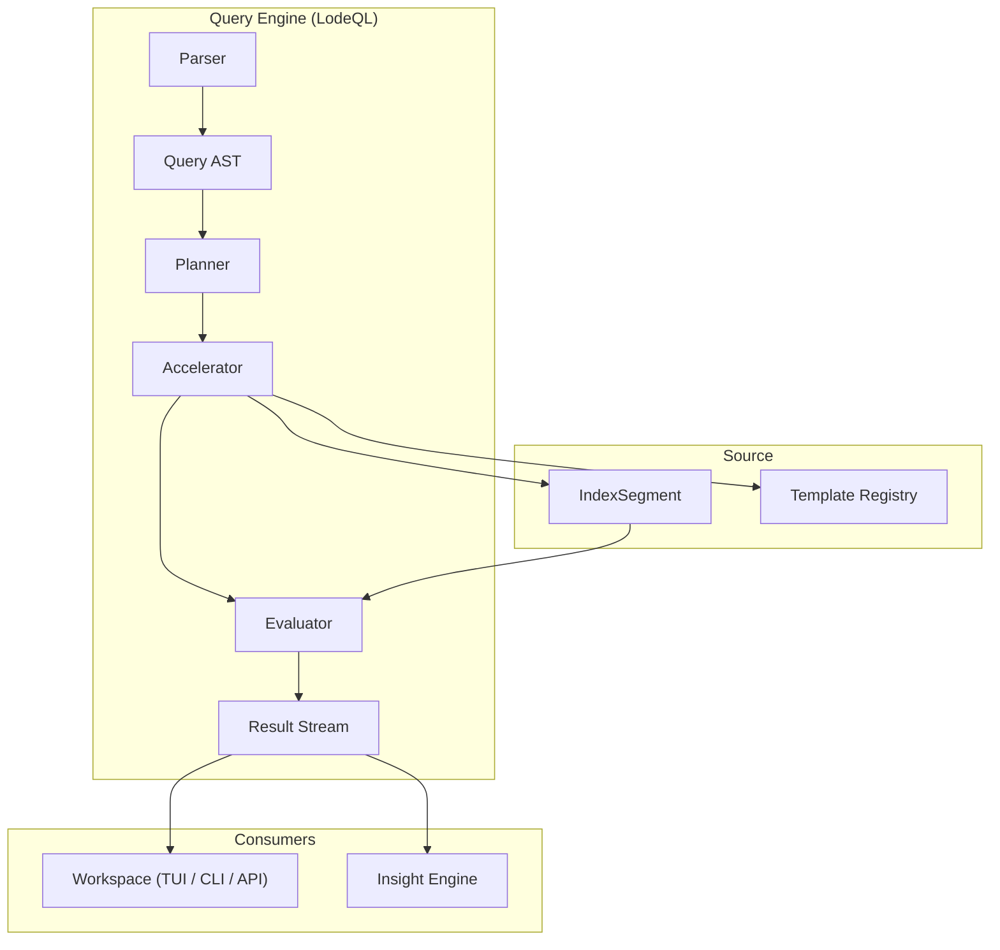
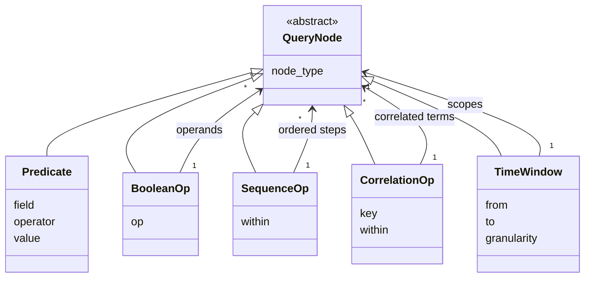
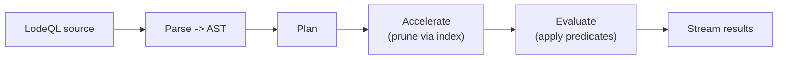
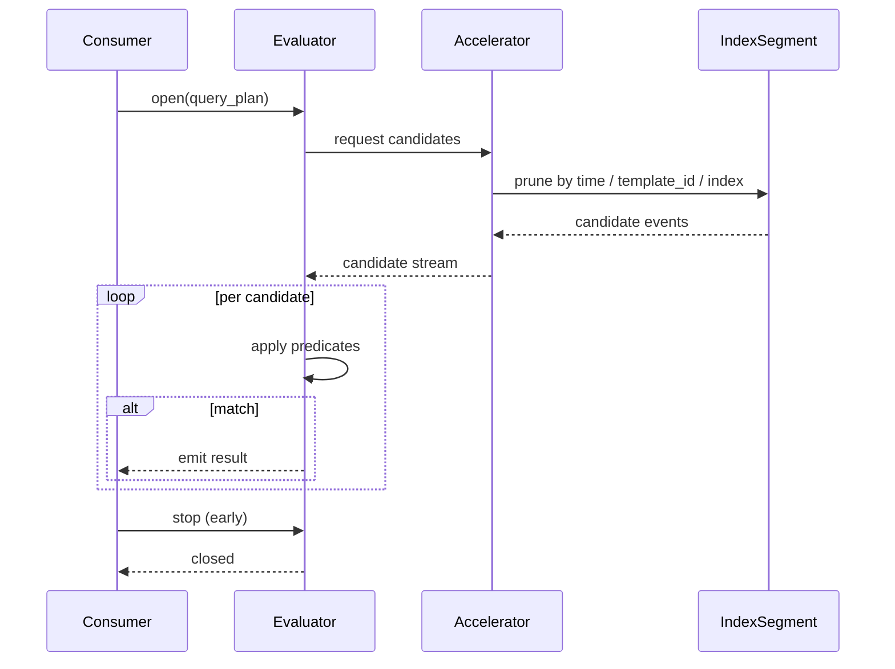

# RFC-0004 — Query Engine (LodeQL)

**Status:** Draft
**Author:** carvalhosauro
**Version:** 1.0

---

# 1. Introduction

This document defines the **Query Engine** for **Lode** and its query language, **LodeQL**.

Its goal is to specify how a query is represented, planned, accelerated, and evaluated against indexed events, and how results flow back incrementally.

This RFC defines query *semantics*. It does not define storage and index layout (RFC-0002), nor the way results are displayed (RFC-0008).

---

# 2. Purpose / Motivation

Investigation is interrogation. The user asks structured questions about events: what happened, when, in what order, correlated with what.

A query is not a string match. It is a structured question with predicates, time windows, and composition operators. Treating queries as raw text would lose structure, defeat optimization, and make temporal composition impossible.

The Query Engine exists to:

- represent every query as a structured tree (an AST), never as a raw string
- evaluate that tree against IndexSegments and LogEvents
- use index acceleration to prune work before evaluation
- stream results incrementally instead of materializing whole result sets
- compose predicates temporally (AND/OR, sequence, correlation over time windows)

LodeQL is the language; the AST is its canonical form.

---

# 3. Architecture Overview

## 3.1 Position in the System

The Query Engine sits between the IndexSegment and the Workspace. It reads indexed events and streams results to whatever interface consumes them.



## 3.2 Sub-components

- **Parser** — turns LodeQL source into a Query AST.
- **Query AST** — the canonical structured representation of a query.
- **Planner** — turns the AST into an evaluation plan.
- **Accelerator** — uses index, `template_id`, and time bounds to prune candidates.
- **Evaluator** — applies predicates to surviving events.
- **Result Stream** — emits matches incrementally.

---

# 4. Principles

The Query Engine follows these principles:

- Structured (queries are trees, never raw strings)
- Declarative (the query states *what*, the planner decides *how*)
- Accelerated (prune via index before evaluating)
- Streaming (results flow incrementally, never fully materialized)
- Temporal-first (time windows and ordering are first-class)
- Deterministic (same query over same segments yields the same results)
- Read-only (the engine never mutates events, templates, or indexes)
- Decoupled (semantics here; storage in RFC-0002; rendering in RFC-0008)

---

# 5. Core Concepts / Model

## 5.1 Query AST

A LodeQL query is a tree of nodes. Leaf nodes are predicates; internal nodes compose them logically and temporally.



- **Predicate** — a leaf: `field operator value` (e.g. `severity = error`, `template_id = T42`).
- **BooleanOp** — `AND` / `OR` / `NOT` over child nodes.
- **TimeWindow** — scopes a subtree to a `[from, to]` interval.
- **SequenceOp** — ordered events occurring `within` a window (A then B).
- **CorrelationOp** — events sharing a correlation `key` `within` a window.

## 5.2 Evaluation Plan

The planner-produced form of the AST. It is the AST annotated with:

- which predicates can be served by an index
- which segments and time ranges are in scope
- the evaluation order that prunes the most candidates first

The plan is internal; LodeQL users never write it.

## 5.3 Result Stream

An incremental sequence of matching events. Properties:

- results are emitted as they are found, in segment/time order
- the full result set is never materialized in memory
- a consumer may stop early; the engine stops producing

---

# 6. Processing Flow

Each query follows the same lifecycle:

1. LodeQL source is parsed into a Query AST.
2. The AST is validated (fields, operators, window bounds).
3. The Planner produces an evaluation plan.
4. The Accelerator prunes candidates using index, `template_id`, and time bounds.
5. The Evaluator applies remaining predicates to surviving events.
6. Matches are emitted to the Result Stream incrementally.
7. Temporal operators buffer only the minimum needed to satisfy their window.
8. Telemetry events are emitted for observability.



## 6.1 Index Acceleration

Before evaluating predicates, the Accelerator narrows the candidate set:

- **Time bounds** — discard segments outside the query's TimeWindow.
- **template_id** — when a predicate fixes a template, use the index to fetch only those events.
- **Search indexes** — use IndexSegment search structures to skip non-matching events.

Acceleration is a pruning step. It never changes results; it only reduces the events the Evaluator must inspect.

## 6.2 Temporal Composition

LodeQL composes predicates over time:

- **Boolean** — `AND`, `OR`, `NOT` combine predicates within the same window.
- **Sequence** — `A then B within W` matches when B follows A inside window W.
- **Correlation** — events sharing a key (e.g. request id) within W are grouped and matched together.

Temporal operators rely on partial cross-stream ordering (RFC-0006); they never assume perfect global order.

## 6.3 Streaming Evaluation

Results stream to the consumer as they are produced.



The Evaluator buffers only what temporal operators require. A consumer that stops early causes the engine to stop producing.

---

# 7. Contract

The Query Engine defines these conceptual contracts:

```rust
fn parse(lodeql_source: &str) -> Result<QueryAST, QueryError>;

fn plan(ast: QueryAST) -> Result<EvaluationPlan, QueryError>;

fn accelerate(plan: &EvaluationPlan, segments: &[IndexSegment]) -> Result<CandidateStream, QueryError>;

fn evaluate(plan: &EvaluationPlan, candidates: CandidateStream) -> Result<ResultStream, QueryError>;

fn run(lodeql_source: &str, scope: &QueryScope) -> Result<ResultStream, QueryError>;
```

`run` returns a stream, not a materialized list. Results are consumed incrementally.

---

# 8. Concurrency

Queries are read-only and may run concurrently with ingestion and with each other.

Each query evaluates against immutable IndexSegments, so it sees a consistent snapshot per segment.

Multiple segments may be evaluated in parallel; the Result Stream preserves per-segment ordering and merges by time where windows require it.

A query never blocks ingestion and ingestion never blocks a query.

---

# 9. Failure Handling

Query failures are local and never corrupt state.

Examples:

- parse error → `Err(QueryError::Parse(detail))`, no plan produced
- unknown field/operator → validation error before evaluation
- missing segment → that segment is skipped, the stream continues, a warning is emitted

Retry and supervision belong to the Runtime (RFC-0012) and Recovery (RFC-0013).

---

# 10. Observability

The Query Engine emits internal events:

- `query.parsed`
- `query.planned`
- `query.accelerated`
- `query.result.emitted`
- `query.completed`

These events do not alter results; they only provide observability (RFC-0009 / RFC-0011).

---

# 11. Extensibility

The Query Engine is designed to evolve without breaking:

- new predicate operators behind the same Predicate contract
- new temporal operators as new QueryNode types
- new acceleration strategies behind the Accelerator contract
- plugin-contributed functions via the Plugin System (RFC-0010)

Every extension must respect the contracts in Section 7 and the invariant that queries are structured trees.

---

# 12. Out of Scope

This RFC does not define:

- Domain entities (RFC-0000)
- Ingestion mechanics (RFC-0001)
- Storage and index layout (RFC-0002)
- Template mining (RFC-0003)
- Insight heuristics that consume query results (RFC-0005)
- Time parsing and ordering details (RFC-0006)
- Workspace state and query history (RFC-0007)
- TUI / rendering layer (RFC-0008)
- Plugin-contributed query functions (RFC-0010)
- Runtime supervision (RFC-0012)

These topics are specified in their own RFCs.

---

# 13. Decisions

## DEC-001 — Queries are Structured Trees, not Strings

Every query is represented as a Query AST. The raw LodeQL string is only an input syntax.

## DEC-002 — Semantics, not Storage

The Query Engine defines what a query means; how events are stored and indexed belongs to RFC-0002.

## DEC-003 — Results Stream, never Fully Materialize

Results are emitted incrementally. The engine never holds an entire result set in memory.

## DEC-004 — Acceleration never Changes Results

Index, `template_id`, and time pruning only reduce work; they never alter the result set.

## DEC-005 — Temporal Composition is First-Class

Sequence and correlation over time windows are native operators, not post-processing.

## DEC-006 — Time Ordering is Partial

Temporal operators rely on partial cross-stream ordering and never assume perfect global order (RFC-0006).

## DEC-007 — The Engine is Read-Only

Evaluating a query never mutates events, templates, or indexes.

---

# 14. Glossary

| Term            | Definition                                                            |
| --------------- | --------------------------------------------------------------------- |
| LodeQL          | Lode's structured query language                                      |
| Query AST       | The canonical tree representation of a query                          |
| Predicate       | A leaf node: `field operator value`                                   |
| BooleanOp       | A node combining children with AND / OR / NOT                         |
| TimeWindow      | A node scoping a subtree to a time interval                           |
| SequenceOp      | A node matching ordered events within a window                        |
| CorrelationOp   | A node matching events sharing a key within a window                  |
| Evaluation Plan | The planner's annotated, executable form of the AST                   |
| Accelerator     | The component that prunes candidates via index, template_id, and time |
| Result Stream   | The incremental sequence of matching events                           |
