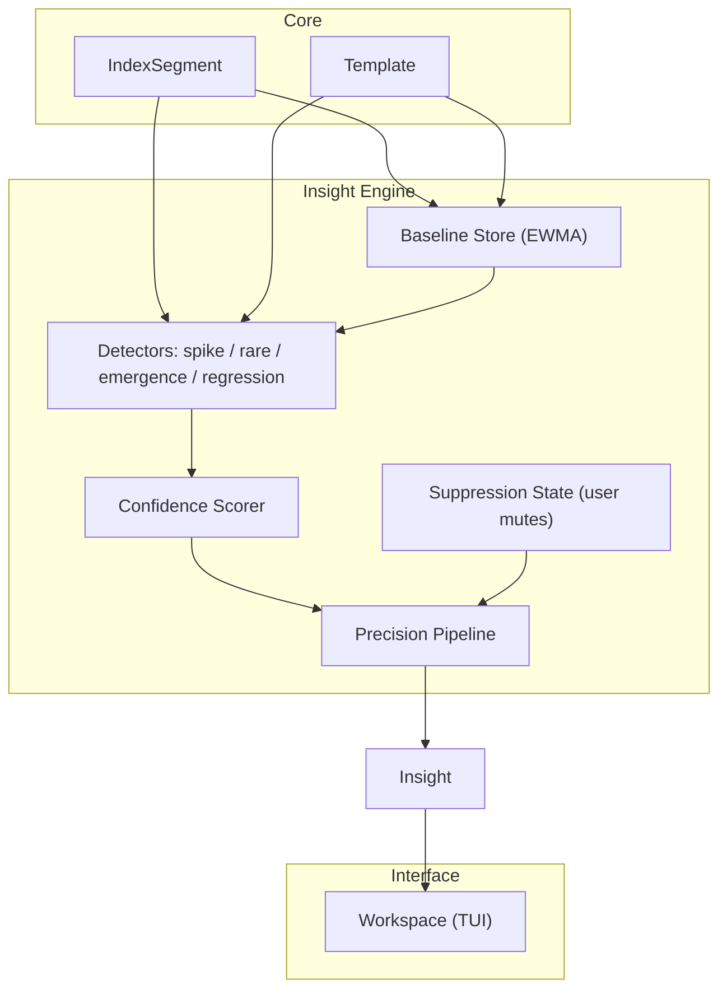
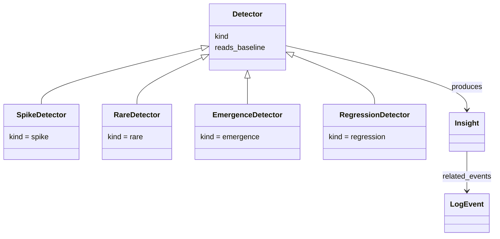
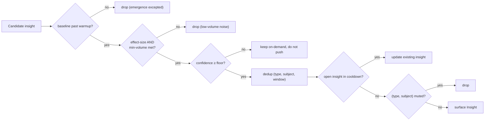
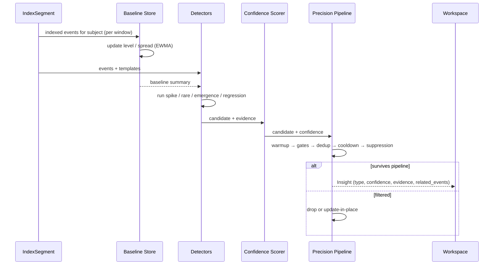

# RFC-0005 — Insight Engine

**Status:** Draft
**Author:** carvalhosauro
**Version:** 1.1

---

# 1. Introduction

This document defines the **Insight Engine** for **Lode**.

The Insight Engine performs automatic detection of relevant activity over indexed data and produces the `Insight` entity defined in RFC-0000.

An insight is a derived, **explainable** observation: a statement that something deserves attention, with the exact evidence that triggered it. The engine is **statistical, not ML**: every insight is reproducible and self-describing (e.g. *"template X: 240 events in the last 1m vs baseline 12 ± 4, z = 9.3"*).

This document defines how insights are detected, scored, **and — above all — kept precise**. It does not define template mining (RFC-0003), the query layer (RFC-0004), time semantics it consumes (RFC-0006), or how insights are displayed (RFC-0008).

---

# 2. Purpose

Manual log investigation does not scale. A human cannot watch every stream, count every template, or notice that a once-rare event has become frequent.

The Insight Engine exists to:

- surface relevant activity without an explicit query
- establish what "normal" looks like per template and per stream
- detect deviations from that normal
- attach a confidence score so consumers can rank what matters

But a noisy insight panel is worse than none — it trains the user to ignore it. **Precision is the primary design goal.** The engine optimizes to minimize false positives, accepting some missed signals (lower recall) in exchange. False-positive fatigue is the failure mode this RFC is built to prevent.

---

# 3. Architecture Overview

## 3.1 Position in the System

The Insight Engine reads indexed events and templates. It never reads streams directly and never writes back into events.



## 3.2 Sub-components

- **Baseline Store** — the rolling, robust notion of "normal" per `(stream, template)`.
- **Detectors** — four independent v1 detectors: spike, rare, emergence, regression.
- **Confidence Scorer** — assigns `Insight.confidence` from effect size, baseline maturity, and volume.
- **Precision Pipeline** — the staged filter that turns raw candidates into the few insights worth surfacing. The heart of this RFC.
- **Suppression State** — the user-controlled mute list, a deterministic input to the pipeline.

---

# 4. Principles

- Statistical and explainable (no ML, no black box; every insight states its evidence)
- Precision over recall (a missed signal beats a false one)
- Derived (insights observe; they never alter events)
- Non-intrusive (detection never blocks ingestion or query)
- Baseline-relative (deviation measured against established normal, not absolutes)
- Per-stream first (cross-stream correlation is deferred to v2)
- Scored (every insight carries a confidence, never a binary verdict)
- Deterministic (same indexed data, baselines, parameters, and suppression state → same insights)
- Passive (insights never notify; consumers decide what to surface)

---

# 5. Core Concepts

## 5.1 Insight

Represents an automatic discovery. Reuses the `Insight` entity from RFC-0000.

Fields:

- `type` — `spike`, `rare`, `emergence`, or `regression`
- `confidence` — normalized score in `[0.0, 1.0]`
- `description` — the human-readable explanation, including the evidence
- `related_events` — a non-empty set of event identifiers (by id / `row_anchor`)

Properties:

- an insight is immutable once surfaced, except that a cooldown may extend an open one (5.5)
- an insight never references events after its own detection window (no lookahead)
- `related_events` reflects exactly the evidence that produced it

## 5.2 Detectors (v1)



The four v1 detectors are specified in Section 6. Anomaly (distribution-shape) and cross-stream correlation are deferred to v2 (Section 17).

## 5.3 Baseline

The rolling notion of "normal" for a `(stream, template)` subject.

Fields:

- `subject` — `(stream, template)`
- `level` — EWMA of occurrences per fixed window
- `spread` — EWMA of absolute deviation (a robust dispersion estimate)
- `windows_seen` — count of windows observed (drives warmup)
- `last_updated`

Properties:

- the baseline is flat and robust (EWMA level + robust spread); it has **no seasonality** in v1 (deferred to v2)
- baselines are derived, never ingested
- a subject with `windows_seen < W` is in **warmup** and produces no spike/rare/regression insights — only emergence

## 5.4 Severity (minimal dependency for regression)

Severity is derived by the Enrichment Pipeline (RFC-0017), not by this engine. The Regression detector requires only a minimal contract:

- an event carries a `severity`; a template is **error-bearing** in a window if its events' severity meets or exceeds a configured floor (default `warn`).
- if severity is unavailable or unreliable, regression falls back to **new error-bearing template emergence** plus templates matching configured error markers.

A complete severity model is specified in RFC-0017; this RFC defines only what the detector consumes.

## 5.5 Suppression State

The user-controlled mute list — a first-class, persisted, deterministic input.

- an entry mutes a `(type, subject)` pair, optionally scoped to a stream.
- suppression is set by user feedback (Section 10) and persisted (RFC-0007 / RFC-0016).
- because it is an explicit input, the same suppression state yields the same output — suppression never breaks determinism.

---

# 6. Detectors

All four detectors are statistical, read-only over the index and baseline, and emit candidate insights with explicit evidence.

## 6.1 Spike

A sharp, short-window increase in a template's rate.

- fires when window count `> level + k · spread` **and** count `≥ min_volume`.
- the dual gate (relative **and** absolute) is deliberate: it kills the classic "2 → 6 is a 3× spike" noise at low volume.
- evidence: the window count, the baseline `level ± spread`, and the resulting effect size.

## 6.2 Rare

A template occurring far below its historical frequency, or a known template returning after a long absence.

- fires when a stable template's rate falls into a low percentile of its own baseline, or reappears after an absence exceeding a configured gap.
- distinct from emergence: rare concerns *known* templates; emergence concerns *new* structure.

## 6.3 Emergence

The appearance of a template that did not exist in the baseline.

- driven directly by the mining signal `mining.template.emerged` (RFC-0003).
- the only insight type allowed during a subject's warmup.
- low base confidence until the new template accumulates evidence.

## 6.4 Regression

A **sustained** elevation of error-bearing activity — distinct from a spike, which is instantaneous.

- fires when an error-bearing template's rate stays above `level + k · spread` across `M` consecutive windows (a deterministic change-point), **or** a new error-bearing template emerges and persists.
- the persistence requirement (`M` windows) is what separates a regression (a state change) from a spike (a burst).
- depends on the minimal severity contract (5.4).
- evidence: the sustained windows, the error-template(s), and the rate trajectory.

---

# 7. Baseline Model

"Normal" is established incrementally per subject:

1. As events are indexed, each is attributed to a `(stream, template)` subject.
2. Per fixed window, the subject's count updates `level` (EWMA) and `spread` (EWMA of absolute deviation).
3. EWMA decays old observations, so the baseline tracks recent normality and is robust to single outliers.
4. `windows_seen` increments each window; until it reaches `W`, the subject is in warmup.
5. Baselines are updated continuously and are eventually consistent with the index.

Seasonality (hour-of-day / day-of-week cycles) is **out of scope for v1** and deferred to v2; the flat EWMA baseline is the simplest model that is robust and good enough to validate the precision pipeline.

---

# 8. Precision Pipeline

Every candidate passes the same deterministic, ordered gate. This pipeline — not the detectors — is what makes the panel trustworthy.



1. **Warmup gate** — subject must have `windows_seen ≥ W`; otherwise drop (emergence is the only exception).
2. **Effect-size + volume gate** — must exceed both the relative threshold (`k · spread`) and the absolute `min_volume`.
3. **Confidence floor** — below `C_min`, the insight is retained for on-demand inspection but never pushed to the panel.
4. **Dedup** — collapse candidates sharing `(type, subject, window)` into one.
5. **Cooldown** — if an insight of `(type, subject)` is already open within the cooldown window, **update** it (extend, bump counts) rather than emitting a duplicate.
6. **Suppression** — drop if `(type, subject)` is muted (5.5).

---

# 9. Confidence Scoring

`Insight.confidence` is a normalized `[0.0, 1.0]` score derived from:

- **effect size** — how many `spread` units the observation sits above `level`.
- **baseline maturity** — more `windows_seen` raises confidence; a thin baseline caps it low.
- **volume** — higher absolute counts raise confidence; tiny counts cap it.
- **persistence** (regression only) — more sustained windows raises confidence.

Rules:

- confidence ranks insights; it never proves them. A single uncorroborated deviation never reaches `1.0`.
- a warmup-thin baseline caps confidence below the push floor.
- the score is a pure function of the listed inputs — reproducible and explainable.

---

# 10. Feedback and Suppression

The precision flywheel: the user teaches the engine what is noise.

- marking an insight **not useful** adds its `(type, subject)` to the suppression list (5.5), optionally scoped to the stream.
- suppression is persisted and is an explicit input to the pipeline (Section 8, step 6).
- v1 feedback is **manual mute only** — deterministic and explainable. Adaptive thresholds that auto-tune from feedback are deferred to v2 (they trade determinism for convenience).
- a muted `(type, subject)` can be un-muted; the change takes effect on the next detection cycle.

---

# 11. Processing Flow



---

# 12. Contract

The Insight Engine defines these conceptual contracts:

```rust
fn update_baseline(&mut self, subject: &Subject, window_events: &[LogEvent]) -> Result<Baseline, InsightError>;

fn detect(detector: &dyn Detector, events: &[LogEvent], baseline: &Baseline) -> Result<Vec<CandidateInsight>, InsightError>;

fn score(candidate: &CandidateInsight, baseline: &Baseline) -> Result<ScoredCandidate, InsightError>;

fn refine(scored: ScoredCandidate, suppression_state: &SuppressionState) -> Result<Option<Insight>, InsightError>;
// Ok(Some(insight)) → surfaced; Ok(None) → filtered by the precision pipeline

fn mute(&mut self, kind: InsightType, subject: &Subject, scope: Option<StreamScope>) -> Result<(), InsightError>;
```

`refine` is the precision pipeline; `Ok(None)` means the candidate was dropped by one of the pipeline gates. Detection failure for one subject never aborts others.

---

# 13. Concurrency

Detectors run independently and may run concurrently across subjects.

Baseline updates per subject are serialized; across subjects they are independent.

Detection never blocks ingestion, indexing, or query; the engine consumes the index asynchronously.

A failed detector run is contained per run, never per stream.

---

# 14. Failure Handling

Failures are local and never corrupt events or baselines.

- detector error → no insight for that subject in that cycle; the index is untouched.
- thin baseline → confidence capped, candidate likely filtered at the floor.
- unavailable severity → regression falls back to emergence + error markers (5.4).

Deep recovery and retry belong to the Execution Runtime (RFC-0012) and Recovery (RFC-0013).

---

# 15. Observability

The Insight Engine emits internal events:

- `insight.baseline.updated`
- `insight.candidate.detected`
- `insight.scored`
- `insight.surfaced`
- `insight.suppressed`
- `insight.updated` (cooldown merge)

These provide observability only and never alter the detection flow (RFC-0009 / RFC-0011).

---

# 16. Quality and Acceptance

Insight quality is **measured, not assumed**, against a labeled insight corpus. Precision is the primary correctness gate — the same discipline RFC-0003 §12 applies to mining — and the source of the engine's deterministic tests. Without a defined corpus and a defined notion of a *correct* insight, the precision gate would either block sign-off (nobody can measure it) or decay into a subjective judgment a weak engine passes; this section removes that ambiguity.

- **Insight corpus** — synthetic and real log windows carrying **injected, labeled anomalies**: a rate spike of template X at window `t`, a new template appearing at window `t′`, a known template gone rare, a sustained error-bearing regression. The ground-truth **label is the expected `(detector, window)` pair** — which detector should fire, and the window it should fire in. The corpus reuses RFC-0003's golden-corpus standard-format logs as its substrate, with the anomalies injected on top; the injection recipe is a versioned corpus artifact, never code.
- **Metric — precision** — the fraction of surfaced insights that match a ground-truth label. **Precision is gated.** Recall (labeled anomalies the engine actually caught) is reported alongside as informative signal, never gated — consistent with the precision-over-recall principle (DEC-002): raising recall by surfacing more candidates must never drop precision below the bar.
- **Acceptance bar** — `precision ≥ 0.80` **per detector** over the labeled corpus under default parameters, required before Phase 4 sign-off. False positives are the enemy (Section 2); a change that raises recall while dropping any detector below the bar does not ship.
- **Determinism test** — the same window, in the same order, with the same baselines, parameters, and suppression state yields identical insights. This is the acceptance-side check of the determinism invariant (Section 4) and mirrors RFC-0003 DEC-009. No lookahead: an insight references only events at or before its detection window. Any non-determinism is a defect.

The acceptance bar and the determinism test gate any change to a detector, the baseline model, or the precision pipeline.

---

# 17. Extensibility

Added without modifying existing detectors:

- **anomaly** detector (distribution / ratio shift) — v2
- **cross-stream correlation** (linking related events across streams, respecting RFC-0006 partial order) — v2
- **seasonality-aware baselines** (hour/day cycles) — v2
- **adaptive thresholds** from feedback — v2
- custom detectors via the Plugin System (RFC-0010)
- a pluggable ML detector seam (must declare its non-determinism)

Every extension respects the contracts here, the determinism rule (Section 16), and the precision-over-recall principle.

---

# 18. Out of Scope

This RFC does not define:

- The domain entities themselves (RFC-0000)
- Template mining and pattern evolution (RFC-0003)
- The query language used to inspect insights (RFC-0004)
- Time parsing and ordering semantics, which this engine consumes (RFC-0006)
- The full severity model, owned by Enrichment (RFC-0017)
- How insights are surfaced and ranked visually (RFC-0008)
- Configuration of detector parameters and mutes (RFC-0016)
- Custom detector plugins (RFC-0010)
- Runtime supervision and recovery (RFC-0012 / RFC-0013)

---

# 19. Decisions

## DEC-001 — Statistical and Explainable, not ML

Detection is statistical (EWMA baselines, robust spread, rule-based gates). Every insight states the evidence that triggered it. ML is a future pluggable seam that must declare its non-determinism.

## DEC-002 — Precision over Recall

The engine optimizes to minimize false positives. A missed signal is acceptable; a false one erodes trust in the whole panel. The acceptance gate is precision, not recall.

## DEC-003 — v1 Detectors: Spike, Rare, Emergence, Regression

Four detectors ship in v1. Anomaly and cross-stream correlation are deferred to v2.

## DEC-004 — Flat Robust Baseline, no Seasonality (v1)

Baselines are EWMA level + robust spread, per `(stream, template)`. Seasonality is deferred to v2.

## DEC-005 — Dual Gate: Relative AND Absolute

A spike requires both a relative deviation (`k · spread`) and a minimum absolute volume, eliminating low-volume noise.

## DEC-006 — Warmup before Firing

A subject produces no spike/rare/regression insight until its baseline has `W` windows of evidence. Emergence is the only warmup-eligible type.

## DEC-007 — Regression is Sustained, Spike is Instantaneous

Regression requires elevation across `M` consecutive windows; spike is a single-window burst. The persistence requirement separates a state change from a blip.

## DEC-008 — Manual Mute, Deterministic Feedback

v1 feedback is manual mute of `(type, subject)`, persisted and treated as an explicit pipeline input. Adaptive auto-tuning is deferred to v2 to preserve determinism.

## DEC-009 — Insights are Passive and Lookahead-Free

The engine never notifies; consumers surface insights. An insight references only events at or before its detection window.

## DEC-010 — Precision Gated at ≥ 0.80 per Detector

Insight detection must reach `precision ≥ 0.80` **per detector** on the labeled insight corpus (Section 16) under default parameters — before a change ships and before Phase 4 sign-off. The ground-truth label is the expected `(detector, window)` pair; recall is reported alongside but never gated.

---

# 20. Glossary

| Term            | Definition                                                                    |
| --------------- | ----------------------------------------------------------------------------- |
| Insight         | An automatic, derived, explainable observation about indexed events           |
| Baseline        | EWMA `level` + robust `spread` of normal rate per `(stream, template)`        |
| Detector        | An independent unit producing candidate insights of one kind                  |
| Subject         | The unit a baseline describes: a `(stream, template)` pair                    |
| Spike           | A single-window sharp increase in a template's rate                           |
| Rare            | A known template far below its historical frequency, or returning after absence|
| Emergence       | The appearance of a template absent from the baseline                         |
| Regression      | A sustained elevation of error-bearing activity over `M` windows              |
| Error-bearing   | A template whose events meet or exceed a severity floor (default `warn`)      |
| Effect size     | How many `spread` units an observation sits above `level`                     |
| Warmup          | The period (`windows_seen < W`) before a subject is eligible to fire          |
| Precision Pipeline | The deterministic gate: warmup → gates → dedup → cooldown → suppression     |
| Suppression     | The persisted user mute list of `(type, subject)`, a pipeline input           |
| Confidence      | A normalized `[0.0, 1.0]` score ranking an insight's relevance                |
| Insight corpus  | Labeled log windows with injected anomalies; ground truth is the expected `(detector, window)` pair |
| Precision       | Fraction of surfaced insights that match a ground-truth label; the acceptance metric |
| Recall          | Fraction of labeled anomalies the engine surfaced; reported, never gated      |
