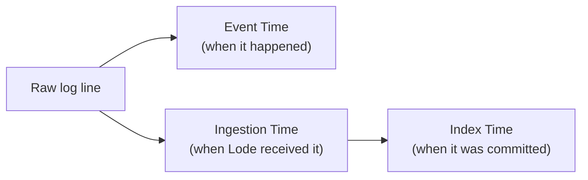
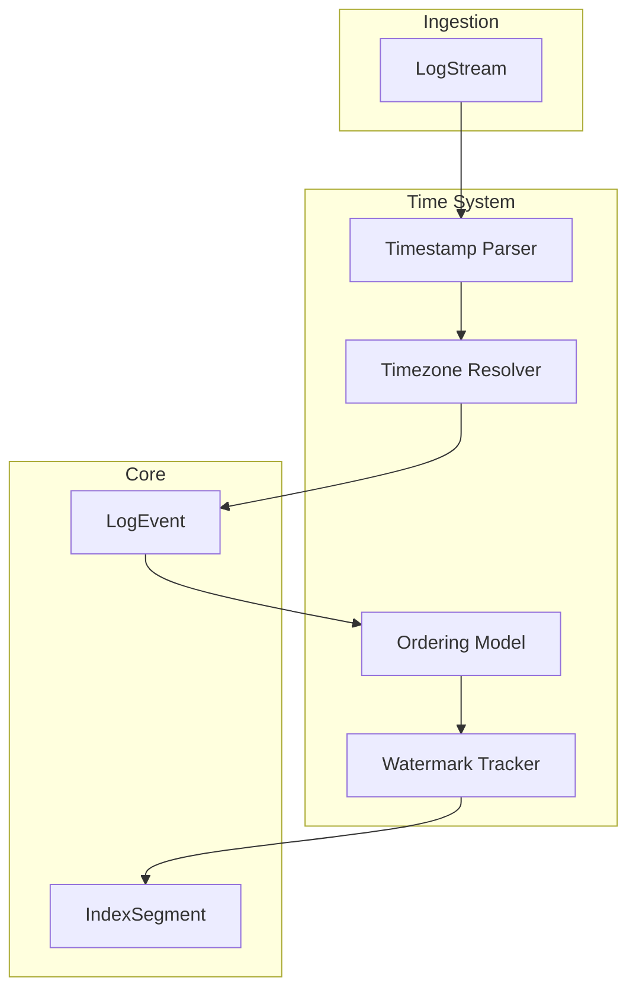
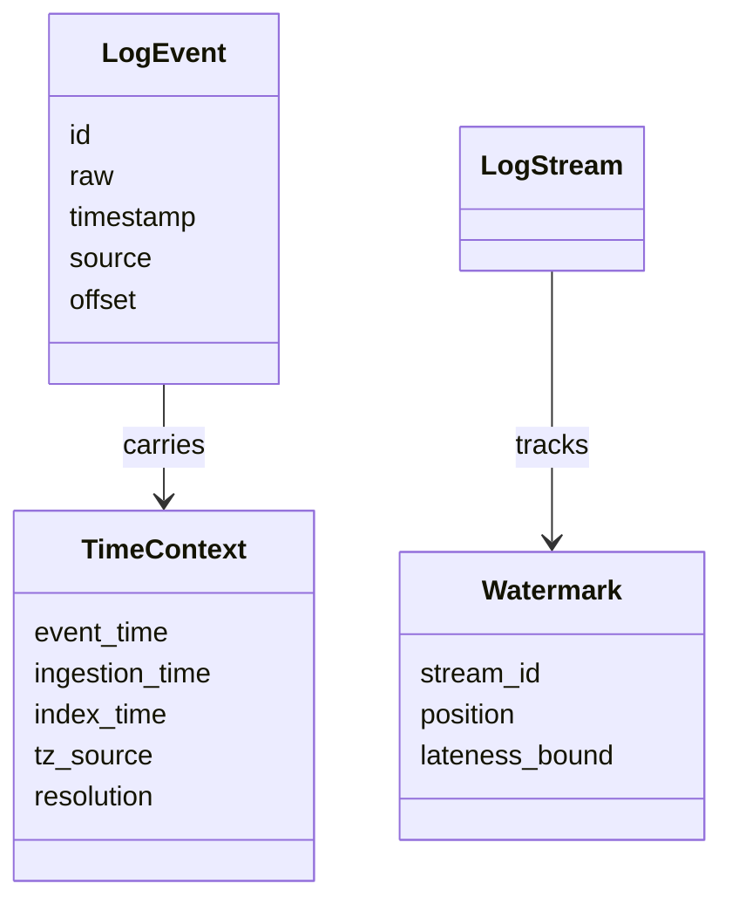
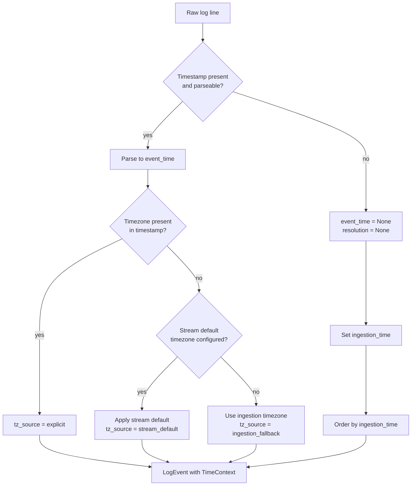
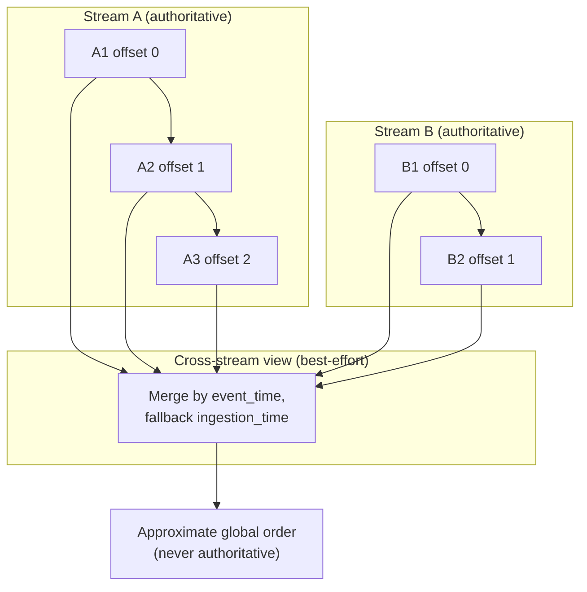

# RFC-0006 — Time System & Ordering

**Status:** Draft
**Author:** carvalhosauro
**Version:** 1.0

---

# 1. Introduction

This document defines the **Time System & Ordering** model for **Lode**.

It specifies how Lode interprets time across inconsistent log sources: how timestamps are parsed, how timezone ambiguity is resolved, how late events are handled, and how events are ordered within and across streams.

This document does not define ingestion mechanics (RFC-0001), storage (RFC-0002), or the query language (RFC-0004). It defines only the temporal semantics those components rely on.

---

# 2. Purpose

Logs lie about time. Formats differ between sources, timezones are often missing, clocks drift, and events arrive out of order. A naive system that trusts a single global clock produces wrong investigations.

The Time System exists to:

- parse heterogeneous and missing timestamps deterministically
- resolve timezone ambiguity with explicit, predictable rules
- accommodate events that arrive late or out of order
- define what ordering guarantees Lode does and does not provide

It prevents the failure mode where two events appear causally related only because of an accidental clock alignment.

---

# 3. Architecture Overview

## 3.1 The Three Times

Lode distinguishes three independent notions of time. Every event carries all three.



- **Event Time** — the timestamp the event claims, parsed from `raw`. May be `None`.
- **Ingestion Time** — when Lode received the line. Always present, assigned by Lode.
- **Index Time** — when the event was committed to an IndexSegment. Always present, monotonic per segment.

## 3.2 Position in the System

The Time System is part of the Enrichment Pipeline. It derives `timestamp` (event time) and feeds ordering decisions consumed downstream.



---

# 4. Principles

- Three times, always (event, ingestion, index are distinct and all retained)
- Never invent event time (an unparseable timestamp is `None`, never guessed silently)
- Deterministic resolution (the same line resolves to the same time every run)
- Per-stream order is authoritative (the order of arrival within a stream is trusted)
- Cross-stream order is best-effort (no perfect global timeline is ever assumed)
- Late is normal (out-of-order arrival is expected, not an error)
- Ingestion-time fallback (when event time is absent, ingestion time orders the event)

---

# 5. Core Concepts

## 5.1 Time Fields on a LogEvent

The Time System derives the temporal fields of the `LogEvent` defined in RFC-0000.



- `event_time` — parsed event timestamp, or `None`.
- `ingestion_time` — assigned at receipt.
- `index_time` — assigned at commit.
- `tz_source` — how the timezone was determined (`explicit`, `stream_default`, `ingestion_fallback`).
- `resolution` — how event time was obtained (`parsed`, `inferred_offset`, `None`).

## 5.2 Watermark

A conceptual marker of how complete a stream's timeline is.

A watermark for a stream asserts: "events with event time earlier than this position are not expected to arrive anymore." Events arriving before the watermark are **late**.

Properties:

- a watermark is per stream, never global
- a watermark advances monotonically as ingestion time progresses
- the watermark carries a `lateness_bound`, the tolerated window for late events
- the watermark is advisory; late events are accepted, never dropped

## 5.3 Ordering Model

Two distinct guarantees:

- **Per-stream ordering** — authoritative. Within a single stream, events are ordered first by `offset` (arrival), and event time is treated as metadata layered on top.
- **Cross-stream ordering** — best-effort. Across streams, events are merged by event time when present, falling back to ingestion time, and the result is explicitly approximate.

---

# 6. Processing Flow

## 6.1 Timestamp Resolution



1. Attempt to parse a timestamp from `raw` against the stream's known formats.
2. If no timestamp parses, set `event_time = None` and `resolution = None`. The event still exists (RFC-0000, DEC-001).
3. If the parsed timestamp carries a timezone, use it (`tz_source = explicit`).
4. If it does not, apply the stream's configured default timezone (`tz_source = stream_default`).
5. If no default exists, fall back to the ingestion timezone (`tz_source = ingestion_fallback`).
6. Always assign `ingestion_time`. Events with `event_time = None` are ordered by ingestion time.

## 6.2 Late-Event Handling

```mermaid
sequenceDiagram
    participant ST as LogStream
    participant TS as Time System
    participant WM as Watermark Tracker
    participant IDX as IndexSegment

    ST->>TS: event (event_time = T)
    TS->>WM: read current watermark W
    alt T >= W (on time)
        WM->>WM: advance watermark toward T
        TS->>IDX: append in arrival order
    else T < W (late)
        TS->>WM: check lateness_bound
        alt within lateness_bound
            TS->>IDX: append, flag as late
            Note over IDX: per-stream offset order preserved;<br/>event_time marks it as out of order
        else beyond lateness_bound
            TS->>IDX: append, flag as very_late
            Note over IDX: never dropped; cross-stream<br/>merges treat it as best-effort only
        end
    end
```

- Late events are accepted and appended; the raw log is never lost (RFC-0000, DEC-002).
- Per-stream `offset` order is preserved regardless of lateness.
- The watermark advances on ingestion progress, not on the late event.
- A late event lowers confidence in any cross-stream ordering that spans its window.

## 6.3 Per-Stream vs Cross-Stream Ordering



- Within each stream, order is exact and authoritative.
- The cross-stream view merges streams by event time, falling back to ingestion time, and is explicitly approximate.
- Consumers (Query Engine, Insight Engine) must treat cross-stream order as best-effort and never as proof of causality.

---

# 7. Contract

The Time System defines conceptual contracts:

```rust
fn parse_timestamp(raw: &str, formats: &[Format]) -> Option<EventTime>

fn resolve_timezone(event_time: EventTime, stream: &LogStream) -> Result<(EventTime, TzSource), TimeError>

fn assign_times(&self, event: &LogEvent) -> Result<TimeContext, TimeError>

fn classify_lateness(event: &LogEvent, watermark: &Watermark) -> Lateness
// where Lateness is OnTime | Late | VeryLate
```

`parse_timestamp` returns `None` (not an error) when the timestamp is unparseable; the event proceeds with `timestamp = None`.

---

# 8. Concurrency

Each stream tracks its own watermark independently.

Ingestion time is assigned at receipt and is monotonic per stream.

Index time is monotonic per IndexSegment.

No shared global clock is required; cross-stream merges are computed on demand and never serialize ingestion.

---

# 9. Failure Handling

Failures are local and never block ingestion.

Examples:

- unparseable timestamp → `event_time = None`, ordered by ingestion time.
- missing timezone → resolution falls back per the rules in 6.1.
- event arrives beyond `lateness_bound` → flagged `very_late`, never dropped.
- clock skew between sources → contained to cross-stream best-effort order only.

Deep recovery belongs to RFC-0013.

---

# 10. Observability

The Time System emits internal events:

- `time.timestamp.parsed`
- `time.timestamp.unparseable`
- `time.timezone.resolved`
- `time.event.late`
- `time.watermark.advanced`

These events provide observability only and never alter resolution (RFC-0009 / RFC-0011).

---

# 11. Extensibility

The Time System evolves without breaking existing semantics.

Future extensions:

- new timestamp formats per stream
- per-source `lateness_bound` tuning
- additional `tz_source` resolution strategies
- custom parsers contributed through the Plugin System (RFC-0010)

Every extension must preserve the three-times distinction and the per-stream ordering guarantee.

---

# 12. Out of Scope

This RFC does not define:

- The domain entities themselves (RFC-0000)
- Ingestion adapters and arrival mechanics (RFC-0001)
- How `index_time` and segments are stored (RFC-0002)
- Temporal composition in queries (RFC-0004)
- How insights consume ordering for correlation (RFC-0005)
- Runtime supervision and retry (RFC-0012 / RFC-0013)

These topics are specified in their own RFCs.

---

# 13. Decisions

## DEC-001 — Three Times are Distinct

Event time, ingestion time, and index time are independent and all retained. They are never collapsed into one.

## DEC-002 — Never Invent Event Time

An unparseable timestamp yields `timestamp = None`. Lode never silently fabricates an event time.

## DEC-003 — Ingestion-Time Fallback for Ordering

When `event_time` is `None`, the event is ordered by ingestion time. It is still indexed and queryable.

## DEC-004 — Per-Stream Order is Authoritative

Within a stream, arrival order (`offset`) is the source of truth. Event time is metadata on top of it.

## DEC-005 — Cross-Stream Order is Best-Effort

Lode never assumes a perfect global timeline across distinct streams. Cross-stream merges are approximate and never prove causality (consistent with RFC-0000, DEC-006).

## DEC-006 — Late Events are Never Dropped

Events arriving after the watermark are accepted and flagged, never discarded. The raw log is preserved.

## DEC-007 — Timezone Resolution is Deterministic

Timezone is resolved in a fixed order: explicit, then stream default, then ingestion fallback. The same line always resolves identically.

---

# 14. Glossary

| Term               | Definition                                                                  |
| ------------------ | --------------------------------------------------------------------------- |
| Event Time         | The timestamp an event claims, parsed from `raw`; may be `None`             |
| Ingestion Time     | When Lode received the line; always present                                 |
| Index Time         | When the event was committed to an IndexSegment; monotonic per segment      |
| Watermark          | A per-stream marker of how complete a timeline is                           |
| Lateness Bound     | The tolerated window within which late events are considered recoverable    |
| Late Event         | An event arriving with event time earlier than the current watermark        |
| Per-Stream Order   | The authoritative arrival order within a single stream                      |
| Cross-Stream Order | The best-effort, approximate order merged across distinct streams           |
| tz_source          | How a timezone was determined: explicit, stream_default, ingestion_fallback |
