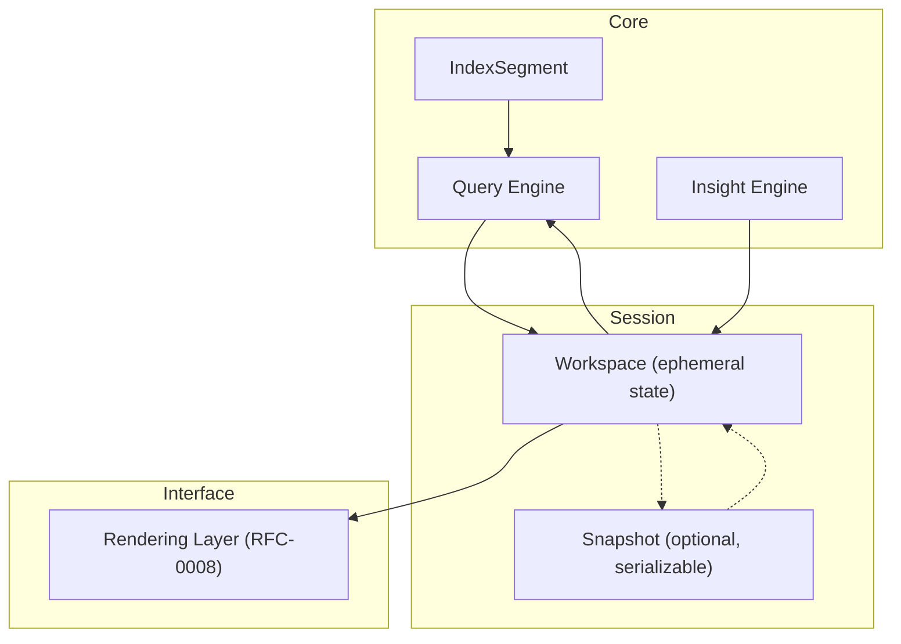
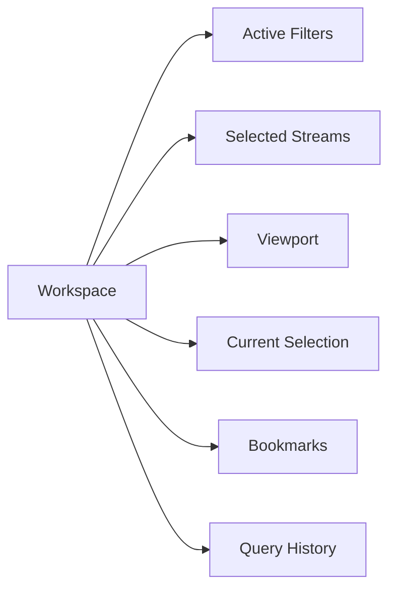
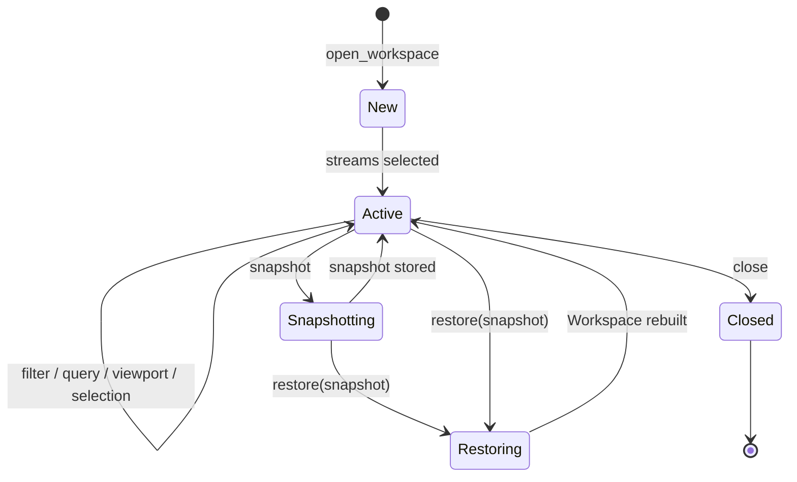
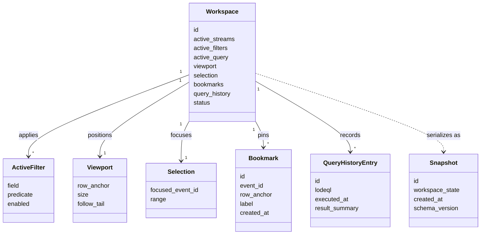
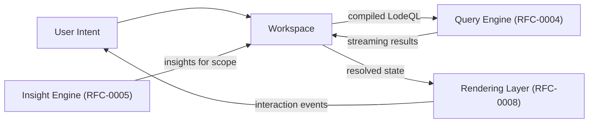

# RFC-0007 — Workspace Model

**Status:** Draft
**Author:** carvalhosauro
**Version:** 1.0

---

# 1. Introduction

This document defines the **Workspace Model** for **Lode**.

A Workspace is the ephemeral state of a single active investigation. It holds the user's intent: which streams are observed, which filters are applied, the active LodeQL queries, the viewport position, the current selection, bookmarks, and query history.

This document does not define how state is rendered (RFC-0008), how queries are evaluated (RFC-0004), or how insights are produced (RFC-0005). It defines only what investigation state exists, who coordinates it, and what invariants protect it.

---

# 2. Purpose / Motivation

A log investigation is stateful. The user narrows, jumps, marks, and re-asks. That working state must live somewhere coherent, separate from the immutable event domain.

The Workspace centralizes that state so that:

- intent (filters, queries, selection) is captured in one place
- the rendering layer becomes a pure function of Workspace plus query results
- the engine (query, insight) is driven by explicit, inspectable intent
- a session can be paused and resumed without touching the persistent event domain

It exists to prevent these failures:

- investigation state leaking into the event domain
- rendering owning state it should only read
- queries being implicit side effects of UI events
- a crash losing the user's mental map of the investigation

---

# 3. Architecture Overview

## 3.1 Where the Workspace Sits

The Workspace sits between the engine and the interface. It reads the indexed domain through the Query Engine, surfaces Insights, and exposes intent that the rendering layer consumes.



## 3.2 Internal State Components

The Workspace is composed of sub-states, each with a single responsibility.



## 3.3 Session Lifecycle

A Workspace moves through a small, explicit lifecycle. A session is born new, becomes active under investigation, can be snapshotted and restored, and is eventually closed. Snapshot and restore never leave the ephemeral domain.



---

# 4. Principles

- Ephemeral by default (the Workspace is investigation state, not persistent domain)
- Intent-holding (it expresses what to look at, never what events mean)
- Read-only over the domain (it never mutates raw events)
- Render-agnostic (it holds no pixels, rows, or layout)
- Single source of intent (filters, queries, and selection live here, not in the UI)
- Serializable (its state can be snapshotted and restored without the engine)
- Deterministic resolution (the same Workspace over the same index yields the same view)
- Coordinator, not executor (it drives the engines; it does not evaluate queries itself)

---

# 5. Core Concepts / Model

## 5.1 Relationships



## 5.2 Workspace

The active state of a single investigation.

It contains:

- active streams
- active filters
- active query
- viewport
- current selection
- bookmarks
- query history
- status

The Workspace is ephemeral state and is not part of the persistent domain.

## 5.3 Active Filters

A declarative narrowing of the observed event set.

Properties:

- each filter is a `field` plus a `predicate`
- filters are composable and individually toggleable (`enabled`)
- filters express intent; they are compiled into LodeQL by the Query Engine (RFC-0004)
- filters never alter events; they only restrict what is observed

## 5.4 Selected Streams

The subset of available LogStreams the investigation observes.

Properties:

- a Workspace observes one or more streams
- selecting a stream changes scope, never stream content
- cross-stream ordering remains partial (DEC from RFC-0000 / RFC-0006)

## 5.5 Viewport

The logical window over the resolved result set.

Fields:

- `row_anchor` — the logical position the window is anchored to
- `size` — how many logical rows are in view
- `follow_tail` — whether the viewport tracks the newest events

The Viewport is a logical position, not a rendered region. Pixel mapping belongs to RFC-0008.

## 5.6 Current Selection

The user's point of focus inside the result set.

Fields:

- `focused_event_id`
- `range` — an optional contiguous span

Selection drives detail surfacing and bookmark creation. It references events; it never copies or mutates them.

## 5.7 Bookmarks

Pinned events or positions the user wants to return to.

Fields:

- `id`
- `event_id`
- `row_anchor`
- `label`
- `created_at`

Properties:

- a bookmark references an event by id and `row_anchor` (defined as `(stream_id, source_offset)` or the event `id`, never a `segment_position`); it never stores a mutable copy
- bookmarks survive viewport movement and filter changes
- bookmarks are part of the serializable session state

## 5.8 Query History

The ordered record of LodeQL queries executed in this Workspace.

Fields per entry:

- `id`
- `lodeql` — the executed query (an AST reference, per RFC-0004, not a raw string)
- `executed_at`
- `result_summary`

Properties:

- history is append-only within a session
- a prior query can be re-activated, becoming the new `active_query`
- history is part of the serializable session state

## 5.9 Snapshot

An optional, serializable capture of Workspace state.

Fields:

- `id`
- `workspace_state`
- `created_at`
- `schema_version`

Properties:

- a Snapshot is a copy of intent (filters, streams, viewport, selection, bookmarks, history)
- a Snapshot is **not** part of the persistent event domain; it persists session intent only
- a Snapshot references events by id/`row_anchor`, never by embedding raw event data
- restoring a Snapshot rebuilds a Workspace; it does not reconstruct events

---

# 6. Processing Flow

A Workspace mediates every interaction cycle between the user's intent and the engines.

1. The user changes intent (selects a stream, toggles a filter, types a LodeQL query, moves the viewport, or selects an event).
2. The Workspace updates the corresponding sub-state.
3. If the change affects the result set, the Workspace compiles current intent into a LodeQL request and asks the Query Engine to evaluate it.
4. The Query Engine returns streaming results (RFC-0004); the Workspace resolves the viewport window against them.
5. The Insight Engine surfaces relevant Insights for the current scope (RFC-0005); the Workspace holds them for presentation.
6. The Workspace exposes resolved state to the rendering layer (RFC-0008), which reads and draws it.
7. Query executions are appended to query history; bookmarks are updated on demand.
8. On request, the Workspace serializes its state into a Snapshot, or restores from one.



The Workspace coordinates; it does not evaluate queries, detect insights, or render. Each engine keeps its own responsibility.

---

# 7. Contract

The Workspace is not the event domain, but it defines conceptual contracts for intent management:

```rust
fn open_workspace(streams: Vec<StreamId>) -> Result<Workspace, WorkspaceError>

fn apply_filter(workspace: Workspace, filter: ActiveFilter) -> Result<Workspace, WorkspaceError>

fn set_query(workspace: Workspace, lodeql: LodeQL) -> Result<Workspace, WorkspaceError>

fn move_viewport(workspace: Workspace, position: ViewportPosition) -> Result<Workspace, WorkspaceError>

fn select_event(workspace: Workspace, event_id: EventId) -> Result<Workspace, WorkspaceError>

fn add_bookmark(workspace: Workspace, event_id: EventId) -> Result<Bookmark, WorkspaceError>

fn snapshot(workspace: &Workspace) -> Result<Snapshot, WorkspaceError>

fn restore(snapshot: Snapshot) -> Result<Workspace, WorkspaceError>
```

Every operation returns a new Workspace value; none mutate the underlying events.

---

# 8. Concurrency

Each Workspace belongs to a single investigation and is updated as an isolated unit of state.

- intent updates are serialized per Workspace; the latest intent wins
- query evaluation is asynchronous; results arrive into the Workspace as they stream
- a slow or in-flight query never blocks intent updates; superseded results are discarded
- the Workspace observes the index; it never holds locks on IndexSegments
- multiple Workspaces may observe the same streams independently

---

# 9. Failure Handling

Failures are contained to the session and never corrupt the event domain.

Examples:

- query evaluation fails → the Workspace keeps prior results and surfaces the error
- a bookmarked event is no longer reachable → the bookmark is marked `stale`, never deleted silently
- Snapshot restore with an incompatible `schema_version` → restore is rejected, the Workspace is left untouched
- a selected stream becomes unavailable → it is dropped from the active set, intent is preserved

A Workspace can always be discarded and reopened. Recovery beyond the session belongs to the Runtime (RFC-0012) and Failure Handling (RFC-0013).

---

# 10. Observability

The Workspace emits internal events for observability (RFC-0009 / RFC-0011):

- `workspace.opened`
- `workspace.filter.changed`
- `workspace.query.executed`
- `workspace.viewport.moved`
- `workspace.bookmark.added`
- `workspace.snapshot.created`
- `workspace.restored`

These events report intent transitions; they never alter the events being investigated.

---

# 11. Extensibility

The Workspace evolves by adding new kinds of intent without changing the engines:

- new filter predicates
- new viewport modes (e.g., follow strategies)
- new bookmark kinds (position, range, query)
- richer query history (tagging, pinning)
- new Snapshot `schema_version` with forward/backward negotiation

Every extension must keep the Workspace ephemeral and read-only over the event domain.

---

# 12. Out of Scope

This RFC does not define:

- Query language and evaluation (RFC-0004)
- Insight heuristics (RFC-0005)
- Time and ordering semantics (RFC-0006)
- Rendering, layout, and interaction drawing (RFC-0008)
- Telemetry transport (RFC-0009 / RFC-0011)
- Runtime supervision and recovery (RFC-0012 / RFC-0013)

These topics are specified in their own RFCs.

---

# 13. Decisions

## DEC-001 — Workspace is Ephemeral Domain State

The Workspace is investigation state, not persistent domain. It is restated from RFC-0000 (DEC-005) and owned here.

## DEC-002 — Workspace Holds Intent, Not Meaning

The Workspace expresses what to observe (filters, queries, selection). It never assigns meaning to events; classification and insight belong to the engines.

## DEC-003 — Workspace Never Mutates Raw Events

The Workspace reads the domain through the Query Engine. It holds references by id and `row_anchor` and never alters or copies raw event data.

## DEC-004 — Persistence is an Optional Serializable Snapshot

Session persistence is a Snapshot of intent, not part of the persistent event domain. A Snapshot stores filters, streams, viewport, selection, bookmarks, and history; restoring it rebuilds a Workspace, not events.

## DEC-005 — Rendering Reads, Workspace Owns

The Workspace owns session state; the rendering layer (RFC-0008) is a read-only consumer. State never originates in the UI.

## DEC-006 — Latest Intent Wins

Intent updates are serialized per Workspace. In-flight query results that no longer match current intent are discarded.

---

# 14. Glossary

| Term               | Definition                                                              |
| ------------------ | ----------------------------------------------------------------------- |
| Workspace          | The ephemeral state of a single active investigation                    |
| Active Filter      | A declarative, toggleable narrowing of the observed event set           |
| Selected Streams   | The subset of LogStreams the investigation observes                     |
| Viewport           | The logical window over the resolved result set                         |
| Selection          | The user's current point of focus inside the result set                 |
| Bookmark           | A pinned reference to an event or position                              |
| Query History      | The ordered record of LodeQL queries executed in a Workspace            |
| Snapshot           | An optional, serializable capture of Workspace intent                   |
| Intent             | What the user wants to observe, as opposed to what events mean          |
