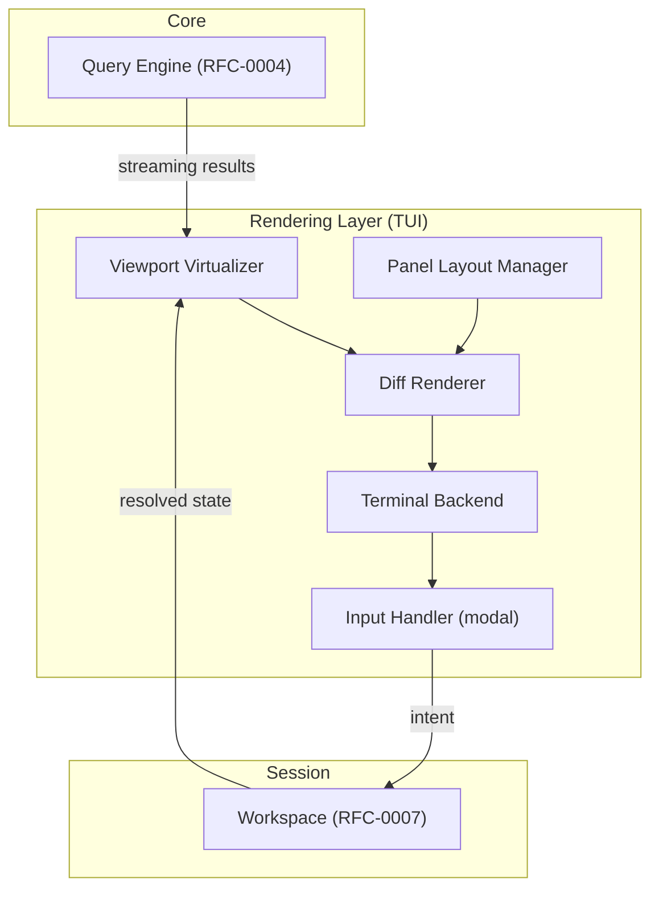
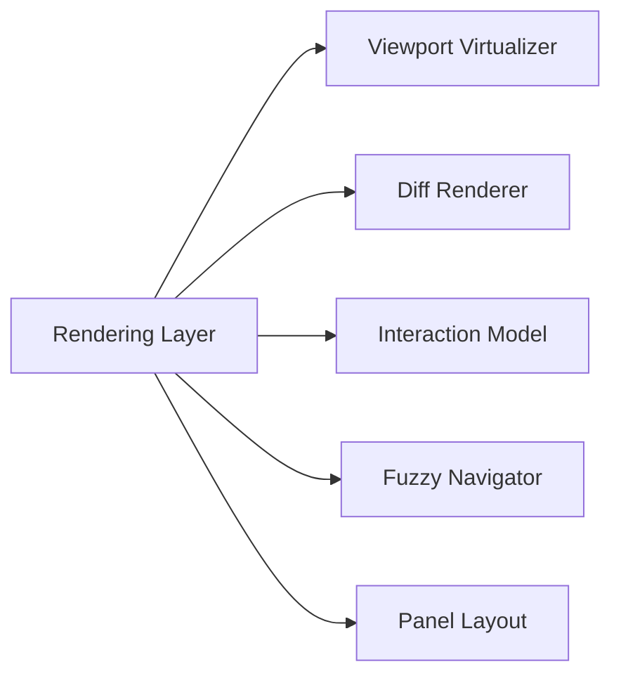
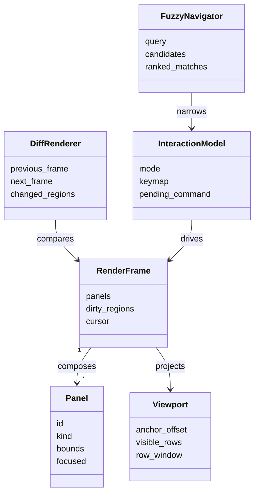
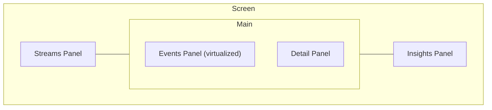
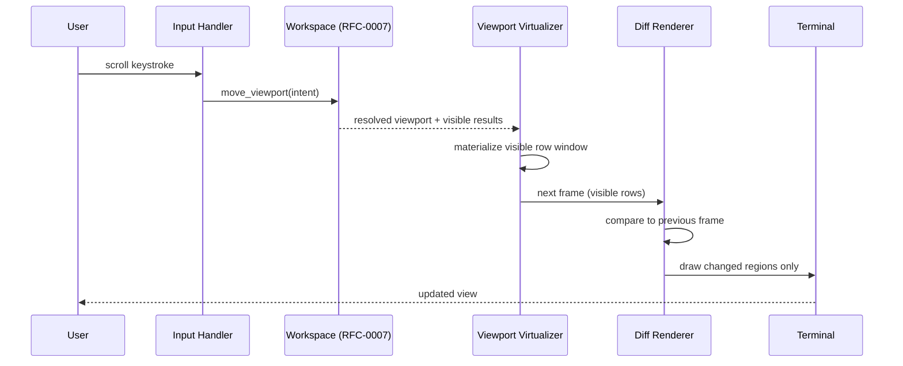

# RFC-0008 — Rendering Layer (TUI)

**Status:** Draft
**Author:** carvalhosauro
**Version:** 1.0

---

# 1. Introduction

This document defines the **Rendering Layer** for **Lode**, with the terminal user interface (TUI) as its first concrete implementation.

The rendering layer turns Workspace state (RFC-0007) and query results (RFC-0004) into a visible, navigable view. It draws a virtualized viewport over huge streams, redraws only changed regions, and exposes a keyboard-driven, modal interaction model with fzf-like fuzzy navigation across a multi-panel layout.

This document does not define investigation state (RFC-0007), query evaluation (RFC-0004), or insight production (RFC-0005). It defines only how state is presented and how interaction is captured.

The TUI is one interface over the engine, not the engine itself. A CLI, an API, or a graphical client could render the same Workspace.

---

# 2. Purpose / Motivation

Lode investigates streams far larger than any screen. The rendering layer must present them without materializing them, react instantly to navigation, and keep the user oriented across many views at once.

It exists to:

- present millions of events through a small visible window
- redraw efficiently, touching only what changed
- offer fast, keyboard-only navigation suited to investigation
- compose multiple views (streams, events, detail, insights) coherently

It prevents these failures:

- rendering the entire result set into memory to show a screen
- full-screen repaints on every keystroke
- the interface owning state that belongs to the Workspace
- a single interface assumption leaking into the engine

---

# 3. Architecture Overview

## 3.1 Where the Rendering Layer Sits

The rendering layer is a read-only consumer. It reads Workspace state and query results, and emits interaction events back as intent. It owns no domain state.



## 3.2 Internal Components



---

# 4. Principles

- Read-only over state (the layer reads the Workspace; it never owns domain state)
- Virtualized (render only the rows currently visible)
- Incremental (redraw only changed regions, never the whole screen by default)
- Keyboard-first (navigation is modal and keyboard-driven)
- Composable layout (independent panels arranged together)
- Interface-pluggable (the TUI is one of many possible renderers)
- Deterministic projection (the same Workspace plus results renders the same view)
- Intent-emitting (interaction produces intent for the Workspace, never direct domain mutation)

---

# 5. Core Concepts / Model

## 5.1 Relationships



## 5.2 Virtualized Viewport

Renders only the rows currently visible over a potentially huge result set.

Properties:

- the visible window is derived from the Workspace viewport (`anchor_offset`, `size`)
- only rows in the window are materialized for drawing
- scrolling shifts the window; it does not load the whole result set
- the result set is consumed as a stream (RFC-0004), never fully buffered

## 5.3 Diff Rendering

Computes the minimal set of changed regions between the previous and next frame.

Properties:

- the renderer keeps the previously drawn frame
- it draws only `changed_regions`, not the full screen
- unchanged panels and rows are left untouched
- a forced full repaint is the exception (e.g., resize), not the default

## 5.4 Interaction Model

A modal, keyboard-driven command model.

Properties:

- `mode` selects which keymap is active (e.g., normal, filter, command)
- keystrokes resolve to intent (move, filter, select, bookmark, run query)
- intent is sent to the Workspace (RFC-0007); the layer never mutates events
- the model is deterministic: a key in a mode always maps to the same intent

## 5.5 Fuzzy Navigator

An fzf-like incremental filter for jumping and narrowing.

Properties:

- candidates come from current state (streams, templates, bookmarks, history)
- a partial query produces `ranked_matches` incrementally
- selecting a match emits intent (jump to position, select stream, re-run query)
- the navigator narrows the view; it never alters the underlying events

## 5.6 Panel Layout

Arranges independent panels into a coherent screen.

Panel kinds:

- **Streams** — selected and available LogStreams
- **Events** — the virtualized result window
- **Detail** — the currently selected event
- **Insights** — Insights surfaced for the current scope (RFC-0005)

Properties:

- each panel reads a slice of Workspace state
- exactly one panel holds focus; focus routes keystrokes
- panels are laid out by bounds; layout is resizable and rearrangeable



---

# 6. Processing Flow

Each render cycle is driven by either an interaction or a state change.

1. The input handler reads a keystroke and resolves it against the active mode's keymap.
2. The resolved intent is sent to the Workspace (RFC-0007), which updates state and may trigger a query (RFC-0004).
3. The viewport virtualizer reads the Workspace viewport and the streaming results, materializing only the visible row window.
4. The panel layout manager assigns the visible content to its panels.
5. The diff renderer compares the next frame against the previous one and computes changed regions.
6. The terminal backend draws only the changed regions.
7. The frame becomes the new previous frame, ready for the next cycle.



Each step has a single responsibility. The layer reads and draws; it never evaluates queries or owns state.

---

# 7. Contract

The rendering layer defines conceptual contracts for projection and interaction:

```rust
fn render(workspace: &Workspace, results: &QueryResults) -> Result<RenderFrame, RenderError>

fn resolve_window(viewport: &Viewport, results: &QueryResults) -> Result<RowWindow, RenderError>

fn diff(previous_frame: &RenderFrame, next_frame: &RenderFrame) -> Result<ChangedRegions, RenderError>

fn handle_key(interaction_model: &InteractionModel, key: Key) -> Result<Intent, RenderError>

fn fuzzy_match(navigator: &FuzzyNavigator, query: &str) -> Result<RankedMatches, RenderError>
```

Every contract reads state and produces a frame or an intent; none mutate events.

---

# 8. Concurrency

The rendering layer is driven by two asynchronous sources: input and state updates.

- input handling and frame drawing run on a single render loop to keep frames consistent
- streaming query results arrive asynchronously and update the visible window incrementally
- a slow query never blocks input; the view shows partial results and fills in as they stream
- only the visible window is ever materialized, bounding memory regardless of stream size

---

# 9. Failure Handling

Rendering failures are visual and never reach the event domain.

Examples:

- a query result is delayed → the panel shows a pending state, prior content remains
- a row cannot be formatted → it renders as its raw line, never blocking the frame
- terminal resize invalidates the frame → a single full repaint recovers, then diffing resumes
- an unbound key in the active mode → ignored, no intent emitted

The view can always be rebuilt from the Workspace. Recovery beyond the session belongs to the Runtime (RFC-0012) and Failure Handling (RFC-0013).

---

# 10. Observability

The rendering layer emits internal events for observability (RFC-0009 / RFC-0011):

- `render.frame.drawn`
- `render.viewport.scrolled`
- `render.mode.changed`
- `render.fuzzy.invoked`
- `render.panel.focused`

These events report interface activity; they never alter the events being investigated.

---

# 11. Extensibility

The rendering layer evolves by adding interfaces and views without changing the engine:

- new renderers (CLI, API, graphical) over the same Workspace
- new panel kinds reading additional Workspace slices
- new interaction modes and keymaps
- new fuzzy candidate sources
- alternative diff strategies for different backends

Every extension must keep the layer read-only over the domain and intent-emitting toward the Workspace.

---

# 12. Out of Scope

This RFC does not define:

- Query language and evaluation (RFC-0004)
- Insight heuristics (RFC-0005)
- Time and ordering semantics (RFC-0006)
- Investigation state, filters, bookmarks, and snapshots (RFC-0007)
- Telemetry transport (RFC-0009 / RFC-0011)
- Runtime supervision and recovery (RFC-0012 / RFC-0013)

These topics are specified in their own RFCs.

---

# 13. Decisions

## DEC-001 — Rendering Owns No Domain State

The layer reads the Workspace (RFC-0007) and query results (RFC-0004). It holds frame and layout state only; it never owns investigation or event state.

## DEC-002 — The TUI is One Interface, Not the Engine

The rendering layer is pluggable. The TUI is the first implementation; CLI, API, and graphical clients are equally valid renderers over the same Workspace.

## DEC-003 — Render Only What is Visible

The viewport is virtualized. Only the visible row window is materialized, regardless of result-set size.

## DEC-004 — Redraw Only What Changed

Rendering is incremental. The diff renderer draws changed regions only; full repaints are the exception, not the default.

## DEC-005 — Interaction Produces Intent, Not Mutation

Keystrokes resolve to intent sent to the Workspace. The layer never mutates raw events.

## DEC-006 — Navigation is Keyboard-First and Modal

The interaction model is modal and keyboard-driven, with fzf-like fuzzy navigation for jumping and narrowing.

---

# 14. Glossary

| Term                | Definition                                                            |
| ------------------- | --------------------------------------------------------------------- |
| Rendering Layer     | The component that projects Workspace state into a visible view       |
| TUI                 | Terminal user interface; the first rendering-layer implementation     |
| Virtualized Viewport| A window that renders only the currently visible rows                 |
| Diff Rendering      | Incremental redraw of only the changed regions of a frame             |
| Interaction Model   | The modal, keyboard-driven mapping of keys to intent                  |
| Fuzzy Navigator     | An fzf-like incremental filter for jumping and narrowing              |
| Panel               | An independent view of a slice of Workspace state                     |
| RenderFrame         | A composed, drawable projection of the current view                   |
| Intent              | An interaction-derived request sent to the Workspace                  |
