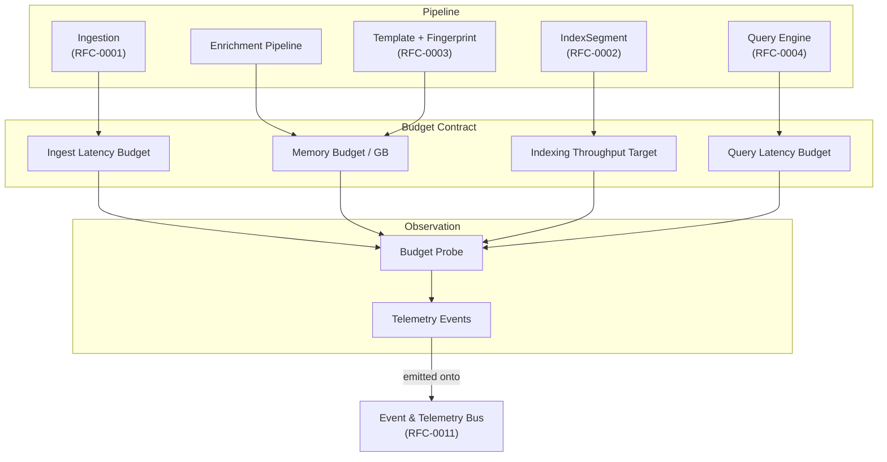
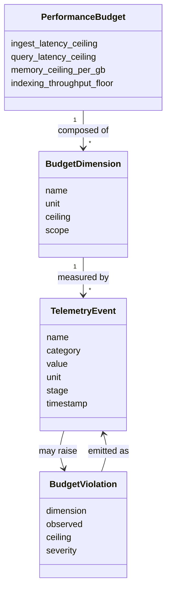
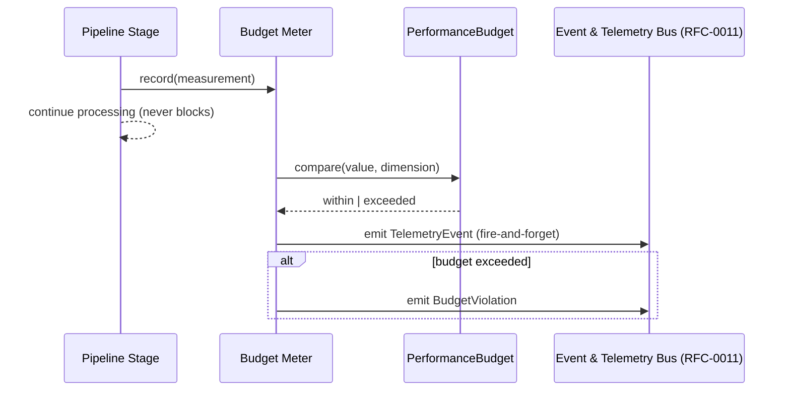

# RFC-0009 — Performance Budget & Telemetry Model

**Status:** Draft
**Author:** carvalhosauro
**Version:** 1.0

---

# 1. Introduction

This document defines the performance budget and telemetry model for **Lode**.

Its goal is to establish the measurable limits the engine must respect and the set of telemetry events that describe how the engine is behaving at runtime.

A performance budget is treated as a contract: a quantified ceiling that the engine must not exceed under expected load. Telemetry is the means by which adherence to that contract is observed.

This document does not define how telemetry is transported, buffered, or delivered to consumers. That is the responsibility of the Event & Telemetry Bus (RFC-0011). This document defines *which* budgets exist and *what* telemetry is measured; it does not define the channel that carries it.

---

# 2. Purpose / Motivation

Lode processes continuous and batch log streams under bounded resources. Without explicit budgets, performance degrades silently and unpredictably as data volume grows.

This RFC exists to:

- Make performance an explicit, enforceable contract instead of an emergent property.
- Bound memory so a large stream cannot exhaust the host.
- Give every pipeline stage a latency and throughput target.
- Define the telemetry vocabulary that proves whether budgets are met.
- Make budget violations observable and bound the engine's reaction to them.

Problems it prevents:

- Unbounded memory growth proportional to ingested volume.
- Latency creep that is only noticed when the system is already unusable.
- Unobservable slowdowns with no measurable cause.
- Ad-hoc, inconsistent metrics scattered across components.

---

# 3. Architecture Overview

## 3.1 Budgets per Pipeline Stage

The performance budget is partitioned across the pipeline stages defined in RFC-0000. Each stage owns a slice of the global budget and emits telemetry against it.



## 3.2 Position in the System

The budget model is a cross-cutting contract. It does not sit inside the data path; it observes the data path and compares observed values against declared ceilings.

- The pipeline produces work and measurements.
- The budget defines ceilings for those measurements.
- Telemetry events report measurements onto the bus (RFC-0011).
- No budget evaluation ever blocks or mutates the data path.

---

# 4. Principles

Lode's performance model follows these principles:

- Budget-as-contract (every limit is explicit and quantified)
- Bounded memory (memory scales with a configured ceiling, not with ingested volume)
- Per-stage accountability (each stage owns its budget and its telemetry)
- Non-intrusive measurement (measuring never changes the result being measured)
- Observable-by-default (every budget has a corresponding telemetry event)
- Degrade, never crash (a violated budget triggers degraded behavior, not failure)
- Deterministic targets (budgets are fixed contracts, not best-effort hints)
- Transport-agnostic (budgets and telemetry definitions do not depend on RFC-0011)

---

# 5. Core Concepts / Model

## 5.1 Budget and Telemetry Relationships



## 5.2 Performance Budget

Represents the full set of ceilings and floors the engine must respect.

Responsibilities:

- declare each budget dimension and its unit
- declare the ceiling (maximum) or floor (minimum) for each dimension
- declare the scope each dimension applies to (per-event, per-stream, per-query, global)

A PerformanceBudget is declarative. It performs no measurement itself.

## 5.3 Budget Dimensions

The model defines four primary budget dimensions.

### 5.3.1 Ingest Latency Budget

The maximum time from a raw line entering the ingestion layer to the resulting LogEvent being written to an IndexSegment.

- Scope: per-event, measured as a rolling percentile per stream.
- Unit: milliseconds.
- Contract: the p99 ingest latency must remain under the declared ceiling for a healthy stream.

### 5.3.2 Query Latency Budget

The maximum time from query submission to the first result and to full completion.

- Scope: per-query.
- Unit: milliseconds.
- Contract: time-to-first-result and time-to-completion each have a ceiling. Streaming results (RFC-0004) are evaluated on time-to-first-result.

### 5.3.3 Memory Budget per GB of Logs

The bounded memory model. Working memory is capped relative to a configured ceiling, not to the total ingested volume.

- Scope: global and per-stream.
- Unit: resident bytes per GB of logs under management.
- Contract: resident working set must stay under the ceiling regardless of how much log data has been ingested. Cold data lives in immutable segments on disk (RFC-0002), not in memory.

### 5.3.4 Indexing Throughput Target

The minimum sustained rate at which events are classified and written to segments.

- Scope: per-stream and global.
- Unit: events per second.
- Contract: sustained indexing throughput must stay above the declared floor under expected load.

## 5.4 Telemetry Event

Represents a single measurement emitted for observability.

Fields:

- `name`
- `category`
- `value`
- `unit`
- `stage`
- `timestamp`

Properties:

- A TelemetryEvent is a fact about a measurement, never a command.
- Emitting it never alters the measured operation.
- It is published onto the Event & Telemetry Bus (RFC-0011).

## 5.5 Telemetry Event Categories

| Category    | Describes                                  | Example                          |
| ----------- | ------------------------------------------ | -------------------------------- |
| latency     | duration of a stage or operation           | `telemetry.ingest.latency`       |
| throughput  | rate of work over time                     | `telemetry.index.throughput`     |
| memory      | resident working set                       | `telemetry.memory.resident`      |
| saturation  | queue depth and backpressure pressure      | `telemetry.ingest.queue_depth`   |
| budget      | a budget evaluation outcome                | `telemetry.budget.violation`     |

## 5.6 Budget Violation

Represents the outcome of an observed value crossing a budget ceiling or floor.

Fields:

- `dimension`
- `observed`
- `ceiling`
- `severity`

A BudgetViolation is itself emitted as a telemetry event in the `budget` category. It records that the contract was exceeded; it does not itself perform recovery.

---

# 6. Processing Flow

Telemetry emission follows a fixed, non-intrusive flow on every measured stage:

1. A pipeline stage completes a unit of work and records a measurement.
2. The measurement is compared against the relevant budget dimension.
3. A TelemetryEvent is constructed for the measurement.
4. If the measurement crosses a ceiling or floor, a BudgetViolation is also constructed.
5. Events are handed to the Event & Telemetry Bus (RFC-0011) as fire-and-forget.
6. The stage continues immediately; it never waits on emission or evaluation.



The measurement path and the emission path are separated. The stage's result is identical whether or not telemetry is enabled.

---

# 7. Contract

The performance model defines conceptual contracts:

```rust
fn record(stage: Stage, measurement: Measurement) -> Result<TelemetryEvent, TelemetryError>

fn evaluate(measurement: Measurement, dimension: &BudgetDimension) -> BudgetOutcome
// where BudgetOutcome is Within | Exceeded(BudgetViolation)

fn emit(event: TelemetryEvent) -> Result<(), TelemetryError>

fn budget_for(dimension: DimensionId) -> Result<BudgetDimension, BudgetError>
// BudgetError::UnknownDimension when the dimension is not registered
```

`emit` returns `Ok(())` unconditionally and synchronously; delivery is the bus's concern (RFC-0011). Measurement recording must never return `Err(_)` due to a full or unavailable telemetry channel.

---

# 8. Failure Handling

A violated budget is a degraded-mode signal, not a crash.

Examples:

- ingest latency over ceiling → emit `telemetry.budget.violation`, enter degraded ingestion
- memory over ceiling → shed in-memory caches, prefer disk segments (RFC-0002)
- throughput under floor → emit violation, signal backpressure upstream (RFC-0001)
- telemetry channel unavailable → drop telemetry, never block the stage

Degraded behavior is bounded here only as a signal. The recovery strategy, retry policy, and mode transitions belong to the Failure Handling & Recovery Model (RFC-0013).

---

# 9. Observability

This RFC defines the telemetry events the engine emits:

- `telemetry.ingest.latency`
- `telemetry.query.latency`
- `telemetry.memory.resident`
- `telemetry.index.throughput`
- `telemetry.ingest.queue_depth`
- `telemetry.budget.violation`

These coexist with the domain events of RFC-0000 (`domain.event.created`, `domain.event.enriched`, `domain.template.assigned`, `domain.insight.generated`). All of them travel over the Event & Telemetry Bus (RFC-0011). Emitting them never alters the processing flow.

---

# 10. Extensibility

The model evolves without breaking existing consumers:

- new budget dimensions may be added with their own ceiling and unit
- new telemetry categories may be introduced
- existing event names are stable contracts and are never repurposed
- ceilings may be tuned per deployment without changing event definitions

Every new dimension must declare its scope, unit, and limit, and must define a corresponding telemetry event.

---

# 11. Out of Scope

This RFC does not define:

- Domain entities and their fields (RFC-0000)
- Ingestion mechanics and backpressure transport (RFC-0001)
- Segment storage and on-disk layout (RFC-0002)
- Query evaluation internals (RFC-0004)
- The transport, subscription, and delivery of telemetry (RFC-0011)
- Supervision and isolation (RFC-0012)
- Recovery, retry, and degraded-mode transitions (RFC-0013)

These topics are specified in their own RFCs.

---

# 12. Decisions

## DEC-001 — A Budget is a Contract, not a Hint

Every budget dimension is an explicit ceiling or floor the engine must not exceed under expected load. Budgets are not best-effort targets.

## DEC-002 — Memory is Bounded, not Volume-Proportional

Working memory scales with a configured ceiling per GB of logs, never with total ingested volume. Cold data lives in immutable segments on disk.

## DEC-003 — Measurement is Non-Intrusive

Recording and emitting telemetry never alters the result or timing semantics of the measured operation. The data path is identical with telemetry on or off.

## DEC-004 — Emission is Fire-and-Forget

`emit/1` always succeeds synchronously and never blocks the producing stage. Delivery guarantees, if any, belong to the bus (RFC-0011).

## DEC-005 — Budget Violation is a Telemetry Event

A crossed ceiling is reported as a first-class telemetry event in the `budget` category. Detection is owned here; recovery is owned by RFC-0013.

## DEC-006 — Budgets Define What, the Bus Defines How

This RFC owns which budgets and telemetry exist. RFC-0011 owns how telemetry is transported and consumed.

---

# 13. Glossary

| Term                  | Definition                                                              |
| --------------------- | ----------------------------------------------------------------------- |
| Performance Budget    | The full set of declared ceilings and floors the engine must respect    |
| Budget Dimension      | A single measurable limit with a name, unit, scope, and ceiling/floor   |
| Ingest Latency Budget | The maximum time from raw line to indexed event                         |
| Query Latency Budget  | The maximum time to first result and to completion                      |
| Memory Budget per GB  | The bounded memory ceiling relative to logs under management            |
| Indexing Throughput   | The minimum sustained classify-and-write rate, in events per second     |
| Telemetry Event       | A single measurement emitted for observability                          |
| Budget Violation      | The recorded outcome of an observed value crossing a budget limit       |
| Degraded Behavior     | A bounded reaction to a violated budget; recovery is deferred to RFC-0013 |
