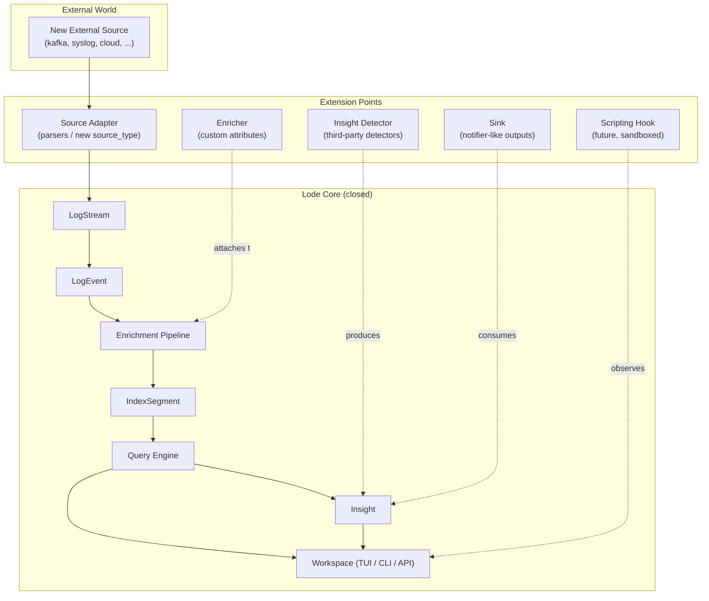
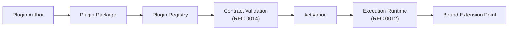
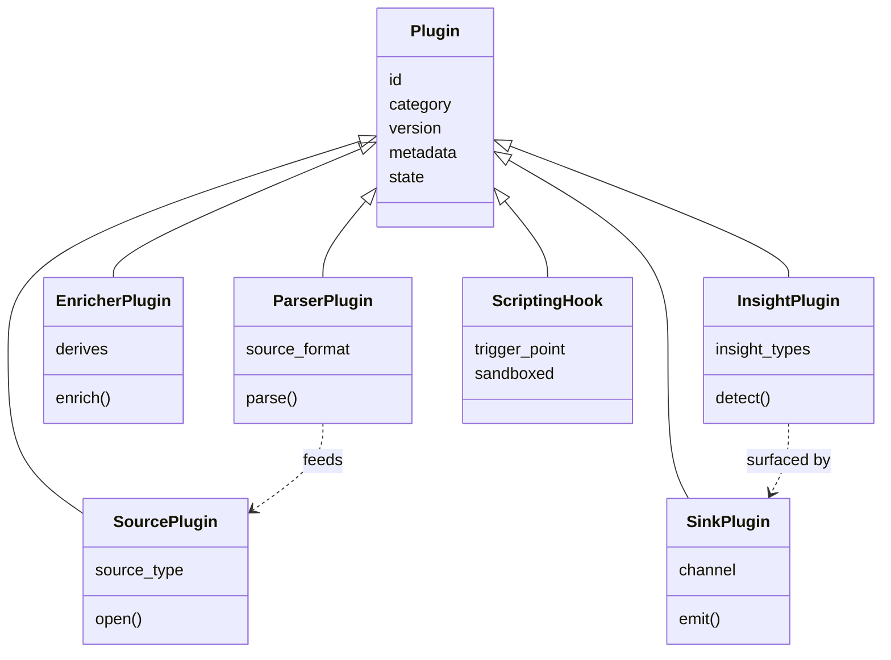
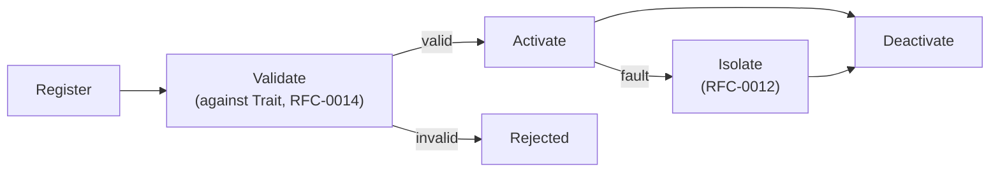
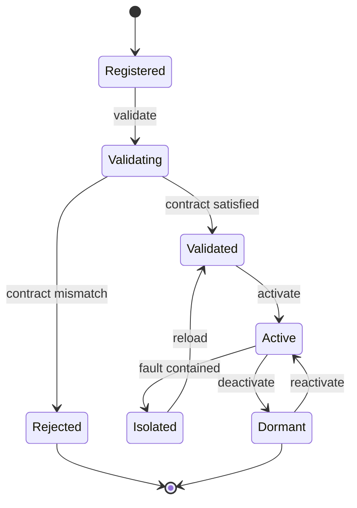

# RFC-0010 — Plugin System

**Status:** Draft
**Author:** carvalhosauro
**Version:** 1.0

---

# 1. Introduction

This document defines the **Plugin System** for **Lode**.

Its goal is to describe how external code extends Lode without modifying the application core: new parsers, new insight detectors, new external data sources, and future scripting hooks.

This document defines extension points and the plugin lifecycle. It does not define the formal interfaces a plugin implements. Those interfaces are **Trait Contracts (RFC-0014)**, and a plugin is valid only when it satisfies them.

---

# 2. Purpose / Motivation

Lode must evolve without growing its core.

The Domain Model (RFC-0000) already anticipates extension: new `source_type` values, new Insight types, new enrichers, new template classifiers. The Plugin System turns those anticipated extension points into a single, governed mechanism.

Problems it prevents:

- core edits for every new log format
- ad-hoc, unsupervised third-party code running inside the engine
- silent corruption of shared state by a faulty extension
- extensions that bypass the conceptual contracts of the engine

A plugin is always optional, always isolated, and always bound to a contract.

---

# 3. Architecture Overview

## 3.1 Extension Points Across the Pipeline

A plugin attaches only at declared **extension points**. It never reaches into the core flow between them.



## 3.2 Where the Plugin System Sits

The Plugin System is a registry and lifecycle manager. It owns no domain logic. It loads candidate extensions, validates them against contracts, activates the valid ones, and isolates the ones that fail.



---

# 4. Principles

The Plugin System follows these design principles:

- Contract-bound (a plugin is meaningless without a trait from RFC-0014)
- Core-closed (extension happens at declared points, never by patching the core)
- Isolated (a failing plugin never takes down a stream or the engine)
- Optional (the engine runs fully with zero plugins)
- Validated-before-active (no plugin runs before its contract is verified)
- Capability-scoped (a plugin sees only the data its category grants)
- Observable (every lifecycle transition emits an internal event)
- Deterministic registration (same plugin set produces the same active topology)

---

# 5. Core Concepts

## 5.1 Plugin Categories

A **Plugin** is an external unit bound to exactly one **category**. The category determines which Trait Contract it must satisfy and which extension point it attaches to.



## 5.2 Custom Parsers

A parser plugin turns a new source format into LogEvents.

Responsibilities:

- accept a raw input shape
- produce structured LogEvents with `raw` preserved
- never assign `template_id` (templates remain derived, RFC-0000)

A parser plugin satisfies the **Enricher** / parsing seam of the Enrichment Pipeline. It may also act as an enricher, deriving additional `attributes`.

A parser plugin never mutates `raw`.

## 5.3 Custom Insights

An insight plugin is a third-party detector that produces Insight entities.

Responsibilities:

- read indexed events or query results
- emit Insight entities (`type`, `confidence`, `description`, `related_events`)
- declare the `insight_types` it can produce

It satisfies the **InsightDetector** trait (RFC-0014). It never writes to IndexSegments and never mutates events.

## 5.4 External Data Sources

A source plugin introduces a new `source_type` beyond the built-in set (file, docker, stdin, journald).

Responsibilities:

- declare a new `source_type`
- open and stream raw input into a LogStream
- honour the stream `mode` (`batch`, `tail`, `hybrid`)

It satisfies the **SourceAdapter** trait (RFC-0014). Ingestion mechanics remain owned by RFC-0001.

## 5.5 Sinks

A sink plugin is a notifier-like output: it consumes Insights or query results and emits them outward (a channel, a webhook, a file).

It satisfies a **Notifier-like sink** trait (RFC-0014). A sink is read-only with respect to the domain: it consumes, it never mutates.

## 5.6 Scripting Hooks

A scripting hook is a **future** extension point. It allows user-supplied logic to run at declared trigger points (for example, on a matched insight, on a viewport selection).

Scripting hooks raise a sandboxing concern: arbitrary user logic must run with constrained capabilities, bounded resources, and no access to raw filesystem or network beyond what its category grants. The sandbox model is deferred; this RFC reserves the extension point only.

## 5.7 Plugin Registry

The registry is the authority on which plugins exist and what state each is in. It holds plugin identity, category, version, declared contract, and current lifecycle state. It is the only component allowed to move a plugin between states.

---

# 6. Processing Flow

The plugin lifecycle is a strict progression. A plugin never skips a stage.

1. **Register** — the registry records the plugin's id, category, and declared version.
2. **Validate** — the plugin is checked against the Trait Contract for its category (RFC-0014). Missing or mismatched trait implementations reject the plugin.
3. **Activate** — a validated plugin is bound to its extension point and made live.
4. **Isolate** — a failing active plugin is contained per the Execution Runtime (RFC-0012); its failure never propagates to the stream or engine.
5. **Deactivate** — a plugin is unbound and returned to a dormant state.



## 6.1 Lifecycle States



Each transition emits an internal event for observability. A plugin in `Isolated` state contributes nothing to the pipeline until reloaded.

---

# 7. Contract

The Plugin System exposes conceptual contracts for managing plugins. The contracts a plugin itself implements belong to RFC-0014.

```rust
fn register(plugin: Plugin) -> Result<PluginId, PluginError>;

fn validate(plugin_id: PluginId) -> Result<(), PluginError>;

fn activate(plugin_id: PluginId) -> Result<(), PluginError>;

fn isolate(plugin_id: PluginId, fault: PluginFault) -> Result<(), PluginError>;

fn deactivate(plugin_id: PluginId) -> Result<(), PluginError>;
```

Validation always precedes activation. A plugin that fails validation is never activated.

---

# 8. Concurrency

Each active plugin runs in isolation, consistent with the per-stream isolation model (RFC-0012).

A source plugin runs per stream, like any other adapter.

An insight plugin runs concurrently with the engine and never blocks query evaluation.

Registry transitions are serialized: a plugin is in exactly one state at a time.

---

# 9. Failure Handling

A plugin fault is local.

Examples:

- parser plugin raises → the offending event is marked `unparsed`, the plugin stays active
- repeated faults → the plugin is moved to `Isolated`
- source plugin disconnects → its stream degrades; other streams are unaffected
- insight plugin crashes → no Insight is produced; the engine continues

Failure containment and retry policy are delegated to the Execution Runtime (RFC-0012). Deep recovery semantics belong to RFC-0013.

---

# 10. Observability

The Plugin System emits internal events:

- `plugin.registered`
- `plugin.validated`
- `plugin.rejected`
- `plugin.activated`
- `plugin.isolated`
- `plugin.deactivated`

These events feed the telemetry and event bus (RFC-0009 / RFC-0011) and never alter the lifecycle itself.

---

# 11. Extensibility

The Plugin System is itself the primary extension mechanism of Lode. It evolves by adding categories, not by changing the core.

Future extension examples:

- new plugin categories bound to new traits
- a formal sandbox model for scripting hooks
- signed / verified plugin packages
- per-plugin capability grants

Every new category must declare its Trait Contract in RFC-0014 before it can be registered.

---

# 12. Out of Scope

This RFC does not define:

- the formal trait interfaces plugins implement (RFC-0014)
- ingestion mechanics for source plugins (RFC-0001)
- insight heuristics and baselines (RFC-0005)
- supervision, isolation, and retry mechanics (RFC-0012)
- failure recovery and degraded mode (RFC-0013)
- telemetry transport and the event bus (RFC-0011)

These topics are specified in their own RFCs.

---

# 13. Decisions

## DEC-001 — Plugins are Contract-Bound

Every plugin satisfies a Trait Contract (RFC-0014). A plugin without a declared contract cannot be registered.

## DEC-002 — The Core is Closed

Extension happens only at declared extension points. Plugins never patch or replace core flow between points.

## DEC-003 — Validate Before Activate

A plugin is validated against its contract before it is ever made live. Invalid plugins are rejected, never activated.

## DEC-004 — Failures are Isolated per Plugin

A faulting plugin is contained (RFC-0012). It never propagates failure to a stream or the engine.

## DEC-005 — Templates Stay Derived

A parser plugin produces LogEvents but never assigns `template_id`; templates remain inferred by the engine.

## DEC-006 — Scripting Hooks are Reserved, Sandboxing Deferred

The scripting hook extension point is declared now; its sandbox model is deferred to a future RFC.

---

# 14. Glossary

| Term            | Definition                                                              |
| --------------- | ----------------------------------------------------------------------- |
| Plugin          | An external unit bound to one category and one Trait Contract           |
| Category        | The kind of a plugin; determines its contract and extension point       |
| Extension Point | A declared seam in the pipeline where a plugin may attach               |
| Parser Plugin   | A plugin that turns a new source format into LogEvents                  |
| Insight Plugin  | A third-party detector that produces Insight entities                   |
| Source Plugin   | A plugin introducing a new `source_type` for a LogStream                |
| Sink            | A notifier-like output that consumes Insights or query results          |
| Scripting Hook  | A future, sandboxed extension point for user-supplied logic             |
| Plugin Registry | The authority over plugin identity, version, and lifecycle state        |
| Isolation       | Containment of a faulting plugin so failure does not propagate          |
