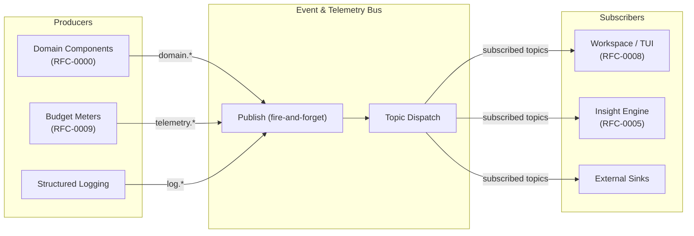
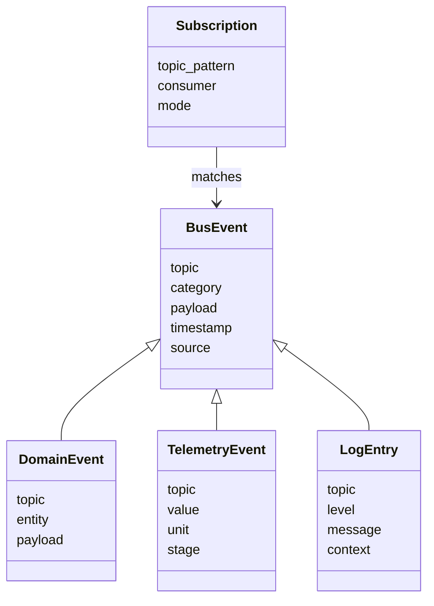
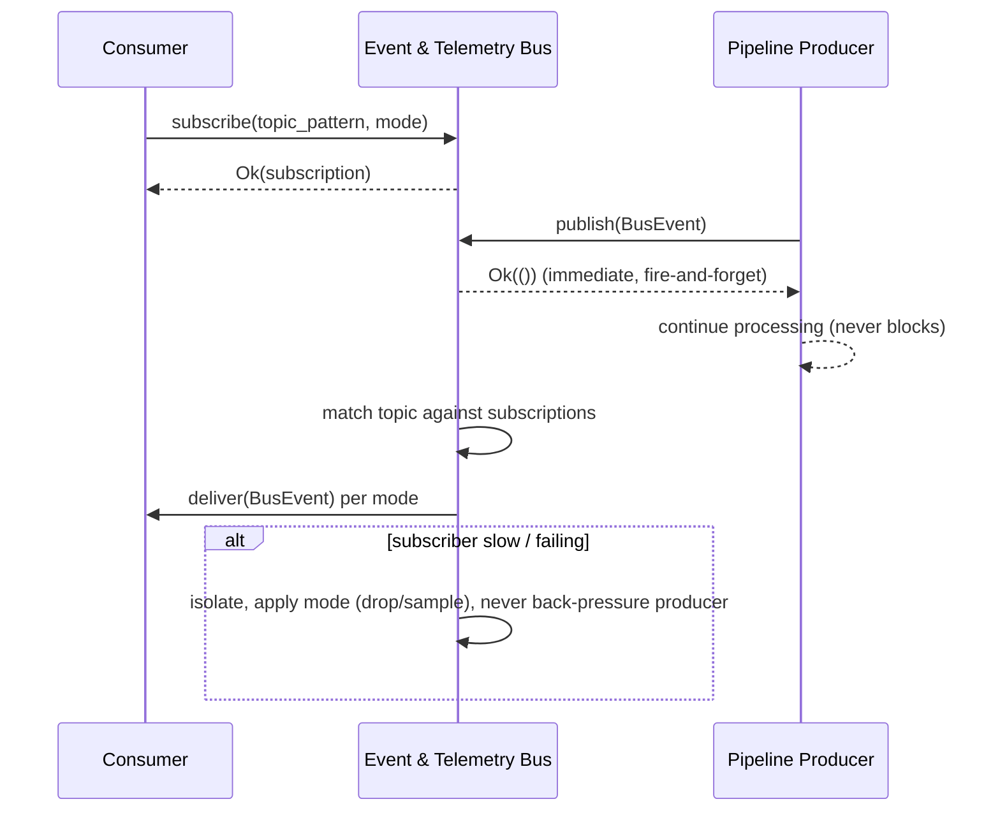

# RFC-0011 — Event & Telemetry Bus

**Status:** Draft
**Author:** carvalhosauro
**Version:** 1.0

---

# 1. Introduction

This document defines the Event & Telemetry Bus for **Lode**.

Its goal is to describe how the system observes itself: the single transport over which domain events, telemetry events, and internal structured logs travel from producers to subscribers.

The bus is a transport and a contract. It carries observability signals without participating in the processing they describe.

This document does not define which budgets exist or what is worth measuring (RFC-0009), nor does it define the domain entities that produce events (RFC-0000). It defines the channel, its publish/subscribe model, and the invariant that observing the system must never change it.

---

# 2. Purpose / Motivation

Lode is observable by design (RFC-0000). Every component emits events, but without a single, well-defined transport those emissions become tightly coupled to their consumers.

This RFC exists to:

- Provide one transport for all observability signals.
- Decouple producers from consumers via subscription.
- Guarantee that emitting an event never alters processing.
- Make the bus safe under load through fire-and-forget delivery and backpressure isolation.
- Unify domain events, telemetry events, and structured logs under one contract.

Problems it prevents:

- Producers blocking on slow consumers.
- Observability code leaking into the data path.
- Each consumer needing bespoke wiring to each producer.
- A failing subscriber taking down the producer that fed it.

---

# 3. Architecture Overview

## 3.1 Bus Topology

Producers publish onto the bus; subscribers receive what they have subscribed to. Producers and subscribers never reference each other directly.



## 3.2 Position in the System

The bus is orthogonal to the data path. The data path produces events as a side effect; the bus carries them. Removing every subscriber must not change any processing result.

- Producers publish and immediately continue.
- The bus dispatches to matching subscribers.
- Subscribers consume independently of one another.
- Slow or failing subscribers are isolated and never propagate back to producers.

---

# 4. Principles

The bus follows these principles:

- Single transport (one channel for all observability signals)
- Producer/consumer decoupling (subscription, not direct reference)
- Non-intrusive (publishing never alters the processing flow)
- Fire-and-forget (producers never wait for delivery)
- Backpressure-safe (a slow subscriber never stalls a producer)
- Failure-isolated (a failing subscriber never affects the producer or peers)
- Topic-addressed (events are routed by name, not by destination)
- Contract-stable (event names are stable and never repurposed)

---

# 5. Core Concepts / Model

## 5.1 Event Categories

The bus carries three categories of signal, all sharing one envelope shape.



## 5.2 Bus Event

The common envelope for every signal on the bus.

Fields:

- `topic`
- `category`
- `payload`
- `timestamp`
- `source`

Properties:

- `category` ∈ {domain, telemetry, log}.
- A BusEvent is a fact, never a command.
- The bus never inspects or interprets `payload`.

## 5.3 Domain Events

Facts about domain entities, defined by RFC-0000 and emitted by domain components.

Examples:

- `domain.event.created`
- `domain.event.enriched`
- `domain.template.assigned`
- `domain.insight.generated`

The bus transports these; it does not define them. Their meaning is owned by RFC-0000.

## 5.4 Telemetry Events

Performance measurements, defined by RFC-0009 and emitted by budget meters.

Examples:

- `telemetry.ingest.latency`
- `telemetry.index.throughput`
- `telemetry.memory.resident`
- `telemetry.budget.violation`

The bus transports these; it does not define which budgets exist. That is owned by RFC-0009.

## 5.5 Internal Structured Logging

Structured log entries are first-class bus events in the `log` category.

Fields:

- `level`
- `message`
- `context`

Logging is structured (key/value context), not free text, so subscribers can filter and route it like any other event.

## 5.6 Subscription

Represents a consumer's interest in a set of topics.

Fields:

- `topic_pattern`
- `consumer`
- `mode`

Properties:

- A subscription matches events by topic pattern (e.g. `telemetry.*`, `domain.event.*`).
- `mode` declares delivery behavior under pressure (e.g. drop-oldest, sample, latest-only).
- Subscriptions are independent; one consumer's behavior never affects another's.

---

# 6. Processing Flow

Publish and subscribe follow a fixed, non-blocking flow:

1. A consumer subscribes with a topic pattern and a delivery mode.
2. A producer constructs a BusEvent and publishes it.
3. Publishing returns immediately; the producer never waits.
4. The bus matches the event topic against active subscriptions.
5. Each matching subscriber receives the event according to its mode.
6. A slow or failing subscriber is isolated; its pressure is absorbed or shed by the bus, never pushed back to the producer.



Publishing and delivery are decoupled. The producer's outcome is identical regardless of subscriber state.

---

# 7. Contract

The bus defines these conceptual contracts:

```rust
fn publish(event: BusEvent) -> Result<(), BusError>;

fn subscribe(topic_pattern: &str, mode: DeliveryMode) -> Result<Subscription, BusError>;

fn unsubscribe(subscription: Subscription) -> Result<(), BusError>;

fn deliver(subscription: &Subscription, event: BusEvent) -> Result<(), BusError>;
```

`publish` returns `Ok(())` synchronously and unconditionally; it never returns `Err(_)` and never blocks. A full buffer or a dead subscriber resolves through the subscription's `mode`, not through the producer.

---

# 8. Concurrency

Publishing is non-blocking and may occur from any process concurrently.

Each subscription is delivered independently; subscribers do not share delivery state.

The bus buffers per subscription, so one slow consumer cannot stall another or the producer.

Delivery ordering is preserved per topic per subscription; cross-topic ordering is not guaranteed, consistent with partial cross-stream ordering (RFC-0000).

---

# 9. Failure Handling

The bus is fire-and-forget and failure-isolated.

Examples:

- subscriber panics → the bus drops the delivery, the producer is unaffected ("let it crash": the panic is contained at the subscriber's task boundary, never poisoning the bus or other subscribers)
- subscriber buffer full → the subscription's `mode` decides (drop-oldest, sample, latest-only)
- no subscribers for a topic → the event is discarded silently
- bus overloaded → telemetry and logs may be shed before domain events

Emitting an event must never fail a producer. Recovery of failing subscribers and supervision belong to RFC-0012 and RFC-0013.

---

# 10. Observability

The bus is the observability transport, so it observes itself only minimally to avoid recursion.

- It may emit `telemetry.bus.dropped` when events are shed under pressure.
- It may emit `telemetry.bus.subscription_count` as a saturation signal.

These follow the telemetry definitions of RFC-0009. The bus never re-publishes an event it is currently dispatching, preventing feedback loops.

---

# 11. Extensibility

The bus evolves without breaking consumers:

- new topics may be added at any time; existing subscriptions are unaffected
- new event categories may be introduced under the shared envelope
- new delivery modes may be added without changing the publish contract
- external sinks may subscribe like any internal consumer

Every new topic must follow the dotted naming convention and must not repurpose an existing name.

---

# 12. Out of Scope

This RFC does not define:

- Domain entities and the meaning of domain events (RFC-0000)
- Which budgets exist or what telemetry is worth measuring (RFC-0009)
- Insight heuristics that consume events (RFC-0005)
- The TUI that subscribes to events (RFC-0008)
- The plugin sinks that may subscribe (RFC-0010)
- Supervision of bus and subscriber processes (RFC-0012)
- Recovery of failed subscribers and degraded-mode policy (RFC-0013)

These topics are specified in their own RFCs.

---

# 13. Decisions

## DEC-001 — One Transport for All Observability

Domain events, telemetry, and structured logs share a single bus and a single envelope shape, routed by topic.

## DEC-002 — Publishing is Non-Intrusive

Emitting an event never alters the processing flow. Removing every subscriber must not change any processing result. This is a core invariant.

## DEC-003 — Fire-and-Forget Publishing

`publish` always succeeds synchronously and never blocks the producer. Delivery is the bus's concern, not the producer's.

## DEC-004 — Backpressure is Subscriber-Local

Pressure from a slow consumer is absorbed or shed per subscription via its delivery `mode`, never propagated back to the producer or to peer subscribers.

## DEC-005 — Failure is Isolated per Subscription

A failing subscriber is contained ("let it crash": its task/thread boundary absorbs the failure) and never affects the producer or other subscribers.

## DEC-006 — The Bus Carries, it Does Not Define

The bus owns transport and the subscription contract. It does not own the meaning of domain events (RFC-0000) nor the definition of budgets (RFC-0009).

---

# 14. Glossary

| Term            | Definition                                                                 |
| --------------- | -------------------------------------------------------------------------- |
| Event & Telemetry Bus | The single transport carrying all observability signals              |
| Bus Event       | The common envelope for every signal: topic, category, payload, source     |
| Domain Event    | A fact about a domain entity, defined by RFC-0000, transported by the bus  |
| Telemetry Event | A performance measurement, defined by RFC-0009, transported by the bus     |
| Log Entry       | A structured, key/value log record carried as a `log`-category bus event   |
| Subscription    | A consumer's declared interest in a topic pattern, with a delivery mode    |
| Topic           | The dotted name an event is routed by (e.g. `domain.event.created`)        |
| Fire-and-forget | Publishing that returns immediately and never waits on delivery            |
| Backpressure-safe | The property that a slow subscriber never stalls a producer or peer       |
| Non-intrusive   | The invariant that observing the system never changes it                   |
