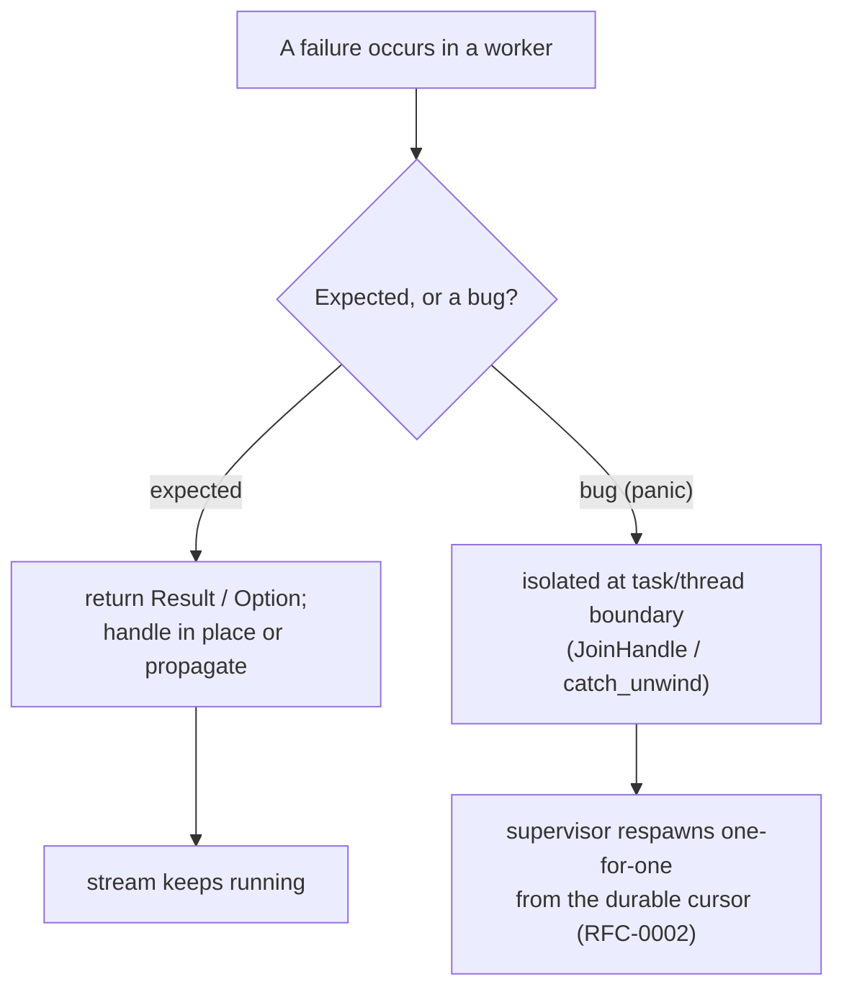
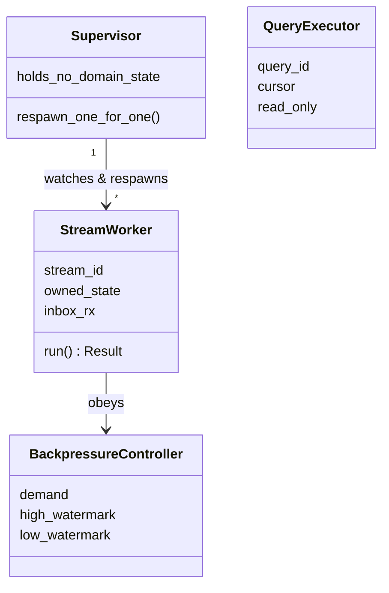
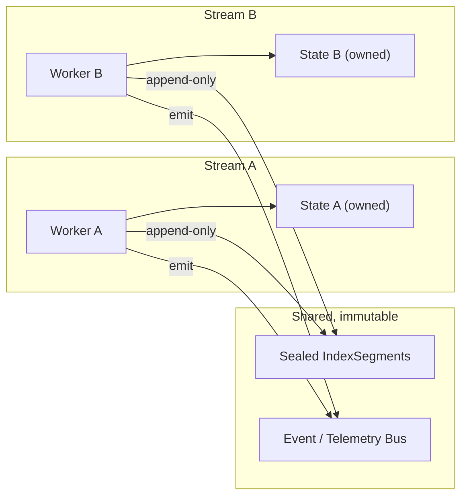
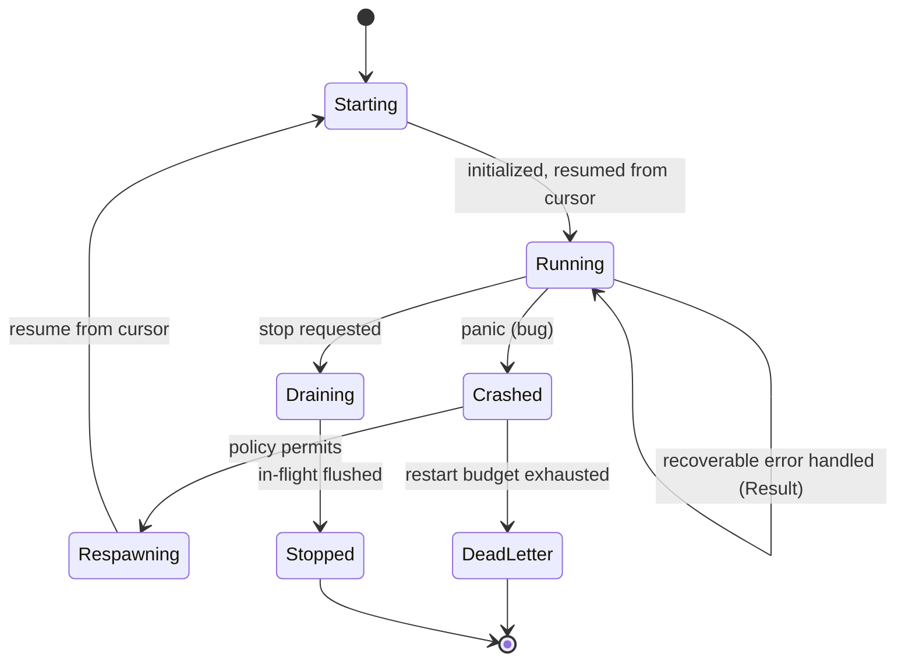
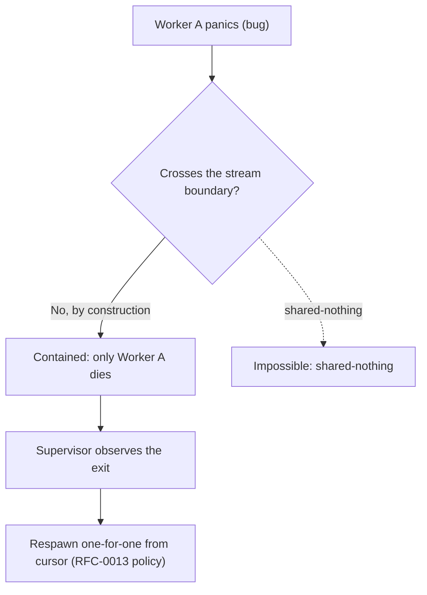
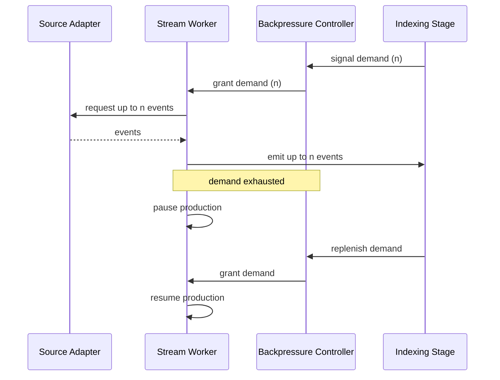

# RFC-0012 — Execution Runtime Model

**Status:** Draft
**Author:** carvalhosauro
**Version:** 1.1

---

# 1. Introduction

This document defines the **Execution Runtime Model** for **Lode**: how work runs concurrently, how each LogStream is isolated, and how failures are handled.

The model is **Rust-idiomatic, not OTP**. Two tools, in order of primacy:

1. **Expected failures are values.** IO errors, a rotated or vanished source, a parse or timestamp failure, a malformed line — these are `Result` / `Option`, handled or propagated explicitly. This is the overwhelming majority of failures and is the primary error strategy.
2. **Ownership is isolation.** One worker exclusively owns one stream's state; nothing is shared mutably across streams. Isolation is a property of ownership and the type system, not of a runtime framework.

A **thin supervisor** sits behind both as a safety net for the one case the type system cannot cover — a *panic* (a bug). It isolates the panicked worker at its task/thread boundary and respawns it **one-for-one** from the durable cursor. The supervisor is a backstop, not the center of the design, and there is **no supervision hierarchy**.

This document defines the error model, worker topology, and lifecycle. Concrete recovery semantics (backoff, dead-letter, index rebuild) belong to RFC-0013.

---

# 2. Purpose

Guarantee that concurrency never compromises correctness — primarily through the type system and ownership, and only secondarily through supervision.

Problems it prevents:

- one failing stream corrupting another — by ownership (shared-nothing), not by repair
- a recoverable error handled as a crash — expected failures are `Result`, never a panic
- a bug (panic) propagating into global state — containment + respawn
- shared mutable state creating non-deterministic results
- an unbounded producer overwhelming a slow consumer — bounded channels

The runtime owns *where* and *how long* work lives. It does not own *what* the work means.

---

# 3. Error Handling Model

Failures split into two kinds, handled very differently. The split is the heart of this RFC.

| Kind | Examples | Handling |
| ---- | -------- | -------- |
| **Expected** (~99%) | source IO error, rotation/truncation, parse/timestamp failure, malformed line, backpressure timeout | a value: `Result<_, E>` / `Option`, handled in place or propagated. **Never a panic.** |
| **Bug** (rare residue) | violated invariant, `unreachable!` reached, a corruption assertion | a `panic`, isolated at the worker's task/thread boundary, the worker respawned from the cursor. |



Rust's `Result` does the work that OTP's "let it crash" does in Erlang — but at compile time, explicitly, and with no restart machinery for the common case. "Let it crash" is reserved for **bugs**, where it means *isolate + respawn*, never *skip error handling*. Panicking on a recoverable error is itself a defect.

---

# 4. Architecture Overview

Flat topology: a set of independent **stream workers** (one per LogStream) over **shared, immutable services** (sealed segments, the bus), with **one thin supervisor** that respawns workers that panic. There is no multi-level tree.

```mermaid
flowchart TB

Sup["Thin Supervisor (flat, one-for-one respawn; holds no domain state)"]

subgraph Workers
    WA["Stream Worker A (owns state A)"]
    WB["Stream Worker B (owns state B)"]
    WC["Stream Worker C (owns state C)"]
end

subgraph "Shared, immutable services"
    Seg["Sealed IndexSegments"]
    Bus["Event / Telemetry Bus"]
    QE["Query Executors (read-only, per query)"]
end

Sup -. watches JoinHandle, respawns on panic .-> WA
Sup -. .-> WB
Sup -. .-> WC

WA -->|append-only| Seg
WB -->|append-only| Seg
WC -->|append-only| Seg
WA -->|emit| Bus
WB -->|emit| Bus
WC -->|emit| Bus
QE -->|read| Seg
```

- Workers are spawned one per active LogStream and own that stream's state exclusively.
- Query executors are spawned per in-flight query and are read-only over sealed segments.
- The supervisor's only job: observe a worker exit and, **if it was a panic**, respawn that one worker (one-for-one) from the cursor (policy in RFC-0013). It holds no domain state and is not a hierarchy.
- Shared services (storage, bus) are owned values/handles wired at startup — not "supervised children".

---

# 5. Principles

- **Errors are values** — expected failures are `Result`/`Option`, handled explicitly; panicking on a recoverable error is a bug.
- **Ownership is isolation** — one worker owns one stream's state; no shared mutable state across streams (enforced by the borrow checker and `Send`).
- **Shared-nothing** — cross-stream communication only through immutable artifacts (sealed segments) and bounded channels.
- **Panics are exceptional and contained** — a bug panics; it is isolated at the task/thread boundary and never poisons shared state or other streams.
- **Flat, one-for-one respawn** — a panicked worker is respawned from its cursor; no supervision hierarchy, no all-for-one restart.
- **Bounded flow** — every producer respects downstream demand via bounded channels.
- **Recovery is delegated** — the runtime respawns; the semantics (backoff, budget, dead-letter) live in RFC-0013.

---

# 6. Core Concepts



## 6.1 Stream Worker

One worker (async task or OS thread) per active LogStream.

Responsibilities:

- own the ingestion lifecycle and state of exactly one stream
- run a loop that returns `Result`: expected errors are handled or propagated as values
- emit LogEvents downstream under backpressure

Properties:

- `owned_state` is owned by the worker and never shared with another worker (the borrow checker enforces this)
- a recoverable error keeps the worker running (or drains it cleanly); only a **bug** panics
- a respawned worker resumes from the Storage-owned ingestion cursor (last committed `source_offset`, RFC-0002)

## 6.2 Supervisor

A single, thin component — not a tree.

Responsibilities:

- watch worker `JoinHandle`s
- on a **panic** exit, respawn that one worker (one-for-one) from the cursor, consulting the RFC-0013 policy for budget/backoff
- never hold or touch domain state

A clean worker exit (drain/stop) is not respawned. The supervisor does not restart siblings, and there is no parent-of-parents.

## 6.3 Query Executor

One short-lived worker per in-flight query: evaluates over sealed IndexSegments, streams results to the caller, terminates on completion or cancellation. It never mutates stream state.

## 6.4 Backpressure Controller

A demand regulator: tracks downstream demand, pauses production above a high watermark, resumes below a low watermark.

---

# 7. Isolation per Stream

Each LogStream is processed by exactly one Stream Worker. Workers never share mutable state — guaranteed by ownership, not by convention.



Rules:

- A worker reads and writes only its own state.
- Workers communicate only through immutable, append-only artifacts (sealed IndexSegments) and the Bus.
- No worker can observe or mutate another worker's in-flight state — there is no `&mut` path to it.
- This realizes the RFC-0000 invariant: each LogStream is processed in isolation; cross-stream ordering is partial.

---

# 8. Stream Worker Lifecycle

The worker's run loop handles expected errors as values and stays `Running`. Only a panic (bug) moves it to `Crashed`; the trigger for `Crashed → Respawning` is the recovery policy in RFC-0013.



States:

- `Starting` — initializes and resumes from the Storage-owned cursor (RFC-0002).
- `Running` — ingests and emits under backpressure; **recoverable errors are handled here and the worker stays Running**.
- `Crashed` — terminated by a panic, observed at its task/thread boundary (its `JoinHandle`); its owned state is dropped.
- `Respawning` — the supervisor re-creates the worker (one-for-one) per policy.
- `Draining` — stops accepting input and flushes in-flight work.
- `DeadLetter` — restart budget exhausted; parked for RFC-0013 handling.
- `Stopped` — clean shutdown complete.

A panic drops only the worker's owned state. Sealed segments and other streams are untouched.

---

# 9. Failure Containment

For the bug case, containment is the contract: a panic is tolerable only because it cannot escape its boundary. A panicking worker is isolated at its task/thread boundary — observed via its `JoinHandle`, or contained with `catch_unwind` — and never poisons shared state or other streams.



Containment guarantees:

- A panic terminates that worker only.
- It never corrupts another worker's state, nor global/shared state, and never leaves a poisoned lock (a further reason streams own their state instead of sharing it).
- Already-sealed IndexSegments are immutable and unaffected.

The invariant: **failures are local and never propagate global state** — the runtime expression of the same RFC-0000 invariant.

---

# 10. Backpressure Coordination

The pipeline is demand-driven end to end via bounded channels. A consumer pulls; a producer never pushes beyond demand.



Backpressure is coordinated per stream. One slow consumer throttles only the streams feeding it, never the whole runtime. A source that cannot be paused (e.g. a fast tail) is buffered to a high watermark, then throttled at the adapter.

---

# 11. Contract

The runtime is not the domain, but it defines conceptual lifecycle contracts:

```rust
fn start_stream_worker(&self, stream: LogStream) -> Result<WorkerRef, RuntimeError>;

fn stop_stream_worker(&self, worker: WorkerRef, mode: StopMode) -> Result<(), RuntimeError>;
// StopMode::Drain | StopMode::Immediate; on success the worker is Stopped

fn on_worker_exit(&self, worker: WorkerRef, reason: ExitReason) -> ExitDirective;
// ExitReason::Clean is not respawned; ExitReason::Panic(_) consults the policy.
// ExitDirective::Respawn(RestartPolicy) | ExitDirective::DeadLetter | ExitDirective::Ignore

fn grant_demand(&self, worker: WorkerRef, n: usize) -> Result<usize, RuntimeError>;
```

`on_worker_exit` returns a directive; the concrete policy that produces it (budget, backoff) is owned by RFC-0013. Expected, recoverable errors never reach the supervisor — they are handled inside the worker as `Result`.

---

# 12. Observability

The runtime emits internal events for lifecycle transitions:

- `runtime.worker.started`
- `runtime.worker.panicked`
- `runtime.worker.respawning`
- `runtime.worker.dead_letter`
- `runtime.backpressure.paused`
- `runtime.backpressure.resumed`

These report lifecycle; they never alter it. They are consumed via RFC-0009 / RFC-0011.

---

# 13. Extensibility

The runtime evolves by adding worker types, not a supervision hierarchy:

- a new worker type for a new ingestion mode
- pluggable restart policies (semantics defined in RFC-0013)
- alternative backpressure strategies per source type

Every new worker must declare what state it owns and its isolation boundary. The supervisor stays flat.

---

# 14. Out of Scope

This RFC does not define:

- Concrete recovery semantics: backoff, max attempts, dead-letter handling (RFC-0013)
- Parsing-failure and corruption strategy (RFC-0013)
- Ingestion mechanics and adapter internals (RFC-0001)
- IndexSegment layout and flush mechanics (RFC-0002)
- Query language and evaluation (RFC-0004)
- Telemetry event transport (RFC-0009 / RFC-0011)
- Trait contracts for engines and adapters (RFC-0014)

---

# 15. Decisions

## DEC-001 — Errors are Values

Expected failures are `Result`/`Option`, handled or propagated explicitly. Panicking on a recoverable error is a defect. This is the primary error strategy; the type system, not a framework, carries it.

## DEC-002 — Ownership is Isolation

Each LogStream's state is owned by exactly one worker; the borrow checker guarantees no other worker can mutate it. Isolation needs no runtime machinery.

## DEC-003 — Shared-Nothing Between Streams

Workers never share mutable state; communication is only through immutable artifacts, the Bus, and bounded channels.

## DEC-004 — Panics are Contained and Respawned, not a Strategy

A bug panics; it is isolated at the task/thread boundary and the worker is respawned from the cursor. "Let it crash" applies only to bugs and means *isolate + respawn*, never *skip error handling*.

## DEC-005 — Flat Topology, One-for-One Respawn

There is no supervision hierarchy. A single thin supervisor respawns the one worker that panicked, from its cursor. A subsystem never restarts siblings.

## DEC-006 — Recovery is Delegated

The runtime owns respawn structure; the recovery semantics (backoff, budget, dead-letter) are owned by RFC-0013.

## DEC-007 — Demand-Driven Pipeline

Production is bounded by downstream demand; backpressure is coordinated per stream, never globally.

---

# 16. Glossary

| Term                    | Definition                                                             |
| ----------------------- | ---------------------------------------------------------------------- |
| Errors-as-values        | Expected failures expressed as `Result`/`Option` and handled explicitly, not by crashing |
| Ownership isolation     | Each stream's state owned by one worker; no `&mut` path from any other |
| Stream Worker           | The single worker (async task or OS thread) that owns one LogStream's ingestion lifecycle and state |
| Supervisor              | One thin, flat component that respawns a panicked worker one-for-one from its cursor; holds no domain state |
| Query Executor          | A short-lived, read-only worker that evaluates one in-flight query     |
| Shared-nothing          | The guarantee that streams never share mutable state                   |
| Failure Containment     | The guarantee that a panic cannot escape its stream boundary           |
| One-for-one respawn      | Respawning only the worker that died, never its siblings               |
| Backpressure            | Demand-driven flow control via bounded channels, bounding producers to consumer capacity |
| Dead Letter             | The parked state for a stream whose restart budget is exhausted        |
