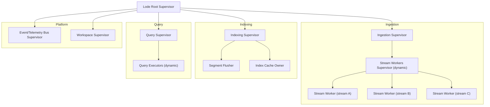
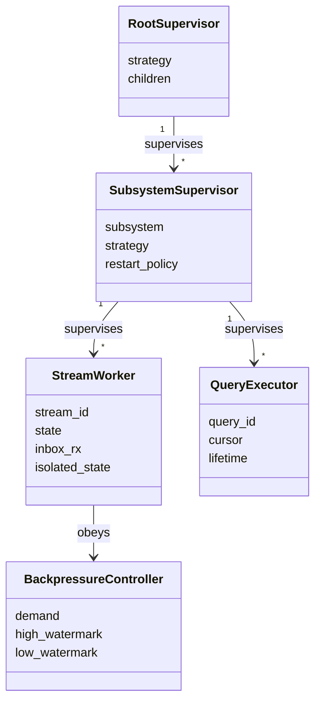
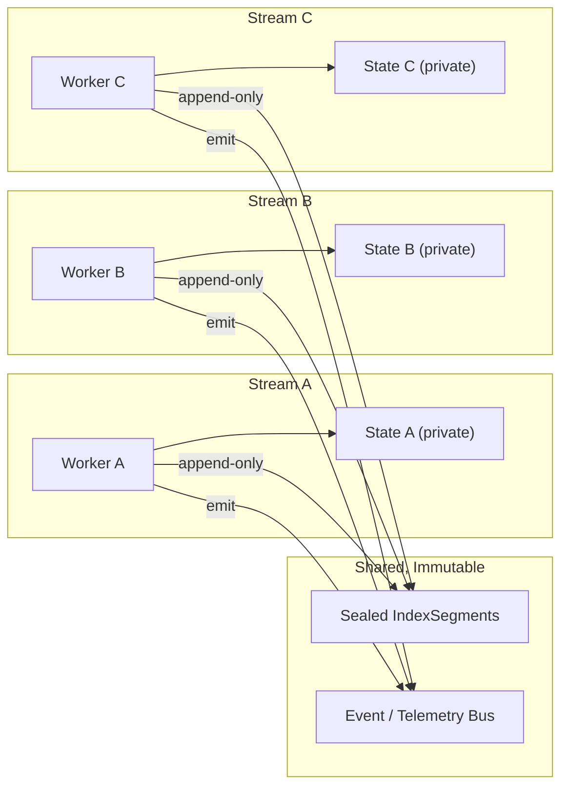
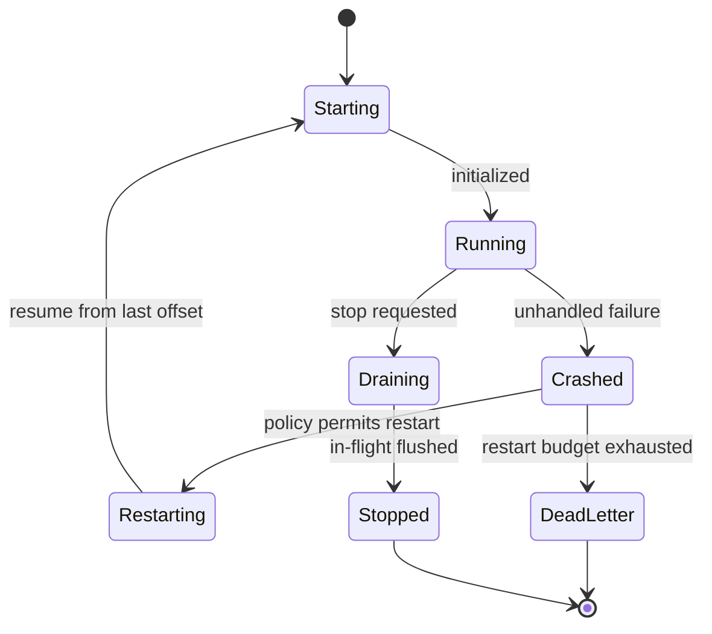
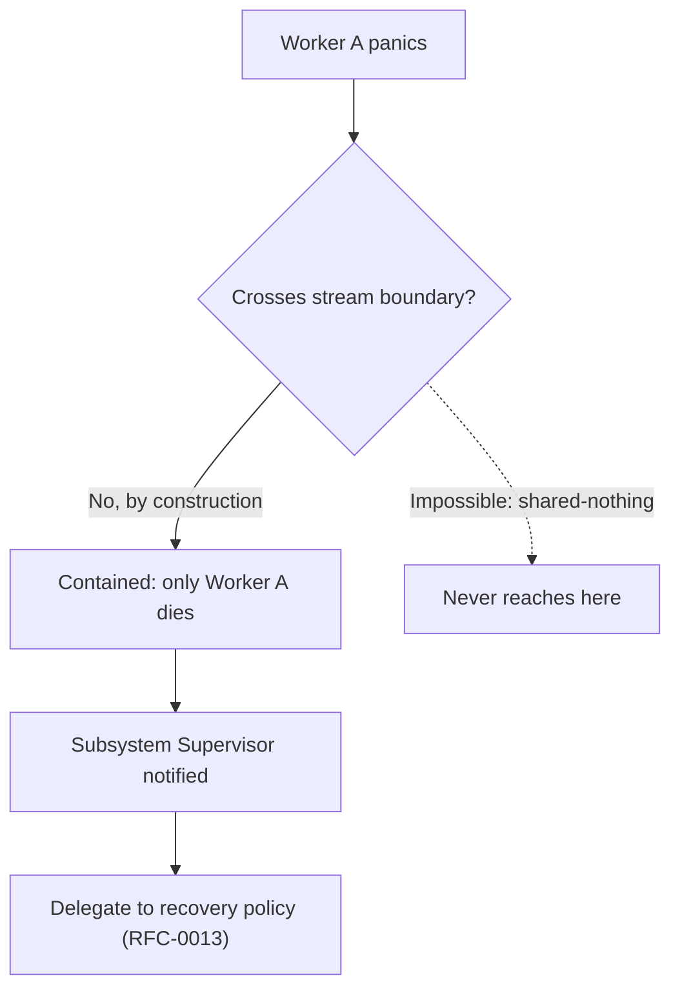
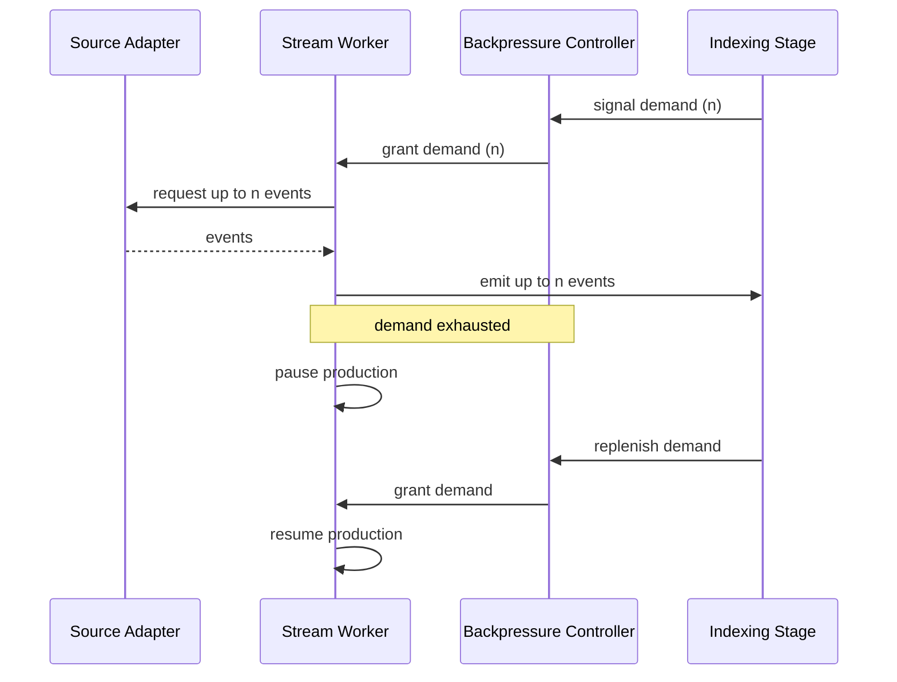

# RFC-0012 — Execution Runtime Model

**Status:** Draft
**Author:** carvalhosauro
**Version:** 1.0

---

# 1. Introduction

This document defines the **Execution Runtime Model** for **Lode**.

Its goal is to describe how Lode executes work concurrently: how workers are organized, how each LogStream is isolated, how failures are contained, and how restart and retry are delegated.

Lode is conceptually a supervised-worker system. Work runs as supervised workers — async tasks on an executor, or OS threads — organized so that one supervisor owns and monitors the worker handles of each subsystem, with isolation enforced per stream.

This document defines worker topology and lifecycle only. It does not define the concrete recovery semantics (backoff, dead-letter, index rebuild); those belong to RFC-0013.

---

# 2. Purpose

The runtime exists to guarantee that concurrency never compromises correctness.

Problems it prevents:

- one failing stream corrupting another stream
- a local panic propagating into global state
- shared mutable state creating non-deterministic results
- an unbounded producer overwhelming a slow consumer
- recovery logic leaking into domain components

The runtime owns *where* and *how long* work lives. It does not own *what* the work means.

---

# 3. Architecture Overview

## 3.1 Supervision Tree

Lode runs as a tree of supervisors, one supervisor per subsystem. Each subsystem owns the worker handles that perform its work.



## 3.2 Subsystem Boundaries

- Each subsystem is supervised independently.
- A subsystem failure is restarted by the Root Supervisor without restarting siblings.
- Stream Workers are spawned dynamically, one per active LogStream.
- Query Executors are spawned dynamically, one per in-flight query.

---

# 4. Principles

The runtime follows these principles:

- One worker per LogStream (isolation by default)
- Shared-nothing (streams never share mutable state; cross-stream communication only via channels)
- Let it crash (a worker panics and is isolated at its task/thread boundary rather than corrupting state)
- Containment first (a failure stays inside the smallest possible unit)
- Supervise, don't inspect (recovery is structural, not ad hoc)
- Delegated recovery (the runtime restarts; semantics live in RFC-0013)
- Bounded flow (every producer respects downstream demand via bounded channels)
- Topology is explicit (the tree shape is a design artifact, not emergent)

---

# 5. Core Concepts

## 5.1 Runtime Entities



## 5.2 Root Supervisor

The top of the tree.

Responsibilities:

- start each subsystem supervisor
- restart a failed subsystem in isolation
- never hold domain state

## 5.3 Subsystem Supervisor

One per subsystem (Ingestion, Indexing, Query, Bus, Workspace).

Responsibilities:

- own the lifecycle of its children
- apply a restart policy to its children
- delegate recovery semantics to RFC-0013

A subsystem supervisor never reaches into another subsystem.

## 5.4 Stream Worker

One worker (async task or OS thread) per active LogStream.

Responsibilities:

- own the ingestion lifecycle of exactly one stream
- exclusively own that stream's state in worker-local memory
- emit LogEvents downstream under backpressure

Properties:

- `isolated_state` is owned by the worker and never shared with another worker
- a Stream Worker panic affects only its own stream
- a restarted worker resumes from the Storage-owned ingestion cursor (last committed `source_offset`, RFC-0002)

## 5.5 Query Executor

One worker per in-flight query.

Responsibilities:

- evaluate a query over sealed IndexSegments
- stream results back to the caller
- terminate when the query completes or is cancelled

A Query Executor never mutates stream state.

## 5.6 Backpressure Controller

A conceptual demand regulator on the pipeline.

Responsibilities:

- track downstream demand
- pause production above a high watermark
- resume production below a low watermark

---

# 6. Isolation per Stream

Each LogStream is processed by exactly one Stream Worker. Workers never share mutable state.



Rules:

- A worker reads and writes only its own state.
- Workers communicate only through immutable, append-only artifacts (sealed IndexSegments) and the Bus.
- No worker can observe or mutate another worker's in-flight state.
- This realizes the RFC-0000 invariant: each LogStream is processed in isolation; cross-stream ordering is partial.

---

# 7. Stream Worker Lifecycle

A Stream Worker moves through a small set of states. The runtime owns the transitions; the trigger for `Crashed → Restarting` is decided by the recovery policy in RFC-0013.



States:

- `Starting` — worker initializes and resumes from the Storage-owned ingestion cursor (last committed `source_offset`, RFC-0002).
- `Running` — worker ingests and emits events under backpressure.
- `Crashed` — worker terminated on a panic, observed at its task/thread boundary (its `JoinHandle`); its owned state is dropped.
- `Restarting` — the supervisor is re-creating the worker according to policy.
- `Draining` — worker stops accepting input and flushes in-flight work.
- `DeadLetter` — restart budget exhausted; the stream is parked for RFC-0013 handling.
- `Stopped` — clean shutdown complete.

A panic drops only the worker's owned, worker-local state. Sealed segments and other streams are untouched.

---

# 8. Failure Containment

Lode applies "let it crash", but containment is the contract: a panic is allowed only because it cannot escape its boundary. A panicking worker is isolated at its task/thread boundary — observed via its `JoinHandle`, or contained with `catch_unwind` — and never poisons shared state or other streams.

Containment guarantees:

- A Stream Worker panic terminates that worker only.
- The panic never corrupts another worker's state.
- The panic never corrupts global or shared state, and never leaves a poisoned lock behind (a further reason streams own their state rather than share it).
- Already-sealed IndexSegments are immutable and therefore unaffected.
- The supervisor observes the exit and applies the restart policy.



The invariant: **failures are local and never propagate global state.** This is the runtime expression of the same RFC-0000 invariant.

---

# 9. Backpressure Coordination

The pipeline is demand-driven end to end. A downstream consumer pulls; an upstream producer never pushes beyond demand.

Flow of demand:

1. The indexing stage signals how much it can accept.
2. The Stream Worker produces only up to the signalled demand.
3. When demand reaches zero, the worker pauses production.
4. The worker resumes when demand is replenished.
5. A source that cannot be paused (e.g. a fast tail) is buffered up to a high watermark, then throttled at the adapter.



Backpressure is coordinated per stream. One slow consumer throttles only the streams feeding it, never the whole runtime.

---

# 10. Contract

The runtime is not the domain, but it defines conceptual lifecycle contracts:

```rust
fn start_stream_worker(&self, stream: LogStream) -> Result<WorkerRef, RuntimeError>;

fn stop_stream_worker(&self, worker: WorkerRef, mode: StopMode) -> Result<(), RuntimeError>;
// StopMode::Drain | StopMode::Immediate; on success the worker is Stopped

fn supervise(&self, spec: ChildSpec) -> Result<ChildRef, RuntimeError>;

fn on_worker_exit(&self, worker: WorkerRef, reason: ExitReason) -> ExitDirective;
// ExitDirective::Restart(RestartPolicy) | ExitDirective::DeadLetter | ExitDirective::Ignore

fn grant_demand(&self, worker: WorkerRef, n: usize) -> Result<usize, RuntimeError>;
```

`on_worker_exit` returns a directive; the concrete policy that produces it is owned by RFC-0013.

---

# 11. Observability

The runtime emits internal events for every lifecycle transition:

- `runtime.worker.started`
- `runtime.worker.crashed`
- `runtime.worker.restarting`
- `runtime.worker.dead_letter`
- `runtime.backpressure.paused`
- `runtime.backpressure.resumed`

These events report lifecycle; they never alter it. They are consumed via RFC-0009 / RFC-0011.

---

# 12. Extensibility

The runtime evolves by adding supervised subsystems, not by modifying existing ones.

Future extension examples:

- a new subsystem supervisor under the Root
- a new worker type for a new ingestion mode
- pluggable restart policies (semantics defined in RFC-0013)
- alternative backpressure strategies per source type

Every new worker must declare its supervisor and its isolation boundary.

---

# 13. Out of Scope

This RFC does not define:

- Concrete recovery semantics: backoff, max attempts, dead-letter handling (RFC-0013)
- Parsing-failure and corruption strategy (RFC-0013)
- Ingestion mechanics and adapter internals (RFC-0001)
- IndexSegment layout and flush mechanics (RFC-0002)
- Query language and evaluation (RFC-0004)
- Telemetry event transport (RFC-0009 / RFC-0011)
- Trait contracts for engines and adapters (RFC-0014)

These topics are specified in their own RFCs.

---

# 14. Decisions

## DEC-001 — One Worker per LogStream

Each LogStream is owned by exactly one Stream Worker, giving isolation by default.

## DEC-002 — Shared-Nothing Between Streams

Workers never share mutable state; communication is only through immutable artifacts, the Bus, and bounded channels.

## DEC-003 — Let It Crash, Contained

A worker fails fast: a panic is isolated at its task/thread boundary and the worker is dropped; containment guarantees the panic never escapes its stream.

## DEC-004 — Recovery is Delegated

The runtime owns restart structure; the recovery semantics (backoff, retries, dead-letter) are owned by RFC-0013.

## DEC-005 — One Supervisor per Subsystem

Each subsystem is supervised independently so a subsystem failure never restarts its siblings.

## DEC-006 — Demand-Driven Pipeline

Production is bounded by downstream demand; backpressure is coordinated per stream, never globally.

---

# 15. Glossary

| Term                    | Definition                                                             |
| ----------------------- | ---------------------------------------------------------------------- |
| Supervision Tree        | The hierarchy of supervisors and workers that defines worker topology  |
| Root Supervisor         | The top supervisor that owns all subsystem supervisors                 |
| Subsystem Supervisor    | A supervisor owning and monitoring the worker handles of one subsystem |
| Stream Worker           | The single worker (async task or OS thread) that owns the ingestion lifecycle of one LogStream |
| Query Executor          | A short-lived worker that evaluates one in-flight query                |
| Isolation               | The guarantee that streams never share mutable state                   |
| Failure Containment     | The guarantee that a panic cannot escape its stream boundary           |
| Let It Crash            | The policy of failing fast — a worker panics and is isolated at its task/thread boundary, then restarted — instead of defensive repair |
| Backpressure            | Demand-driven flow control via bounded channels, bounding producers to consumer capacity |
| Dead Letter             | The parked state for a stream whose restart budget is exhausted        |
