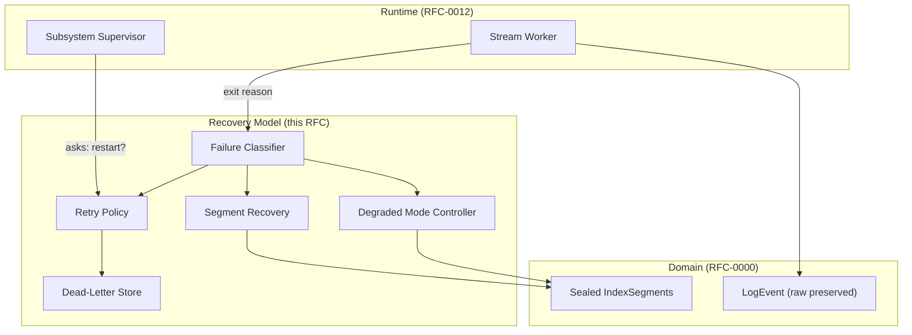
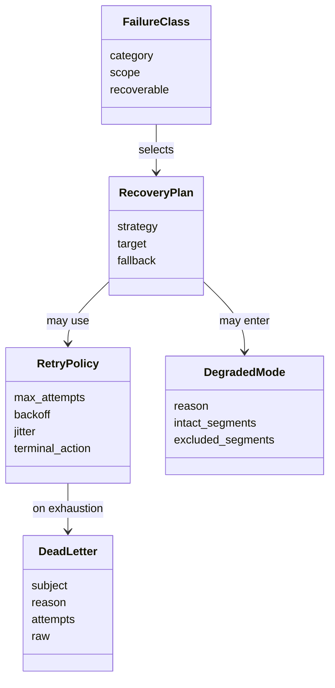
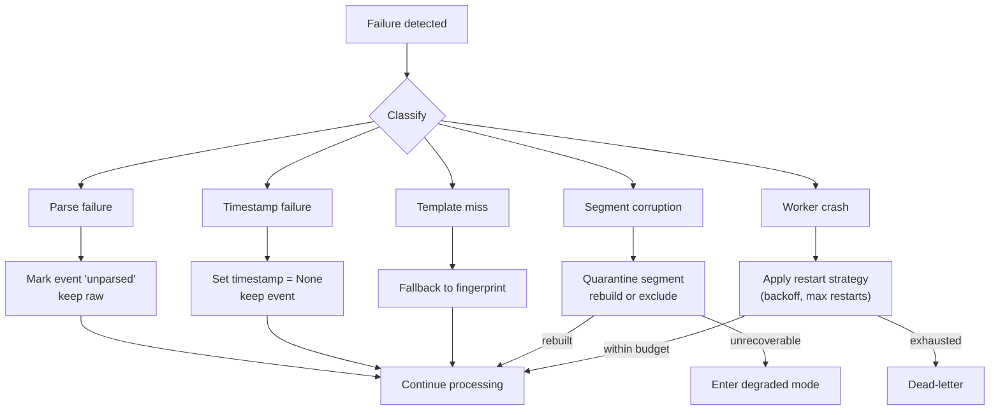
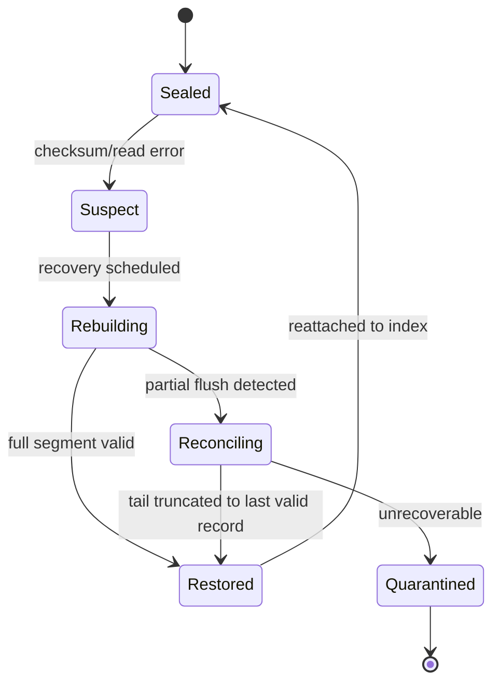
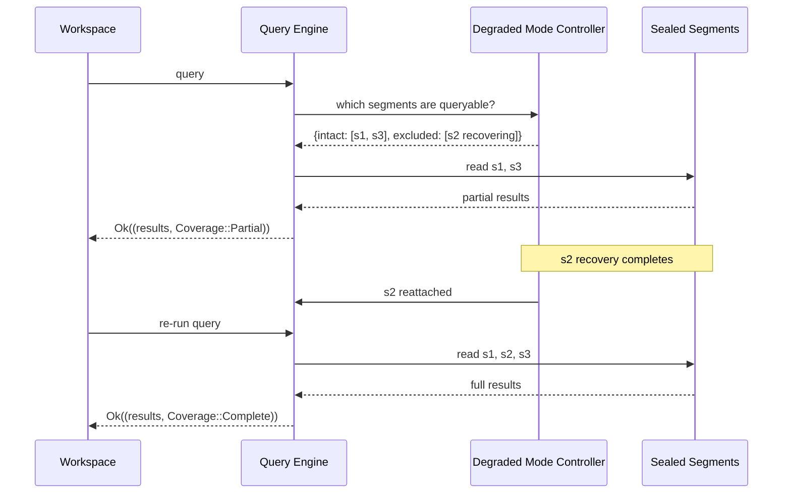

# RFC-0013 — Failure Handling & Recovery Model

**Status:** Draft
**Author:** carvalhosauro
**Version:** 1.0

---

# 1. Introduction

This document defines the **Failure Handling & Recovery Model** for **Lode**.

Its goal is to specify how Lode behaves under failure: how parsing failures are absorbed, how partial corruption is contained, how indexes are recovered, how the system runs degraded, and what concrete recovery semantics the runtime delegates here.

RFC-0012 owns *where* work runs and *how long* it lives. This document owns *what happens when that work fails*: the recovery strategy, not the worker topology.

This document does not define worker supervision or topology; that belongs to RFC-0012.

---

# 2. Purpose

Failures in a log investigation engine are normal, not exceptional. Inputs are malformed, segments are truncated, timestamps are ambiguous, and workers panic.

This model exists to guarantee:

- a malformed input is never lost (raw is preserved)
- a damaged IndexSegment never poisons its neighbors
- in-memory indexes can be rebuilt from durable, sealed segments
- the system degrades gracefully rather than stopping entirely
- retries are bounded and end in a defined state

The governing invariant, inherited from RFC-0000: **failures are local and never propagate global state.**

---

# 3. Architecture Overview

## 3.1 Where Recovery Sits



## 3.2 Responsibilities

- The runtime detects failures and asks for a recovery directive.
- The recovery model classifies the failure and chooses a strategy.
- Domain artifacts (raw events, sealed segments) are the durable ground truth recovery relies on.

---

# 4. Principles

The recovery model follows these principles:

- Preserve, never discard (a failed input keeps its raw form)
- Localize (a failure is contained to the smallest unit possible)
- Quarantine over cascade (isolate the damaged part, keep the rest)
- Rebuild from durable truth (in-memory state is reconstructible from sealed segments)
- Degrade, don't halt (reduced capability beats full stop)
- Bound every retry (no infinite loops; every path ends in a defined state)
- Defined terminal states (success, degraded, or dead-letter)

---

# 5. Core Concepts

## 5.1 Recovery Entities



## 5.2 Failure Class

A classification of a failure.

Categories:

- `Parse` — an event could not be parsed
- `Timestamp` — a timestamp is missing or ambiguous
- `Template` — no template matched
- `SegmentCorruption` — an IndexSegment is damaged
- `WorkerCrash` — a Stream Worker panicked and exited unexpectedly

Each class carries a `scope` (event, segment, stream) and whether it is recoverable.

## 5.3 Retry Policy

The concrete semantics the runtime delegates here.

Fields:

- `max_attempts`
- `backoff` (e.g. exponential)
- `jitter`
- `terminal_action` (`TerminalAction::DeadLetter` or `TerminalAction::Degraded`)

This is the runtime's restart strategy for a worker (max restarts within a window, plus backoff), expressed as recovery semantics.

## 5.4 Recovery Plan

The chosen strategy for a failure class: what to do, on what target, and the fallback if it fails.

## 5.5 Dead Letter

A parked subject (event, segment, or stream) whose recovery was exhausted. It preserves `raw`, `reason`, and `attempts` for later inspection.

## 5.6 Degraded Mode

A reduced-capability operating state. It records which segments are intact and which are temporarily excluded.

---

# 6. Failure Classification & Strategy

Every failure is classified before any action. Classification selects exactly one strategy.



## 6.1 Parsing Failure Strategy

When an event cannot be parsed:

- the event is created anyway
- it is marked `unparsed`
- its `raw` value is preserved intact

A parse failure never drops data and never stops the stream. This realizes the RFC-0000 contract: logs are events even when parsing fails, and raw is immutable.

## 6.2 Timestamp & Template Fallbacks

- An invalid or ambiguous timestamp sets `timestamp = None` (the field is an `Option<Timestamp>`); the event survives.
- A template miss falls back to a stable fingerprint.

## 6.3 Partial Corruption Handling

A damaged IndexSegment is quarantined immediately.

- The damaged segment is excluded from active reads.
- Neighboring segments are untouched and remain queryable.
- The damaged segment is scheduled for recovery (Section 7).
- A damaged segment must never poison its neighbors; segments are independent units.

---

# 7. Index Recovery

In-memory indexes are derived state. They can always be rebuilt from sealed, durable segments.

A segment moves through a recovery lifecycle:



Recovery rules:

- `Sealed` segments are the source of truth for rebuilding in-memory indexes.
- A `Suspect` segment failed a checksum or read; it is detached from active reads.
- `Rebuilding` reconstructs the in-memory index from the segment's durable contents.
- A partially-flushed segment enters `Reconciling`: its tail is truncated to the last valid record, and the recovered prefix is kept.
- An unrecoverable segment is `Quarantined` and recorded; its neighbors stay live.
- Rebuilding one segment never blocks reads of intact segments.

---

# 8. Degraded Mode

When a part of the system is unavailable, Lode keeps operating with reduced capability rather than stopping.

Behavior:

- queries are served from all intact segments
- excluded (suspect/recovering) segments are skipped
- results are flagged as partial so the caller knows coverage is incomplete
- the excluded segments rejoin automatically once recovered



Degraded mode is always preferred over a full stop. A single recovering segment never makes the whole index unavailable.

---

# 9. Retry Policies

These are the concrete semantics the runtime (RFC-0012) delegates here.

Rules:

- Every recoverable failure has a `RetryPolicy`.
- Retries use backoff with jitter to avoid synchronized storms.
- `max_attempts` bounds every retry path.
- On exhaustion, the failure reaches a `terminal_action`:
  - `TerminalAction::DeadLetter` — the subject is parked with its raw, reason, and attempt count.
  - `TerminalAction::Degraded` — the system continues with reduced capability.
- A dead-lettered subject is never silently dropped; its raw is preserved for inspection.

Retry is per subject (event, segment, or stream). One subject's retries never throttle unrelated work.

---

# 10. Contract

The recovery model defines conceptual contracts:

```rust
fn classify_failure(&self, reason: &ExitReason, context: &FailureContext) -> Result<FailureClass, RecoveryError>;

fn recovery_plan(&self, class: &FailureClass) -> Result<RecoveryPlan, RecoveryError>;

fn retry(&self, subject: Subject, policy: &RetryPolicy) -> RetryOutcome;
// RetryOutcome::Recovered | RetryOutcome::Retry(Attempt) | RetryOutcome::DeadLetter(Subject)

fn recover_segment(&self, segment: IndexSegment) -> Result<SegmentRecovery, QuarantineError>;
// Ok(SegmentRecovery::Restored) | Ok(SegmentRecovery::Reconciled) | Err(QuarantineError::Quarantined)

fn serve_degraded(&self, query: &Query) -> Result<(Results, Coverage), RecoveryError>;
// Coverage::Partial on success when segments are excluded
```

The runtime's `on_worker_exit` directive (RFC-0012) is produced by `recovery_plan` here.

---

# 11. Observability

The recovery model emits internal events:

- `recovery.failure.classified`
- `recovery.event.unparsed`
- `recovery.segment.quarantined`
- `recovery.segment.restored`
- `recovery.mode.degraded`
- `recovery.subject.dead_letter`

These events report recovery decisions; they never alter domain semantics. They are consumed via RFC-0009 / RFC-0011.

---

# 12. Extensibility

The recovery model evolves by adding failure classes and strategies, not by changing existing ones.

Future extension examples:

- new failure categories with their own recovery plans
- pluggable backoff strategies per failure class
- alternative degraded-mode policies per subsystem
- richer dead-letter triage and replay

Every new failure class must declare its scope, recoverability, and terminal action.

---

# 13. Out of Scope

This RFC does not define:

- Worker topology, supervision, and lifecycle (RFC-0012)
- Ingestion mechanics and adapters (RFC-0001)
- IndexSegment on-disk layout and flush mechanics (RFC-0002)
- Template mining algorithm (RFC-0003)
- Query language and evaluation (RFC-0004)
- Timestamp parsing rules (RFC-0006)
- Telemetry event transport (RFC-0009 / RFC-0011)

These topics are specified in their own RFCs.

---

# 14. Decisions

## DEC-001 — Failed Parsing Preserves Raw

A parse failure marks the event `unparsed` and keeps its raw value; data is never dropped.

## DEC-002 — Corruption is Quarantined, not Cascaded

A damaged IndexSegment is excluded immediately and never poisons its neighbors.

## DEC-003 — Indexes are Rebuildable from Sealed Segments

In-memory indexes are derived state, always reconstructible from durable, sealed segments.

## DEC-004 — Partial Flushes are Reconciled by Truncation

A partially-flushed segment is recovered by truncating its tail to the last valid record.

## DEC-005 — Degraded Mode over Full Stop

The system serves queries from intact segments rather than stopping when one part is recovering.

## DEC-006 — Every Retry is Bounded

Retries use backoff with jitter and a max-attempt limit, terminating in dead-letter or degraded mode.

## DEC-007 — Failures are Local

No failure propagates into global state; this is the runtime expression of the RFC-0000 invariant.

---

# 15. Glossary

| Term               | Definition                                                                  |
| ------------------ | --------------------------------------------------------------------------- |
| Failure Class      | A classification of a failure by category, scope, and recoverability        |
| Retry Policy       | Bounded retry semantics: backoff, jitter, max attempts, terminal action     |
| Recovery Plan      | The chosen strategy, target, and fallback for a failure class               |
| Segment Recovery   | Rebuilding or reconciling an IndexSegment from its durable contents         |
| Reconciliation     | Truncating a partially-flushed segment to its last valid record             |
| Quarantine         | Excluding a damaged segment from active reads to protect its neighbors      |
| Degraded Mode      | Operating with reduced capability instead of stopping entirely              |
| Dead Letter        | A parked subject whose recovery was exhausted, with its raw preserved       |
| Unparsed           | The marker on a LogEvent whose raw could not be parsed                      |
