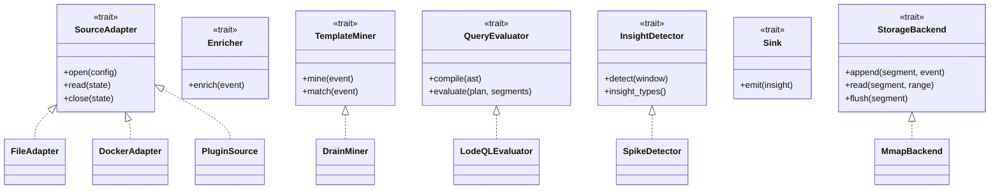
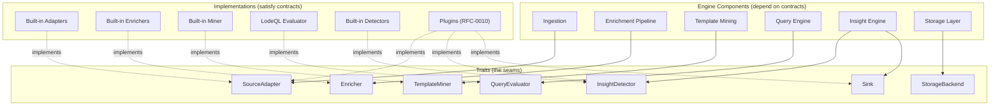
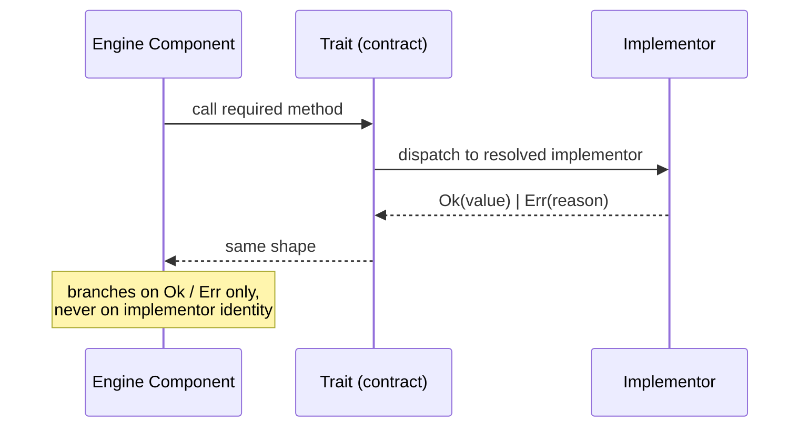

# RFC-0014 — Trait Contracts

**Status:** Draft
**Author:** carvalhosauro
**Version:** 1.0

---

# 1. Introduction

This document defines the **Trait Contracts** of **Lode**: the formal interfaces between components.

A trait is a named contract with a set of required methods, in the Rust sense. It declares *what* a component must provide, never *how*. Components depend on traits, not on concrete types.

This document defines the shapes of those contracts. It does not define their implementations. Each concrete implementation lives in its owning RFC.

---

# 2. Purpose / Motivation

Lode is a set of decoupled components (RFC-0000). Decoupling only holds if the seams between components are formal.

A trait is that formal seam. It lets the engine depend on a contract while the implementation varies — a built-in adapter, a plugin (RFC-0010), or a future module — without the engine knowing which.

Problems it prevents:

- the engine importing concrete types and becoming rigid
- plugins guessing at the shape they must satisfy
- silent drift between what a component expects and what another provides
- breaking changes that no version boundary catches

Contract-first design is the rule: a component is written against a trait before any implementation exists.

---

# 3. Architecture Overview

## 3.1 Traits and Their Implementors



## 3.2 Contract-First Dependency Direction

Components point at traits. Implementations also point at traits. The engine never points at an implementation.



Dependency arrows point from components to traits and from implementations to traits. A component depends on a trait via generics (`<T: Trait>`) or trait objects (`Box<dyn Trait>` / `&dyn Trait`), never on a concrete type.

---

# 4. Principles

Trait Contracts follow these design principles:

- Contract-first (write against the trait before the implementation)
- Depend on contracts, not types (the engine names a trait via generics or trait objects, never a concrete implementation)
- Explicit methods (every required function is declared with its return shape)
- `Result`/`Option` return shapes (`Result<T, Error>` for fallible calls, `Option<T>` for present-or-absent)
- Stable seams (a trait changes only through versioning)
- Implementation-agnostic (built-in and plugin implementations are interchangeable)
- Minimal surface (a trait declares only what callers need)

---

# 5. Core Concepts

## 5.1 Trait

A **trait** is a named contract: a set of method declarations with typed return shapes. A type that implements it satisfies the trait and is an **implementor**. The engine holds a reference to a trait — through generics or a trait object — not to a concrete implementor.

Two families of trait exist:

- **Engine interfaces** — contracts the engine offers or coordinates (QueryEvaluator, TemplateMiner, StorageBackend).
- **Adapter interfaces** — contracts that bridge the engine to the outside (SourceAdapter, Enricher, InsightDetector, Sink).

## 5.2 SourceAdapter

Bridges an external origin to a LogStream. Owns the lifecycle of a source.

```rust
trait SourceAdapter {
    fn open(&self, config: &SourceConfig) -> Result<SourceState, IngestError>;
    fn read(&self, state: SourceState) -> Result<ReadOutcome, IngestError>;
    fn close(&self, state: SourceState) -> Result<(), IngestError>;
}

// `read` yields either a batch with the advanced state, or end-of-stream.
enum ReadOutcome {
    Batch { raw: Vec<RawEvent>, state: SourceState },
    Eof { state: SourceState },
}
```

Implementations: built-in file / docker / stdin / journald adapters (RFC-0001); source plugins (RFC-0010).

## 5.3 Enricher

Derives `attributes`, `timestamp`, and `severity` for a LogEvent. Never mutates `raw`.

```rust
trait Enricher {
    fn enrich(&self, event: LogEvent) -> Result<LogEvent, IngestError>;
}
```

Implementations: built-in enrichers in the Enrichment Pipeline; parser/enricher plugins (RFC-0010).

## 5.4 TemplateMiner

Groups similar events into Templates and matches new events against known patterns.

```rust
trait TemplateMiner {
    fn mine(&self, event: &LogEvent) -> Result<TemplateId, MineError>;
    fn match_event(&self, event: &LogEvent) -> Result<MatchOutcome, MineError>;
}

// `match` falls back to a fingerprint when no template matches.
enum MatchOutcome {
    Matched(TemplateId),
    NoMatch(Fingerprint),
}
```

Implementations: the Template Mining System (RFC-0003). `match_event` falls back to a fingerprint when no template matches.

## 5.5 QueryEvaluator

Compiles a LodeQL AST into a plan and evaluates it over IndexSegments.

```rust
trait QueryEvaluator {
    fn compile(&self, ast: &Ast) -> Result<Plan, QueryError>;
    fn evaluate(&self, plan: &Plan, segments: &[IndexSegment]) -> Result<ResultStream, QueryError>;
}
```

Implementations: the Query Engine (RFC-0004). The evaluator consumes an AST, never a raw query string.

## 5.6 InsightDetector

Reads a window of events or query results and emits Insight entities.

```rust
trait InsightDetector {
    fn insight_types(&self) -> Vec<InsightType>;
    fn detect(&self, window: &Window) -> Result<Vec<Insight>, QueryError>;
}
```

Implementations: built-in detectors (RFC-0005); insight plugins (RFC-0010).

## 5.7 Sink

A notifier-like output. Consumes an Insight or result and emits it outward. Read-only with respect to the domain.

```rust
trait Sink {
    fn emit(&self, insight: &Insight) -> Result<(), SinkError>;
}
```

Implementations: sink plugins (RFC-0010).

## 5.8 StorageBackend

Provides append-only segment storage and range reads.

```rust
trait StorageBackend {
    fn append(&self, segment: &Segment, event: &LogEvent) -> Result<Offset, StorageError>;
    fn read(&self, segment: &Segment, range: Range) -> Result<Vec<LogEvent>, StorageError>;
    fn flush(&self, segment: &Segment) -> Result<(), StorageError>;
}
```

Implementations: the Storage & Indexing Engine (RFC-0002). A segment is immutable after `flush` (sealed; only `&`-access thereafter).

---

# 6. Processing Flow

A component invokes a trait through its declared methods; the resolved implementor handles the call. The component never branches on which implementor it is.

1. The engine holds a reference to a trait and its resolved implementor (via a generic bound or a trait object).
2. The component calls a required method (for example, `read` on a SourceAdapter).
3. The implementor executes and returns a `Result`-shaped value.
4. The component branches only on `Ok(_)` versus `Err(reason)`, never on the implementor's identity.
5. Plugins (RFC-0010) are validated against the trait before they are resolved as implementors.



---

# 7. Contract

The trait system is itself governed by a meta-contract for declaring and resolving traits.

```rust
fn declare_trait(name: &str, methods: &[MethodSig]) -> Result<TraitContract, ContractError>;

fn implements(ty: &TypeId, contract: &TraitContract) -> Result<bool, ContractError>;

fn resolve(contract: &TraitContract) -> Result<Implementor, ContractError>;
```

`implements` is the check the Plugin System (RFC-0010) runs during validation. A type resolves as an implementor only when it satisfies every required method of the trait.

---

# 8. Versioning and Compatibility

A trait carries a version. Compatibility rules follow semver of the trait API and keep the seams stable:

- Adding a method with a default implementation is backward-compatible (a minor change).
- Adding or changing a required method is breaking (a major change).
- Narrowing a return shape is breaking; widening it is compatible.
- A component declares the trait-API version it depends on.

An implementor satisfying an older compatible version remains a valid implementor. A breaking change requires a new major trait version, and existing implementors are revalidated.

---

# 9. Observability

The trait layer emits internal events at resolution boundaries:

- `contract.implemented`
- `contract.resolution.failed`
- `contract.version.mismatch`

These feed the telemetry and event bus (RFC-0009 / RFC-0011) and never alter dispatch.

---

# 10. Extensibility

New seams are added as new traits, not as changes to existing ones.

Future extension examples:

- new traits for new engine seams
- new default-method additions made compatibly to existing traits
- new implementor families (built-in or plugin) for an existing trait

Every new plugin category (RFC-0010) declares its trait here before it can be registered.

---

# 11. Out of Scope

This RFC does not define:

- concrete adapter implementations (RFC-0001)
- storage layout and segment mechanics (RFC-0002)
- the template mining algorithm (RFC-0003)
- the LodeQL grammar and AST (RFC-0004)
- insight heuristics and baselines (RFC-0005)
- plugin lifecycle and extension points (RFC-0010)
- runtime supervision and isolation (RFC-0012)

These topics are specified in their own RFCs.

---

# 12. Decisions

## DEC-001 — Components Depend on Traits, not Concrete Types

The engine references contracts, never concrete implementations. Implementors are interchangeable.

## DEC-002 — Contract-First Design

A component is written against a trait before any implementation exists.

## DEC-003 — `Result`/`Option` Return Shapes are Mandatory

Every method returns `Result<T, Error>` (with named error variants where useful), or `Option<T>` where the contract means present-or-absent. Callers branch on the shape, never on implementor identity.

## DEC-004 — Engine Interfaces and Adapter Interfaces are Distinct

Engine interfaces (QueryEvaluator, TemplateMiner, StorageBackend) are separated from adapter interfaces (SourceAdapter, Enricher, InsightDetector, Sink).

## DEC-005 — Traits are Versioned

Breaking a contract requires a new major version; existing implementors are revalidated against it.

## DEC-006 — Shapes Here, Implementations Elsewhere

This RFC defines contract shapes only. Concrete implementations live in their owning RFCs.

---

# 13. Glossary

| Term            | Definition                                                                 |
| --------------- | -------------------------------------------------------------------------- |
| Trait           | A named contract: a set of required methods with typed return shapes       |
| Method          | A required function a trait declares (`fn`)                                |
| Implementor     | A type that satisfies every required method of a trait                     |
| Engine Interface| A trait the engine offers or coordinates                                   |
| Adapter Interface| A trait bridging the engine to the outside world                          |
| SourceAdapter   | Trait bridging an external origin to a LogStream                           |
| Enricher        | Trait deriving attributes, timestamp, and severity                         |
| TemplateMiner   | Trait grouping and matching events into Templates                          |
| QueryEvaluator  | Trait compiling and evaluating a LodeQL AST                                |
| InsightDetector | Trait producing Insight entities from a window of events                   |
| Sink            | Notifier-like trait emitting Insights or results outward                   |
| StorageBackend  | Trait providing append-only segment storage and range reads                |
| Contract-First  | Designing components against traits before any implementation exists       |
