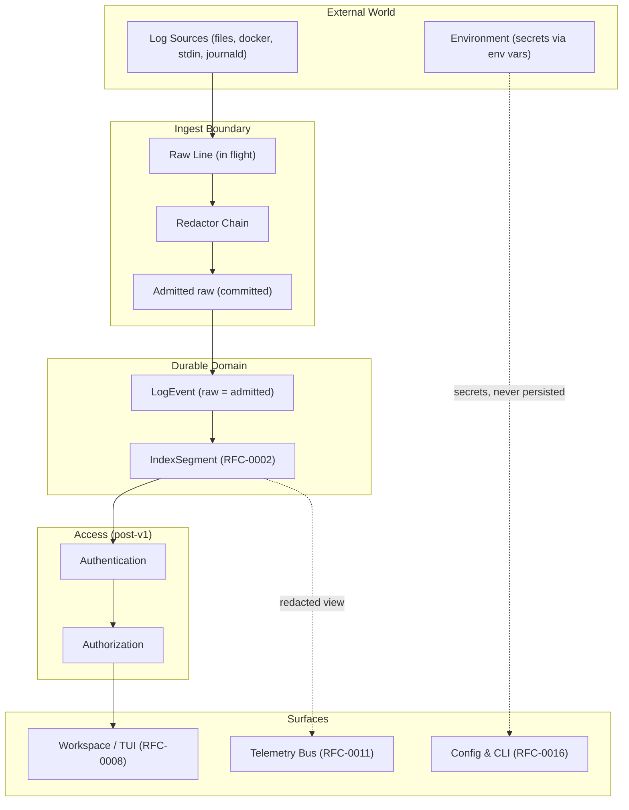
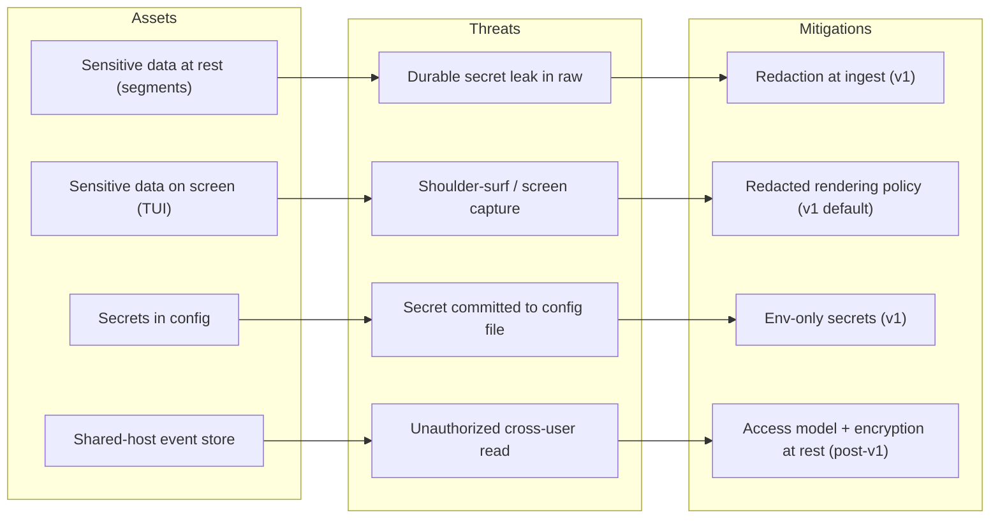
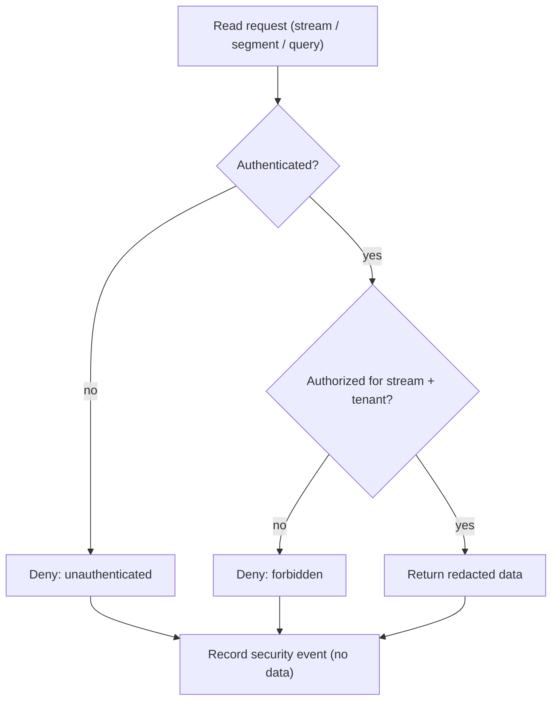

# RFC-0015 — Security & Access Model

**Status:** Draft
**Author:** carvalhosauro
**Version:** 1.0

---

# 1. Introduction

This document defines the **Security & Access Model** for **Lode**.

Lode reads logs, and logs carry secrets, tokens, and PII. A log investigation engine that faithfully preserves raw lines also faithfully preserves whatever sensitive data those lines contain. This RFC exists to make that risk explicit and to define how Lode contains it.

Its goal is to specify the threat model for a local-first tool, the redaction-at-ingest pillar that protects data before it becomes immutable, and the conceptual access and encryption policies that govern later milestones.

This document does not define storage or crypto mechanics, the config surface, or telemetry instrumentation. It describes the security contract, the redaction flow, and the access policy at a conceptual level, not implementation details.

---

# 2. Purpose / Motivation

Lode is local-first. It runs on a developer's laptop, on a shared bastion host, or on an operator's workstation. It reads production logs that were never sanitized for analysis. Those logs contain bearer tokens, API keys, card numbers, emails, and arbitrary user data.

Security exists to ensure that ingesting a log into Lode does not turn that log into a new, durable, queryable copy of its secrets.

Problems it prevents:

- Persisting unredacted secrets into immutable segments where they can never be removed.
- Leaking sensitive values onto the screen, into telemetry, or into config files.
- Treating raw preservation (RFC-0000) as a license to durably store secrets verbatim.
- Conflating "the source is trusted" with "the data is safe to keep".
- Designing access control after data is already exposed, instead of before.

Security guarantees one thing above all: the sensitive original bytes of a log line are redacted at the ingest boundary, before the event's `raw` is committed, and the unredacted original is never persisted.

---

# 3. Architecture Overview

## 3.1 Security Layers



## 3.2 Position in the System

Security is a cross-cutting concern with one owned mechanism and several owned policies.

- It **owns the redaction stage**, which sits inside the ingest boundary (RFC-0001), after a raw line is read and before it becomes a committed `LogEvent.raw` (RFC-0000).
- It **owns the security policy** for access control, encryption at rest, and secrets handling, while delegating the mechanics to the RFCs that own them.

It defines no storage layout, no query language, and no UI.

---

# 4. Principles

Security follows these design principles:

- Redact-before-commit (sensitive bytes are removed before immutability takes hold).
- Persist-nothing-secret (the unredacted original is never written anywhere durable).
- Fail-safe (a redactor that errors must not let unredacted data through).
- Secrets-from-environment (secrets enter only through env vars, never config files).
- Least-exposure (each surface — disk, screen, telemetry — minimizes what it reveals).
- Policy-here-mechanism-elsewhere (this RFC states what must be protected; owners define how).
- Conservative-by-default (v1 ships redaction; access and crypto are deliberately deferred, not assumed).
- Auditable (every redaction and access decision is observable without revealing the secret itself).

---

# 5. Core Concepts / Model

## 5.1 Threat Model

The threat model enumerates assets, threats, and the mitigation that owns each threat. It is scoped explicitly: v1 mitigations are committed in this RFC; later mitigations are conceptual.



### 5.1.1 Assets

- **Sensitive data at rest** — secrets and PII inside sealed `IndexSegment`s (RFC-0002). Immutable, so they cannot be edited out after the fact.
- **Sensitive data on screen** — raw values and matches rendered in the Workspace / TUI (RFC-0008).
- **Secrets in config** — credentials needed to reach a source (e.g. a Docker endpoint token).
- **Multi-user shared host** — a single machine where multiple users run or read Lode against the same event store.

### 5.1.2 Threats and Scope

- **Durable secret leak** — an unredacted secret reaches an immutable segment. **In scope for v1.** Mitigated by redaction at ingest.
- **On-screen exposure** — a secret that survived redaction is shown verbatim in the TUI. **Partially in scope for v1**: redaction removes most secrets before they exist; the TUI inherits already-redacted `raw`. Advanced reveal/mask controls are post-v1.
- **Secret in config** — a credential written to a config file on disk. **In scope for v1** as a prohibition: secrets come only from env vars (RFC-0016).
- **Telemetry leak** — a sensitive value emitted on the telemetry bus. **In scope for v1** as a prohibition: telemetry carries no `raw` and no secrets (RFC-0011).
- **Unauthorized cross-user read** — one user reads another user's streams or store on a shared host. **Out of scope for v1.** Addressed by the access model in a later milestone.
- **Disk theft / offline store copy** — segments read off a stolen disk. **Out of scope for v1.** Addressed by encryption at rest in a later milestone.

## 5.2 Redactor

The unit of redaction. One redactor recognizes a class of sensitive data and replaces it with a stable, non-reversible placeholder.

Fields:

- `id`
- `kind` — `pattern` | `pluggable`
- `target` — the sensitive class it matches (e.g. api_key, bearer_token, email, card_number, custom).
- `placeholder` — the token substituted for a match (e.g. `[REDACTED:api_key]`).

Responsibilities:

- detect occurrences of its target class within a raw line.
- replace each occurrence with its placeholder.
- never emit, log, or retain the matched original.

A redactor is pure with respect to the line: it transforms text in, text out. It holds no state across lines and never reaches outside the line it is given.

## 5.3 Redactor Chain

The ordered composition of redactors applied to a single raw line at the ingest boundary.

Responsibilities:

- run each redactor in declared order over the line.
- thread the output of one redactor as the input to the next.
- produce the **admitted raw** — the line as it will be committed to `LogEvent.raw`.

The chain is the only transformation permitted between a raw line being read and `raw` becoming immutable. Built-in redactors cover common classes (API keys, bearer tokens, emails, card numbers); custom regex redactors and pluggable redactors (RFC-0010) extend the chain without changing it.

## 5.4 Admitted Raw

The result of running the redactor chain over an incoming line.

`LogEvent.raw` is defined as the admitted raw, not the original bytes. This is the precise reconciliation with RFC-0000's immutability invariant:

- RFC-0000 says `raw` is immutable and never lost.
- Redaction is applied **before** `raw` exists as a committed value.
- "Raw" therefore means **raw as admitted** — the verbatim line minus the sensitive spans the chain matched.
- The unredacted original is held only in flight, only long enough to run the chain, and is never persisted.

Immutability still holds: once admitted, `raw` is never altered or discarded. Redaction is the single transformation that occurs *before* immutability takes hold, not an edit of an immutable value.

## 5.5 Access Policy (post-v1)

The conceptual model that decides who may read which streams and segments. Deferred to a later milestone; stated here so v1 does not foreclose it.

Concepts:

- **Principal** — an authenticated identity (a user or a token).
- **Authentication** — establishing that a principal is who it claims to be.
- **Authorization** — deciding whether a principal may perform an action.
- **Stream-level access** — grants scoped to individual `LogStream`s.
- **Tenant** — an isolation boundary; a tenant's events are invisible to other tenants.

In v1 there is no principal and no authorization: the operating-system user owns the local store, and host file permissions are the only boundary. This is stated explicitly so the absence is a documented decision, not an oversight.

## 5.6 Secret

A credential required to reach or operate a source, distinct from sensitive data *inside* logs.

Properties:

- A secret enters Lode **only** through an environment variable.
- A secret is **never** read from a config file (RFC-0016).
- A secret is **never** written to a log, a segment, or the telemetry bus (RFC-0011).
- A secret is referenced in config by name, never by value.

Secrets and redaction targets are different assets: redaction protects sensitive data found *in* the logs; secret handling protects credentials Lode itself *uses*.

---

# 6. Processing Flow

## 6.1 Redaction at Ingest

Redaction runs at the ingest boundary, between reading a raw line (RFC-0001) and committing it as `LogEvent.raw` (RFC-0000).

1. The adapter reads a raw line and reports its `source_offset`.
2. The line, still in flight, enters the redactor chain.
3. Each redactor runs in order, replacing matched spans with placeholders.
4. If a redactor errors, the chain fails safe: the line is held, not admitted, until the failure is resolved per policy. Unredacted data never passes through on error.
5. The chain produces the admitted raw.
6. The admitted raw is committed as the immutable `LogEvent.raw`.
7. The unredacted original is dropped from memory; it is never written anywhere durable.
8. The event proceeds to enrichment, indexing (`index_time`, `row_anchor`), and storage with no knowledge that redaction occurred.

```mermaid
flowchart LR
    L["Raw line @ source_offset"] --> R1["Redactor: api_key"]
    R1 --> R2["Redactor: bearer_token"]
    R2 --> R3["Redactor: email"]
    R3 --> R4["Redactor: card_number"]
    R4 --> R5["Redactor: custom regex"]
    R5 --> AR["Admitted raw"]
    AR --> COMMIT["Commit LogEvent.raw (immutable)"]
    COMMIT --> ORIG["Drop unredacted original (never persisted)"]
```



Redaction is irreversible by design. Because the original is never persisted, a placeholder can never be expanded back to its secret — not by Lode, not by a later query, not off a stolen disk.

## 6.2 Access-Control Decision (post-v1)

When the access model is introduced, every read of a stream or segment passes a decision before data is returned. In v1 this collapses to "host user owns the store"; the flow is documented for the later milestone.

1. A request arrives to read a stream, segment, or query result.
2. The principal is authenticated (or rejected if unauthenticated).
3. The principal's grants are resolved against the requested stream and tenant.
4. If authorized, the read proceeds against already-redacted `raw`.
5. If not, the read is denied and the denial is recorded.
6. The decision is observable as a security event, carrying the principal and the outcome — never the data.



## 6.3 Secret Resolution

1. Config references a secret by name (RFC-0016), never by value.
2. At startup, the named secret is resolved from the environment.
3. If absent, the dependent source fails to open with a clear reason; Lode never falls back to a config-file value.
4. The resolved secret lives only in process memory for the lifetime of the source connection.
5. The secret is never copied into a `LogEvent`, a segment, telemetry (RFC-0011), or any log line Lode itself produces.

---

# 7. Contract

Security is not directly executable, but it defines conceptual contracts. The Redactor is a trait (formalized in RFC-0014):

```rust
trait Redactor {
    fn target(&self) -> &str;

    fn redact(&self, line: &str) -> Result<String, RedactError>;
}
```

The chain and boundary contracts:

```rust
fn build_chain(redactors: Vec<Box<dyn Redactor>>) -> Result<RedactorChain, RedactError>;

fn admit(chain: &RedactorChain, raw_line: &str) -> Result<String, RedactError>;

fn commit_raw(stream: &LogStream, admitted_raw: String, source_offset: u64) -> Result<LogEvent, IngestError>;
```

The secret-handling contract:

```rust
fn resolve_secret(name: &str) -> Result<String, SecretError>;
// SecretError::NotInEnv when the named variable is absent
```

The access contract (post-v1):

```rust
fn authenticate(credential: &Credential) -> Result<Principal, AuthError>;

fn authorize(principal: &Principal, action: Action, resource: &Resource) -> Result<(), AuthError>;
// AuthError::Forbidden when access is denied
```

A redactor that returns `Err(RedactError)` is fail-safe: `admit` propagates the error and the line is never committed with unredacted content. `commit_raw` only ever receives an admitted raw — it can never see the original bytes.

---

# 8. Concurrency

The redactor chain is applied per line, within the stream's ingest loop (RFC-0001). Each `LogStream` runs its chain in isolation; chains share no state across streams.

Redactors are pure functions of a single line and hold no cross-line state, so a chain is safe to run concurrently across streams with no coordination.

Secret resolution happens once per source connection at open time, not per line, and is never on the hot path.

---

# 9. Failure Handling

Security failures fail safe — toward less exposure, never more.

Examples:

- redactor error → the chain fails; the line is not admitted with unredacted content (DEC-002).
- missing secret → the dependent source fails to open with `SecretError::NotInEnv`; no config-file fallback.
- a class the chain does not cover → only that class survives into `raw`; the failure is in coverage, not in the guarantee. New redactors extend coverage without weakening the model.
- corrupt or untrusted custom redactor (RFC-0010) → isolated like any plugin; its failure fails the chain safe, it never silently passes data through.

Crash of one stream's ingest loop, including its chain, never affects another stream. Supervision and retry belong to the Runtime (RFC-0012) and Recovery (RFC-0013).

---

# 10. Observability

Security emits internal events that describe *that* something happened, never *what* sensitive value was involved:

- `security.redaction.applied` — a line passed through the chain (counts per target class, never the matched text).
- `security.redaction.failed` — a redactor errored and the line was withheld.
- `security.secret.resolved` — a named secret was resolved from env (name only, never value).
- `security.secret.missing` — a named secret was absent.
- `security.access.denied` — an access decision was denied (post-v1; principal and resource, never data).

These events do not alter any flow; they only provide observability (RFC-0009 / RFC-0011). The telemetry bus must never carry `raw`, redaction matches, or secret values.

---

# 11. Extensibility

Security evolves by adding redactors and, later, access mechanisms — never by weakening the commit-time guarantee.

Future extension examples:

- new built-in redactor classes (e.g. JWT, private keys, national IDs).
- custom regex and pluggable redactors via the Plugin System (RFC-0010).
- the full access model: authentication, authorization, stream-level grants, multi-tenant isolation.
- encryption at rest, policy owned here and mechanics owned by RFC-0002.

Every redactor must satisfy the `Redactor` trait in Section 7 (formalized in RFC-0014). No extension may reintroduce the unredacted original into a durable path.

---

# 12. Encryption at Rest (post-v1)

Encryption at rest is deferred. This RFC owns the **policy**; RFC-0002 owns the **mechanics**.

Policy:

- **What must be encrypted** — sealed `IndexSegment`s and their indexes, since they hold admitted `raw` which, despite redaction, may still carry residual sensitive context.
- **Key handling (conceptual)** — encryption keys are secrets and follow Section 5.6: supplied via the environment, never stored in config, never written to logs or telemetry. Lode never persists a key alongside the data it protects.
- **Boundary** — Lode decides *that* segments are encrypted and *which* keys apply; RFC-0002 decides *how* bytes are encrypted, mapped, and read back.

Redaction at ingest and encryption at rest are complementary, not redundant: redaction removes secrets that need never exist; encryption protects whatever sensitive context legitimately remains.

---

# 13. Out of Scope

This RFC does not define:

- Storage and crypto mechanics — encryption byte layout, segment mapping (RFC-0002).
- The config surface for declaring redactors and secret references (RFC-0016).
- Telemetry transport and the structured-logging bus (RFC-0011); this RFC only states what must not leak onto it.
- The domain event model (RFC-0000).
- Ingestion read loop, adapters, and offsets (RFC-0001).
- Custom/pluggable redactor packaging and the plugin sandbox (RFC-0010).
- Runtime supervision and retry policy (RFC-0012).
- Failure recovery and degraded mode (RFC-0013).
- Trait contracts in formal form (RFC-0014).

These topics are specified in their own RFCs.

---

# 14. Decisions

## DEC-001 — Redaction Happens at the Ingest Boundary, Before Commit

The redactor chain runs after a raw line is read and before `LogEvent.raw` is committed. Redaction is the one transformation allowed before immutability takes hold.

## DEC-002 — The Unredacted Original Is Never Persisted

The original bytes exist only in flight, only long enough to run the chain. They are never written to a segment, telemetry, config, or any Lode-produced log. "Raw" means raw as admitted.

## DEC-003 — Redaction Is Fail-Safe

A redactor that errors fails the chain; the line is not committed with unredacted content. Failure always resolves toward less exposure, never more.

## DEC-004 — Secrets Come Only From the Environment

Secrets enter exclusively through env vars, are referenced in config by name, and are never read from config files (RFC-0016).

## DEC-005 — No Secret Reaches Telemetry or Persisted Data

`raw`, redaction matches, and secret values never appear on the telemetry bus (RFC-0011) or in any persisted artifact beyond the admitted `raw`.

## DEC-006 — Access Control Is Deferred to a Later Milestone

v1 ships no principal, authentication, or authorization. The host operating-system user and file permissions are the only boundary. This absence is a documented decision.

## DEC-007 — Encryption at Rest Is Policy Here, Mechanism in RFC-0002

This RFC defines what must be encrypted and how keys are handled conceptually; RFC-0002 owns the byte-level mechanics.

---

# 15. Glossary

| Term            | Definition                                                                 |
| --------------- | -------------------------------------------------------------------------- |
| Redactor        | A unit that detects one class of sensitive data and replaces it            |
| Redactor Chain  | The ordered composition of redactors applied to a single raw line          |
| Admitted Raw    | The line after the chain runs; the value committed to `LogEvent.raw`        |
| Redaction       | Replacing sensitive spans with stable, non-reversible placeholders          |
| Fail-Safe       | Resolving a security failure toward less exposure, never more               |
| Secret          | A credential Lode uses to reach a source; sourced only from env vars       |
| Principal       | An authenticated identity (post-v1)                                        |
| Authentication  | Establishing that a principal is who it claims to be (post-v1)             |
| Authorization   | Deciding whether a principal may perform an action (post-v1)               |
| Tenant          | An isolation boundary between distinct sets of events (post-v1)            |
| Encryption at Rest | Protecting sealed segments on disk; policy here, mechanism in RFC-0002   |
