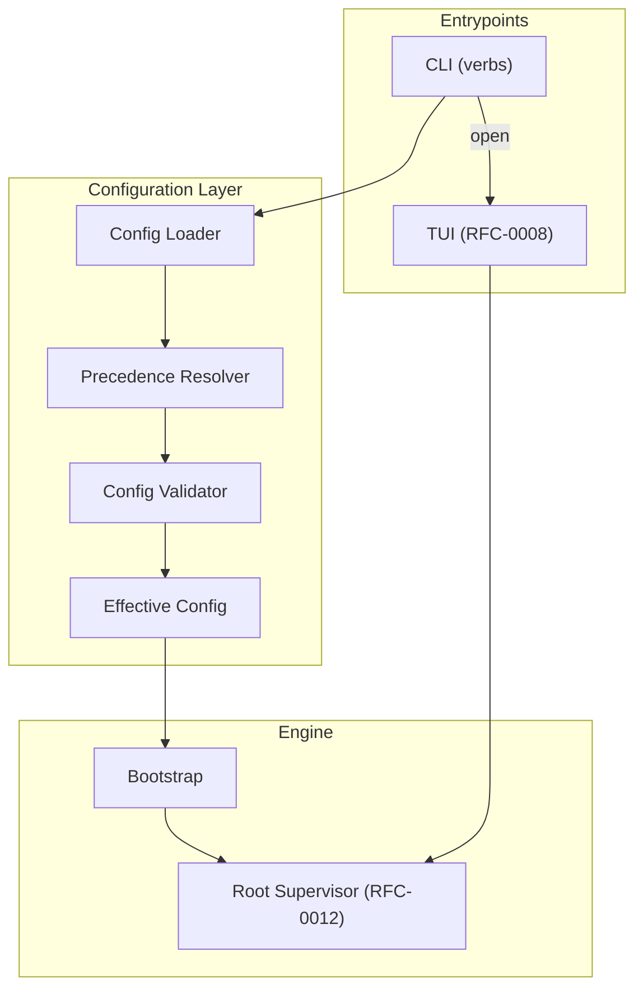
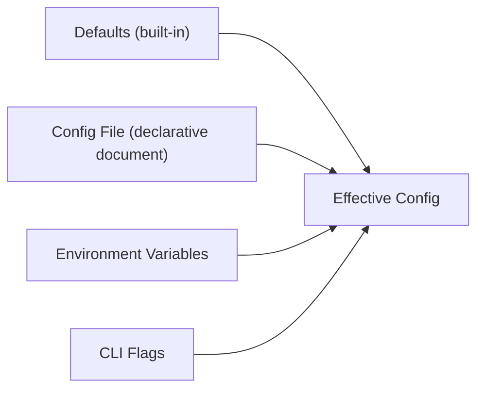
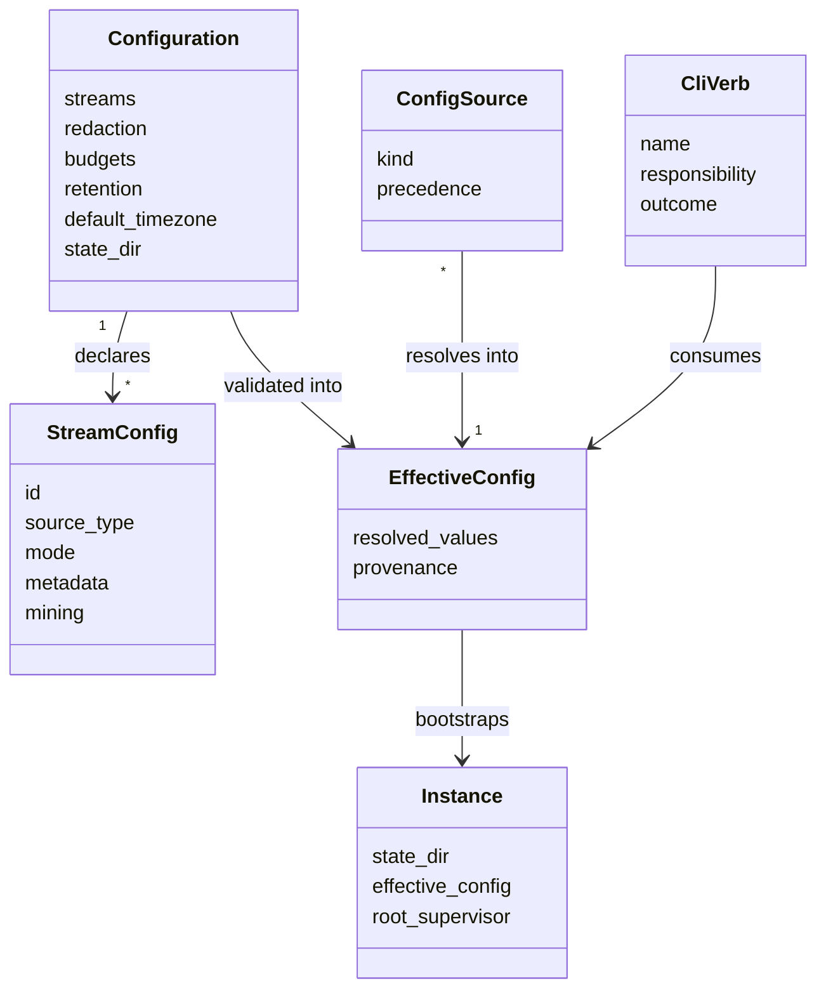
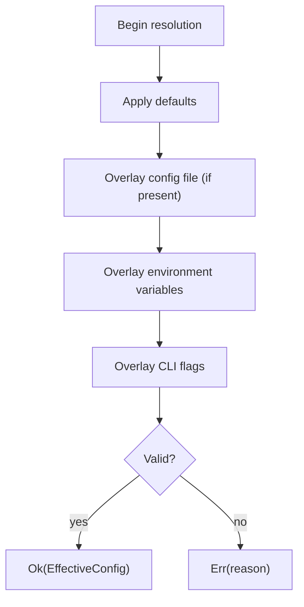
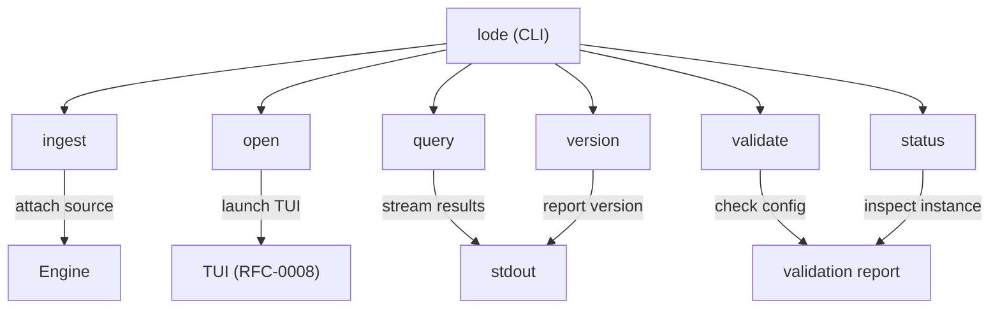
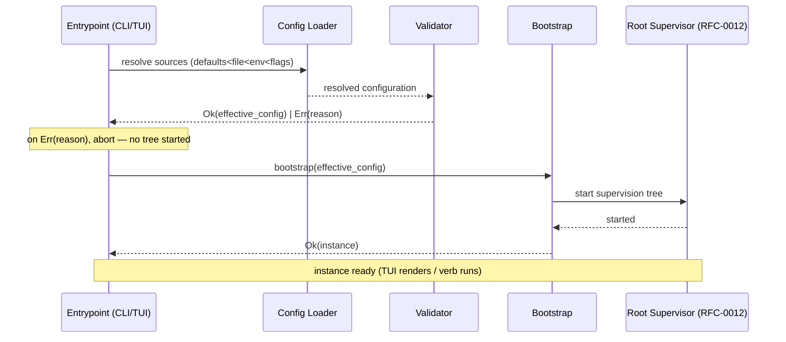

# RFC-0016 — Configuration & CLI Model

**Status:** Draft
**Author:** carvalhosauro
**Version:** 1.0

---

# 1. Introduction

This document defines the **Configuration & CLI Model** for **Lode**.

It specifies how a Lode instance is configured and how it is driven from the command line: what is configurable, how a configuration document is loaded and validated, how configuration sources are layered into one effective configuration, and which CLI verbs exist and what each promises.

Configuration is declarative data, not code. The CLI is one entrypoint over the engine, exactly as the TUI (RFC-0008) is one renderer over the engine. Both drive the same supervised runtime (RFC-0012).

This document does not define process supervision (RFC-0012), rendering (RFC-0008), security policy (RFC-0015), or which performance budgets exist (RFC-0009). It defines only the configuration surface and the CLI surface that sit in front of those subsystems.

---

# 2. Purpose / Motivation

Many RFCs assume "configured" values — declared streams, redaction rules, budgets, a retention window, a default timezone — but no surface declares them and no entrypoint launches the engine. This RFC closes that gap.

It exists to:

- give every "configured" value a single, declarative home
- define one deterministic resolution order across configuration sources
- keep secrets out of configuration files entirely
- expose a small, stable set of CLI verbs over the engine
- describe how a Lode instance bootstraps from configuration into a running supervision tree

Problems it prevents:

- configured values scattered across components with no canonical source
- ambiguous precedence when a flag, an environment variable, and a file disagree
- secrets committed to or logged from configuration files
- the CLI growing engine logic instead of delegating to the engine
- a running instance with no defined state directory or startup contract

---

# 3. Architecture Overview

## 3.1 Where Configuration and the CLI Sit

Configuration and the CLI sit in front of the engine. The CLI parses intent, the configuration loader produces an effective configuration, and the engine is started from that configuration. Neither owns domain state.



## 3.2 Configuration Sources

The effective configuration is composed from four ordered sources. The CLI and environment override the file; the file overrides built-in defaults.



---

# 4. Principles

The configuration and CLI surface follow these principles:

- Declarative configuration (configuration is validated data, never executable code)
- Single source of truth (every "configured" value resolves to one effective configuration)
- Deterministic precedence (the same sources always resolve to the same effective configuration)
- Fail fast on invalid config (an invalid document never starts an engine)
- Secrets never in files (secrets arrive only through the environment, never echoed or logged)
- Thin entrypoint (the CLI parses intent and delegates; it holds no domain logic)
- One engine, many entrypoints (CLI and TUI drive the same runtime)
- Explicit state directory (a running instance has one declared place for its state)

---

# 5. Core Concepts / Model

## 5.1 Relationships



## 5.2 Configuration

The declarative document that describes a Lode instance.

It declares:

- **streams** — the set of `StreamConfig` entries to attach
- **redaction** — redaction rules applied to events (RFC-0015)
- **budgets** — performance budget ceilings (RFC-0009)
- **retention** — the retention window over sealed segments (RFC-0002)
- **default_timezone** — the timezone used when an event carries none (RFC-0006)
- **state_dir** — the directory that holds the instance's durable state

Properties:

- the configuration is data; it carries no executable code
- the configuration is validated as a whole before it is used
- the configuration never contains secrets

The conceptual format family is a structured, human-editable document (YAML/TOML class). This RFC fixes the schema, the validation contract, and the load outcome; it does not fix surface syntax.

Mining tunables are configuration in exactly this sense. Any per-stream `mining` overrides (§5.3) of the RFC-0003 tunables are declarative values, validated as part of the whole configuration and never interpreted as code; per-format tuning that today leaks into the engine belongs here as data, not as a hardcoded branch.

## 5.3 StreamConfig

One declared origin of events, mapped onto the RFC-0000 `LogStream` shape.

Fields:

- `id`
- `source_type` ∈ {file, docker, stdin, journald}
- `mode` ∈ {batch, tail, hybrid}
- `metadata`
- `mining` — optional per-stream overrides of the RFC-0003 mining tunables (RFC-0003 §11, §13): `depth` (`d`), `similarity_threshold` (`st`), `max_templates` (`T_max`), and `stabilization_threshold` (`N`, occurrences before `emerging` → `stable`). Every field is optional; an absent field falls back to its RFC-0003 default. The block carries data, never code.

A StreamConfig declares a stream; it performs no parsing and holds no business rules. It is the configuration projection of a LogStream.

The `mining` block is resolved and validated as part of the EffectiveConfig, on the same precedence chain as every other value (defaults < file < env < flags, §6). This gives per-stream tuning promised by RFC-0003 §13 a declarative home: a combined-log format that needs `depth > 4` (RFC-0003 §6.2) is declared in configuration, not encoded as a per-format branch in the engine.

## 5.4 ConfigSource

One layer that contributes values to the effective configuration.

Kinds, in increasing precedence:

- **defaults** — built-in, always present
- **file** — the declarative configuration document
- **environment** — environment variables
- **flags** — CLI flags

A ConfigSource only supplies values. It never validates the whole; validation is performed once, on the resolved result.

## 5.5 EffectiveConfig

The single resolved configuration the engine is started from.

Properties:

- produced by resolving all sources in precedence order
- validated as one document after resolution
- carries `provenance` so each resolved value knows which source supplied it
- immutable for the lifetime of an instance

## 5.6 CliVerb

One command exposed by the CLI.

Properties:

- a verb names a single responsibility
- a verb consumes the effective configuration
- a verb produces a `Result<Output, Error>` outcome
- a verb delegates work to the engine; it never reimplements it

## 5.7 Instance

A running Lode process, bootstrapped from an EffectiveConfig.

Properties:

- has exactly one `state_dir`
- owns one Root Supervisor (RFC-0012)
- is started by an entrypoint (CLI or TUI) and exposes the same engine to both

---

# 6. Configuration Precedence

Configuration is resolved from four sources in a fixed order. A later source overrides an earlier one, key by key. Resolution is total: a missing source contributes nothing and never aborts resolution.

Resolution order, lowest to highest precedence:

1. **Defaults** — built-in values, always present.
2. **Config file** — the declarative document, if one is found.
3. **Environment variables** — override file and defaults.
4. **CLI flags** — override everything; the most specific intent wins.



Rules:

- Resolution is deterministic: identical sources always yield the identical effective configuration.
- Override is per key, not per source: a flag overrides only the keys it sets.
- Validation runs once, on the fully resolved result, never per layer.
- An invalid effective configuration never starts an engine.

---

# 7. Secrets

Secrets are never part of the declarative configuration.

Rules:

- A secret (token, password, credential) is supplied only through an environment variable.
- The configuration file may reference a secret by the name of its environment variable; it never holds the secret value.
- A secret is never echoed back to stdout/stderr, never written to the state directory, never logged.
- Telemetry and structured logging (RFC-0011) carry references, never secret values.
- Redaction of secret-bearing event content is governed by RFC-0015.

The configuration validator treats a literal secret found in the configuration file as a validation error, not a warning. Security policy and redaction semantics are owned by RFC-0015; this RFC only states where secrets may and may not appear.

---

# 8. CLI Surface

The CLI exposes a small set of verbs over the engine. Each verb resolves the effective configuration, delegates to the engine, and returns a `Result<Output, Error>` outcome. This section defines responsibilities and outcomes, not flag-by-flag syntax.



## 8.1 ingest

Attaches a source to the engine as a LogStream.

Responsibility:

- resolve the StreamConfig (from configuration and/or flags)
- ask the engine to start ingestion for that stream
- report the attachment result

Outcome: `Result<StreamRef, Error>`. Starting the underlying worker is owned by RFC-0012; `ingest` only requests it.

## 8.2 open

Launches an interactive investigation: the TUI over a running engine.

Responsibility:

- ensure an Instance is running (bootstrap if necessary)
- hand the Workspace and engine to the rendering layer (RFC-0008)

Outcome: `Result<Session, Error>`. Rendering and interaction belong to RFC-0008; `open` only wires the entrypoint to the engine.

## 8.3 query

Runs a LodeQL query non-interactively and streams results to stdout.

Responsibility:

- parse the LodeQL query into its AST (RFC-0004)
- run it against the engine as a Query Executor (RFC-0012)
- stream results to stdout as they arrive, never fully buffering

Outcome: `Result<(), Error>`. Streaming is incremental; a non-zero exit status accompanies `Err(reason)`.

## 8.4 validate

Loads and validates the effective configuration without starting an engine.

Responsibility:

- resolve all configuration sources
- validate the resolved document, including the no-secrets-in-file rule
- report what is valid and what is not

Outcome: `Result<EffectiveConfig, Error>`. `validate` never attaches a source and never mutates the state directory.

## 8.5 status

Reports the state of a running Instance.

Responsibility:

- inspect the running engine (active streams, budget posture, instance health)
- present a read-only snapshot

Outcome: `Result<InstanceStatus, Error>`. `status` reads; it never alters the engine. Detailed telemetry transport is owned by RFC-0011.

## 8.6 version

Reports the Lode version.

Responsibility:

- print version identification to stdout

Outcome: `Result<String, Error>`. `version` requires neither configuration nor a running engine.

---

# 9. Bootstrap & Lifecycle

A Lode instance starts the same way regardless of entrypoint: resolve configuration, validate it, then start the supervision tree from it.

Startup sequence:

1. The entrypoint (CLI verb or TUI launch) requests an instance.
2. The configuration sources are resolved in precedence order (Section 6).
3. The resolved effective configuration is validated as one document.
4. On `Err(reason)`, startup aborts; no supervision tree is started.
5. On `Ok(effective_config)`, the state directory is resolved and prepared.
6. The engine bootstraps the Root Supervisor (RFC-0012) from the effective configuration.
7. Declared streams are attached as Stream Workers (RFC-0012) under the tree.
8. The instance is ready; the entrypoint proceeds (TUI renders, or a verb runs).



The configuration maps onto the runtime as follows:

- each `StreamConfig` becomes a Stream Worker under the Ingestion Supervisor (RFC-0012)
- `budgets` configure the budget contract observed by the engine (RFC-0009)
- `retention` configures segment eviction (RFC-0002)
- `default_timezone` configures temporal interpretation (RFC-0006)
- `redaction` configures the redaction rules (RFC-0015)
- `state_dir` is where durable state (sealed segments and instance state) lives

The CLI is one renderer/entrypoint over the engine. The same engine the TUI (RFC-0008) drives is the engine a CLI verb drives; configuration and bootstrap are shared, not duplicated per entrypoint.

---

# 10. Contract

The configuration and CLI surface define conceptual contracts:

```rust
fn load_config(sources: &[ConfigSource]) -> Result<EffectiveConfig, ConfigError>;

fn resolve_precedence(defaults: &Defaults, file: Option<&ConfigFile>, env: &Env, flags: &Flags) -> Result<ResolvedConfig, ConfigError>;

fn validate_config(resolved: ResolvedConfig) -> Result<EffectiveConfig, ConfigError>;

fn bootstrap(effective_config: EffectiveConfig) -> Result<Instance, BootstrapError>;

fn run_verb(verb: CliVerb, effective_config: &EffectiveConfig) -> Result<Output, Error>;
```

Every contract that touches configuration returns the effective configuration or an error. `bootstrap` is the single boundary between configuration data and the running runtime (RFC-0012).

---

# 11. Observability

The configuration and CLI surface emit internal events for observability (RFC-0009 / RFC-0011):

- `config.loaded`
- `config.validation.failed`
- `cli.verb.invoked`
- `cli.verb.completed`
- `instance.bootstrapped`

These events report configuration and entrypoint activity; they never carry secret values and never alter the events being investigated.

---

# 12. Extensibility

The configuration and CLI surface evolve by adding declarations and verbs without changing the engine:

- new configuration keys with their own defaults and validation
- new `source_type` or `mode` values in StreamConfig (mirroring RFC-0000)
- new CLI verbs over the same engine
- new configuration source kinds, placed explicitly in the precedence order
- alternative document formats within the same schema and load contract

Every extension must keep configuration declarative, keep secrets out of files, and keep the entrypoint thin.

---

# 13. Out of Scope

This RFC does not define:

- Process topology, supervision, and recovery (RFC-0012)
- Rendering and TUI interaction (RFC-0008)
- Security and redaction policy semantics (RFC-0015)
- Which performance budgets exist and their ceilings (RFC-0009)
- Storage layout and retention mechanics (RFC-0002)
- Timezone and ordering semantics (RFC-0006)
- Telemetry transport (RFC-0011)
- Query language and evaluation (RFC-0004)

These topics are specified in their own RFCs.

---

# 14. Decisions

## DEC-001 — Configuration is Declarative Data

Configuration is a validated document, never executable code. The engine is started from data, not from a script.

## DEC-002 — One Effective Configuration

All sources resolve into a single effective configuration; every "configured" value has exactly one canonical resolved home.

## DEC-003 — Fixed Precedence: defaults < file < env < flags

Sources are layered in one deterministic order. Override is per key, and the most specific source wins.

## DEC-004 — Validate Once, Fail Fast

Validation runs on the fully resolved configuration, before any engine starts. An invalid configuration never bootstraps a supervision tree.

## DEC-005 — Secrets Never in Files

Secrets arrive only through the environment. A literal secret in a configuration file is a validation error, and secrets are never echoed or logged (RFC-0015 / RFC-0011).

## DEC-006 — The CLI is One Entrypoint Over the Engine

The CLI parses intent and delegates to the engine. It is one entrypoint among many; the TUI (RFC-0008) drives the same engine through the same bootstrap.

---

# 15. Glossary

| Term             | Definition                                                                 |
| ---------------- | -------------------------------------------------------------------------- |
| Configuration    | The declarative, validated document describing a Lode instance             |
| StreamConfig     | The configuration projection of a LogStream (id, source_type, mode, metadata) |
| ConfigSource     | One layer contributing values: defaults, file, environment, or flags       |
| Precedence       | The fixed override order defaults < file < env < flags                     |
| EffectiveConfig  | The single resolved, validated configuration an instance starts from       |
| CliVerb          | One CLI command: ingest, open, query, validate, status, version            |
| Bootstrap        | The step that turns an effective configuration into a running instance     |
| Instance         | A running Lode process with one state directory and one Root Supervisor    |
| State Directory  | The directory that holds an instance's durable state                       |
| Secret           | A credential supplied only via the environment, never stored in files      |
