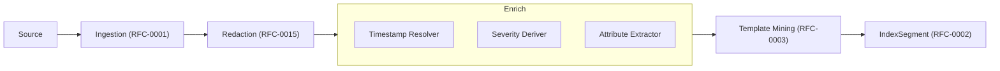
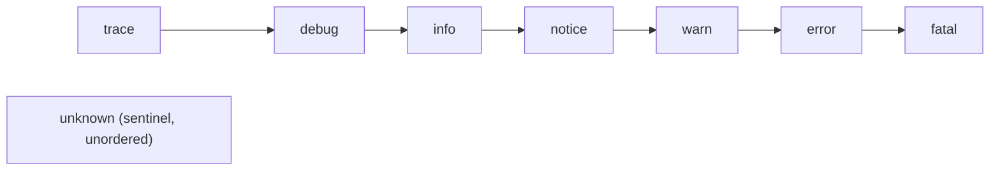
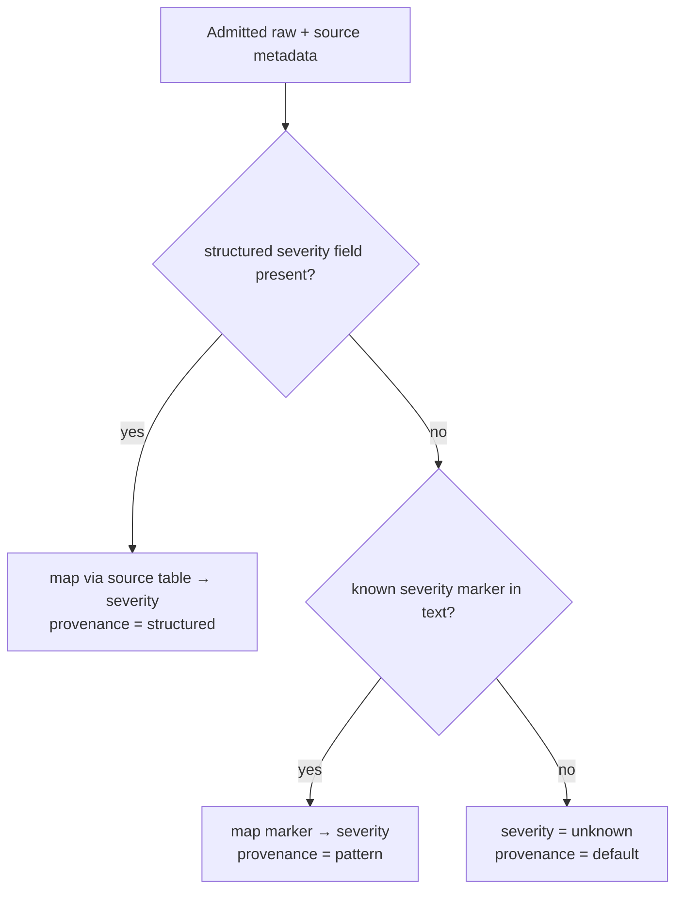
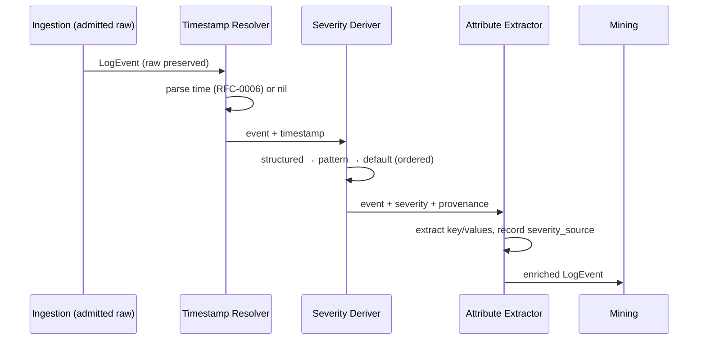

# RFC-0017 — Enrichment & Severity Model

**Status:** Draft
**Author:** carvalhosauro
**Version:** 1.0

---

# 1. Introduction

This document defines the **Enrichment Pipeline** for **Lode**, and within it the **Severity Model** in depth.

Enrichment is the stage between Ingestion (RFC-0001) and Template Mining (RFC-0003). It consumes a raw LogEvent and derives the fields the rest of the system depends on: timestamp, **severity**, and attributes — without ever mutating `raw`.

Severity is specified here in full because a downstream consumer requires it: the Regression detector (RFC-0005) keys on error-bearing activity, which is undefined without a severity model. Until now severity was named but never specified; this RFC closes that gap.

---

# 2. Purpose

Raw log lines are opaque. "Is this an error?" and "when did it happen?" are not answerable from bytes alone. Enrichment turns an admitted raw line into a structured, analyzable LogEvent.

The Enrichment Pipeline exists to:

- resolve a timestamp (delegating parsing rules to RFC-0006)
- derive a **severity** on a single canonical scale, with provenance
- extract attributes (key/value pairs) for filtering and correlation
- do all of the above deterministically, so the same input always enriches the same way

Severity matters most: it drives the Regression detector (RFC-0005), severity filters in the Workspace (RFC-0007), and at-a-glance triage in the TUI (RFC-0008). A wrong or guessed severity poisons all three.

---

# 3. Architecture Overview

## 3.1 Position in the System



Redaction (RFC-0015) runs first, so enrichment — like everything downstream — only ever sees the admitted, redacted `raw`. Enrichment then derives timestamp, severity, and attributes, and hands the enriched event to mining.

## 3.2 Sub-components

- **Timestamp Resolver** — parses a timestamp from the raw line / source metadata under the rules of RFC-0006; sets `timestamp = nil` when none can be resolved.
- **Severity Deriver** — assigns a canonical `severity` and its provenance (Section 6).
- **Attribute Extractor** — pulls key/value pairs (structured fields, captured mask values from RFC-0003) into `attributes`.

---

# 4. Principles

- Source-preserving (enrichment reads `raw`, never alters it)
- Deterministic (same raw + source_type + ruleset → same enrichment)
- Honest over helpful (never guess; unknown is a first-class outcome)
- Provenance-bearing (every derived severity records how it was derived)
- Per-source aware (different sources use different conventions; mappings are per `source_type`)
- Non-blocking (enrichment failure degrades the event, never the pipeline)

---

# 5. Core Concepts

## 5.1 Enriched LogEvent

Enrichment populates these LogEvent fields (entity in RFC-0000):

- `timestamp` — resolved event time, or `nil` (RFC-0006)
- `severity` — a canonical severity value (5.2), possibly `unknown`
- `attributes` — derived key/value pairs, including a severity provenance marker

`raw`, `source`, and `source_offset` are set upstream by Ingestion and are never changed here.

## 5.2 Canonical Severity Scale

Every event is mapped onto one ordered scale, regardless of source convention:



- Ordered, low → high: `trace < debug < info < notice < warn < error < fatal`.
- `unknown` is a sentinel, not a level: it never compares as higher or lower; it means "severity could not be determined".
- Comparisons (e.g. "≥ warn") are defined only over the ordered levels; `unknown` is excluded from every threshold.

## 5.3 Severity Provenance

Each derived severity records **how** it was determined:

- `structured` — read from an explicit source field (highest trust)
- `pattern` — inferred from markers in the raw text (medium trust)
- `default` — nothing matched; severity is `unknown` (no trust)

Provenance is stored on `attributes` (`severity_source`). It lets consumers weight severity: the Regression detector (RFC-0005) treats only `structured` and `pattern` as error-bearing evidence, never `default`.

## 5.4 Severity Mapping

A per-`source_type` table mapping source-native levels onto the canonical scale. Built-in mappings ship for common formats; mappings are configurable and extensible (RFC-0016 / RFC-0010).

---

# 6. Severity Model

## 6.1 Derivation Strategy

Severity is derived by an ordered, first-match-wins strategy. Determinism comes from the fixed order.



1. **Structured** — if the source exposes a severity field (JSON `level`, journald `PRIORITY`, syslog `PRI`), map it via the source table. Highest confidence.
2. **Pattern** — else scan the raw text for known markers (`ERROR`, `WARN`, `FATAL`, `panic`, `exception`, recognized stack-trace headers) and map the first match. Medium confidence.
3. **Default** — else `severity = unknown`, provenance `default`. The system never guesses `info`.

## 6.2 Built-in Source Mappings

| Source convention | Native → Canonical |
| ----------------- | ------------------ |
| syslog (RFC 5424) | debug→debug, info→info, notice→notice, warning→warn, err→error, crit/alert/emerg→fatal |
| journald `PRIORITY` | 7→debug, 6→info, 5→notice, 4→warn, 3→error, 2/1/0→fatal |
| App loggers | TRACE→trace, DEBUG→debug, INFO→info, WARN/WARNING→warn, ERROR→error, FATAL/PANIC→fatal |
| JSON `level` | string-normalized then mapped as App loggers |

Unmapped native values fall through to the pattern stage, never to a silent `info`.

## 6.3 Error-bearing Definition

Used by the Regression detector (RFC-0005):

- a template is **error-bearing** in a window if its events have `severity ≥ floor` (default `floor = warn`) **and** provenance is `structured` or `pattern`.
- `unknown` and `default`-provenance events are never error-bearing.
- the floor is configurable per stream (RFC-0016).

## 6.4 Determinism

Given the same admitted `raw`, the same `source_type`, and the same mapping/marker ruleset, severity and provenance are identical. Severity derivation performs no I/O and no time-dependent logic. This is the testable invariant (Section 14).

---

# 7. Attribute Extraction

Attributes are derived key/value pairs attached to the event for filtering (RFC-0007) and future correlation (RFC-0005 v2):

- structured sources (JSON, logfmt) contribute their fields directly.
- the mask values captured during mining (RFC-0003) — `<IP>`, `<UUID>`, request ids — are recorded as attributes.
- `severity_source` (provenance, 5.3) is always present.

Attributes are derived and additive; they never alter `raw`. Attribute extraction beyond this is out of scope for v1.

---

# 8. Timestamp Resolution

Enrichment resolves `timestamp`, but the **rules** (formats, timezone ambiguity, `nil` on failure, the event-time / ingestion-time / index-time distinction) are owned by RFC-0006. This RFC only places resolution in the pipeline order; it does not redefine time semantics.

---

# 9. Processing Flow



Order is fixed — timestamp, then severity, then attributes — so enrichment is deterministic and each stage may use the prior result.

---

# 10. Contract

```rust
fn enrich(event: LogEvent) -> Result<LogEvent, EnrichError>;

fn derive_severity(raw: &[u8], source_type: &str, ruleset: &Ruleset) -> Result<(Severity, Provenance), EnrichError>;

fn map_severity(native_level: &str, source_type: &str) -> Result<Severity, MapError>;

fn extract_attributes(event: &LogEvent) -> Result<Attributes, EnrichError>;
```

`derive_severity` always returns `Ok((Severity::Unknown, Provenance::Default))` when nothing matches. It never returns `Err` on "no severity found"; that is a valid outcome, not a failure.

---

# 11. Concurrency

Enrichment is stateless per event and runs per stream in isolation (RFC-0012).

Enrichers hold no cross-event state; the same event enriches identically regardless of concurrency.

Enrichment never blocks ingestion or mining; a slow enricher applies backpressure (RFC-0001), it does not drop events.

---

# 12. Failure Handling

Failures are local and degrade the single event, never the pipeline:

- unparseable timestamp → `timestamp = nil` (RFC-0006)
- no severity determinable → `severity = unknown`, provenance `default`
- attribute extraction error → empty attributes, event still flows

The raw is always preserved, so a degraded event can be re-enriched in batch (RFC-0003) once rules improve.

---

# 13. Observability

The Enrichment Pipeline emits internal events:

- `enrich.timestamp.resolved`
- `enrich.severity.derived`
- `enrich.attributes.extracted`
- `enrich.degraded` (any field could not be derived)

These provide observability only and never alter enrichment (RFC-0009 / RFC-0011).

---

# 14. Determinism and Acceptance

Severity quality is measured against the shared golden corpus (RFC-0003 / RFC-0005):

- **Golden corpus** — standard-format samples annotated with ground-truth severity per line.
- **Metric** — severity accuracy (fraction of lines assigned the correct canonical severity), reported separately for structured and pattern derivation.
- **Acceptance bar** — `accuracy ≥ 0.98` on structured sources; `accuracy ≥ 0.85` on pattern-only sources. `unknown` on a line that has no determinable severity counts as correct, not a miss.
- **Determinism test** — re-running enrichment over the corpus yields identical severity and provenance for every line.

---

# 15. Extensibility

Without breaking existing behavior:

- new per-`source_type` severity mappings (built-in or via RFC-0010)
- new severity markers for the pattern stage
- richer attribute extractors per dialect
- a configurable error-bearing floor per stream (RFC-0016)

Every extension respects the canonical scale (5.2), the ordered strategy (6.1), and the determinism invariant (6.4).

---

# 16. Out of Scope

This RFC does not define:

- The domain entities themselves (RFC-0000)
- Ingestion and the admitted-raw boundary (RFC-0001)
- Redaction, which runs before enrichment (RFC-0015)
- Template mining, which consumes enriched events (RFC-0003)
- Time parsing rules and ordering (RFC-0006)
- Insight detection that uses severity (RFC-0005)
- Configuration of mappings, markers, and floors (RFC-0016)
- Runtime supervision and recovery (RFC-0012 / RFC-0013)

---

# 17. Decisions

## DEC-001 — One Canonical Severity Scale

All sources map onto a single ordered scale (`trace … fatal`) plus the `unknown` sentinel. Downstream code never deals with source-native levels.

## DEC-002 — Never Guess: unknown is First-Class

When severity cannot be determined, the result is `unknown` with `default` provenance — never a guessed `info`. A wrong severity is worse than an honest unknown.

## DEC-003 — Ordered, First-Match Derivation

Severity is derived structured → pattern → default, in that fixed order. The order makes derivation deterministic and ranks trust.

## DEC-004 — Provenance is Recorded

Every severity carries how it was derived (`structured` / `pattern` / `default`). Consumers weight severity by provenance; regression ignores `default`.

## DEC-005 — Error-bearing Requires Trust

A template is error-bearing only when `severity ≥ floor` (default `warn`) **and** provenance is `structured` or `pattern`. This protects Regression-detector precision (RFC-0005).

## DEC-006 — Enrichment Never Mutates Raw

Enrichment reads `raw` and writes only derived fields. A degraded event keeps its raw and can be re-enriched in batch.

## DEC-007 — Severity Derivation is Pure

No I/O, no clock, no randomness in severity derivation. Same input, same ruleset → same result. Verified against the golden corpus.

---

# 18. Glossary

| Term             | Definition                                                                 |
| ---------------- | -------------------------------------------------------------------------- |
| Enrichment       | The stage deriving timestamp, severity, and attributes from a raw event    |
| Canonical Severity | The single ordered scale (`trace … fatal`) all sources map onto          |
| `unknown`        | Sentinel severity meaning "could not be determined"; excluded from thresholds |
| Provenance       | How a severity was derived: `structured`, `pattern`, or `default`          |
| Severity Mapping | Per-`source_type` table from native levels to canonical severity           |
| Error-bearing    | A template with `severity ≥ floor` and trusted provenance (RFC-0005)       |
| Marker           | A text token (`ERROR`, `panic`, …) used in pattern-stage derivation        |
| Attribute        | A derived key/value pair attached to an event for filtering/correlation    |
