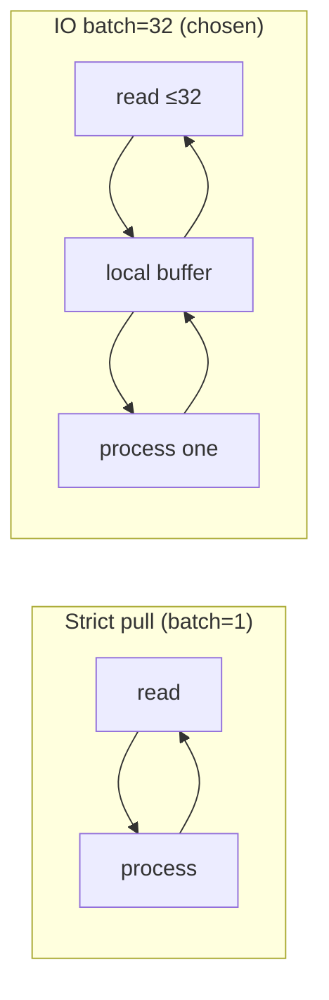

# Phase 0 — Technical Specification

> **Status:** tracker (working document — not committed yet)  
> **Scope:** T0.1 · T0.2 · T0.3 from [`TASKS.md`](../TASKS.md)  
> **Principle:** RFCs define *what* and *why*; this doc defines *how* in Rust.

---

## Decisions locked (2025-06-30)

| # | Decision |
|---|----------|
| D1 | Spec lives in `docs/phase-0-spec.md`; tracker only, no commit until reviewed |
| D2 | Mining intermediate types (`Token`, `MaskedTokens`, `MiningParams`, …) ship in **T0.2** |
| D3 | Mask evaluation order follows **RFC-0003 §6.1** diagram (not spike order) |
| D4 | Golden corpus starts with **3 handcrafted fixtures** only (no Loghub in T0.3) |
| D5 | **M1** — `std::thread` per stream, synchronous pipeline (no inter-stage channels) |
| D6 | Max raw line size **64 KiB** at ingest |
| D7 | **IO read batch** — `demand_batch = 32` lines per `read` call; process still one-by-one (see [§ Pull model](#t01--pull-model-m1)) |

---

## T0.1 — Runtime contract

RFC-0012 v1.1 is already balanced (`Result` + ownership primary, supervisor = panic safety-net). T0.1 delivers an **implementation supplement**: Rust shapes, invariants, and the concurrency decision.

### Crate boundary (Phase 3 implementation)

```
crates/lode-runtime/
  supervisor.rs      # flat JoinHandle watcher, one-for-one respawn
  worker.rs          # per-stream run loop
  backpressure.rs    # demand + watermarks
  types.rs           # WorkerId, ExitReason, ExitDirective, …
```

Depends on: `lode-core`, `lode-source`, `lode-storage`, `lode-parse`. Not part of T0.2.

### Types (supplement to RFC-0012 §11)

```rust
pub struct WorkerId(u64);

pub enum StopMode { Drain, Immediate }

pub enum ExitReason {
    Clean,   // intentional stop — supervisor does NOT respawn
    Panic,   // bug, isolated at task/thread boundary — respawn candidate
}

pub enum ExitDirective {
    Respawn,     // backoff/budget from RFC-0013
    DeadLetter,
    Ignore,
}

/// Exclusive per-stream state. Dropped on panic; never shared across workers.
pub struct StreamWorkerState {
    pub stream: LogStream,
    pub cursor: SourceOffset,
    // parse tree, segment writer handle, …
}
```

### Hard invariants (code-review checklist)

1. Expected failure → `Result` inside the worker loop; worker stays `Running`.
2. Panic → observed via `JoinHandle` / `catch_unwind`; supervisor respawns **one** worker from cursor.
3. `panic = "unwind"` in workspace `Cargo.toml` — do not switch to `abort`.
4. Shared-nothing between streams: no `Arc<Mutex<StreamState>>` across workers.
5. Sealed segments and bus are immutable from the worker's perspective (append-only).

### ROADMAP drift

[`ROADMAP.md`](../ROADMAP.md) line 36 still says "OTP supervision". Update to: *thin supervisor + `Result` errors, panic containment* when T0.1 closes.

---

## T0.1 — Async vs OS threads

RFC-0012 §6.1 allows *"async task or OS thread"* per stream worker. This section compares options for **Lode v1** context:

- Local-first, typically **1–8 active streams**
- Hot path is **CPU-bound** (tokenize → mask → drain); spike showed masking dominates cost
- IO is **intermittent** (file tail, stdin blocking read)
- Supervisor needs reliable panic isolation (`JoinHandle` / `catch_unwind`)
- TUI (Phase 5) is a separate concern — runtime must not assume async TUI

### Models under consideration

| ID | Model | Sketch |
|----|-------|--------|
| **M1** | `std::thread` per stream, **sync pipeline** inside | One loop: `read → enrich → mine → commit`; no inter-stage channels |
| **M2** | `std::thread` per stream, **staged channels** inside | Same ownership, but enrich/mine/index on sub-stages connected by `sync_channel` |
| **M3** | **Tokio** task per stream, async IO + sync CPU | `tokio::fs` / `AsyncRead` for source; mining inline or `spawn_blocking` |
| **M4** | **Hybrid** | Tokio reactor for IO multiplexing + `std::thread` pool for CPU stages |

### Comparison matrix

| Criterion | M1 Sync thread | M2 Thread + channels | M3 Tokio | M4 Hybrid |
|-----------|----------------|----------------------|----------|-----------|
| **Throughput (CPU)** | ★★★★★ No scheduler overhead; cache-hot loop | ★★★★ Context switches between stages | ★★★★ `spawn_blocking` adds hop; inline mining blocks executor | ★★★★★ CPU on dedicated threads |
| **IO latency (tail)** | ★★★ Blocking `read` stalls whole worker | ★★★ Same | ★★★★★ `poll` without blocking reactor | ★★★★★ |
| **Memory per stream** | ~2–8 MiB stack (OS default) + working set | Same + channel buffers | ~2–4 KiB task stack + runtime (~0.5–2 MiB fixed) + buffers | Runtime + thread stacks |
| **Memory at 8 streams** | ~16–64 MiB stacks + data | + channel memory (see § Channels) | ~0.5–2 MiB runtime + small tasks + data | Highest baseline |
| **Panic isolation** | ★★★★★ `JoinHandle` + `catch_unwind` — std, battle-tested | ★★★★★ Same | ★★★★ `JoinHandle` on task; unwind through runtime needs care | ★★★★ Must isolate both runtimes |
| **Code complexity** | ★★★★★ Single loop, no `Send`/`'static` puzzles | ★★★★ Explicit backpressure, more moving parts | ★★★ `async` contagion, cancellation, `spawn_blocking` bridging | ★★ Lowest — two models to reason about |
| **Maintenance** | Easiest to debug (sequential stack traces) | Medium — deadlocks if channel order wrong | Harder — pin, waker, lost wakeups, runtime upgrades | Hardest |
| **Determinism** | ★★★★★ Single thread = total order per stream | ★★★★★ Same if stages are FIFO | ★★★★ Cooperative scheduling can reorder unless pinned | ★★★★ |
| **Scales to 100+ streams** | ★★ Thread limit / RAM | ★★ | ★★★★★ | ★★★★ |
| **stdin / pipe** | Blocking is fine (dedicated thread) | Same | Natural fit | Overkill for v1 |
| **Future docker/journald** | Blocking adapters OK in v2 | Same | Nice for multiplexed sockets | Nice at scale |

### Resource model (quantitative)

**OS thread (M1/M2)** — Linux/WSL2 typical:

```
per thread stack     ≈ 2 MiB (often 8 MiB virtual; committed grows with depth)
per stream working   ≈ parse tree + template registry slice + 0–3 channel buffers
8 streams (M1)       ≈ 16 MiB stacks + ~5–50 MiB working (depends on line size × buffer)
```

**Tokio (M3)** — single multi-thread runtime:

```
runtime fixed cost   ≈ 0.5–2 MiB + N worker threads (default = num_cpus)
per task             ≈ few KiB (no full OS stack until blocking)
risk                 CPU work on async threads starves IO if mining not offloaded
```

**Lode v1 reality:** 1–8 streams, CPU-bound mining. Thread stacks dominate less than **channel buffers × line size** once lines are large.

### Maintenance complexity — what actually hurts

| Pain point | M1 | M3 |
|------------|----|----|
| "Why did this stream stall?" | Read loop blocked on slow disk — obvious | Task parked — need tracing / `tokio-console` |
| "Panic in enricher" | `catch_unwind` on thread entry, respawn | Same, but must not hold runtime locks |
| "Add a new pipeline stage" | Insert function call | New async fn + maybe new channel + `Send` bounds |
| "Test without runtime" | Call functions directly | Need `#[tokio::test]` or block_on |
| "MSRV / deps" | std only | `tokio` version churn |

### Recommendation (v1)

**Primary: M1 — `std::thread` per stream, synchronous pipeline inside the worker.**

Rationale:

1. Matches RFC **ownership isolation** literally — one thread owns one stream's state.
2. Mining is CPU-bound; async buys little for 1–8 streams and costs complexity.
3. Supervisor model maps 1:1 to `std::thread::spawn` + `JoinHandle`.
4. Backpressure without channels: **pull model** — don't read the next line until downstream commits (RFC-0012 §10 semantics, simpler mechanism).
5. Spike and determinism tests assume sequential per-stream processing.

**Defer M3/M4** until v2 sources (docker, journald, many streams) justify IO multiplexing.

**Optional later:** if profiling shows index flush blocks ingest, split to **M2** (add one bounded channel: worker → index writer thread) without going full async.

### When async starts to win

Async is not "faster" — it is **better at waiting on many things at once** with less RAM than one OS thread per waiter. For Lode, the crossover looks roughly like this:

| Situation | Threads (M1) | Async (M3) |
|-----------|--------------|------------|
| 1–8 streams, file tail, CPU mining | Comfortable — each thread blocks on its own file | Overhead without benefit |
| 20–50+ streams tailing simultaneously | ~40–400 MiB in stacks; thread scheduler pressure | One runtime, tasks park cheaply while waiting on IO |
| Many network/socket sources (docker API, journald, remote) | Thread-per-stream blocks on each socket | Single reactor `poll`s all sockets |
| Query + ingest + TUI on **one** thread budget | Need extra threads anyway | Can share one runtime (still need `spawn_blocking` for mining) |
| Mining dominates wall time (>80% CPU) | **Neither model fixes this** — both need dedicated CPU (thread pool or isolate mining) |

**Rule of thumb for Lode:** reconsider async when **≥ ~16 concurrent IO-bound streams** on one process, or when **v2 multiplexed sources** (docker + journald + files) make a thread-per-source wasteful. Until then M1 is simpler and fast enough.

Mining stays CPU-bound in every model — async does not accelerate tokenize/mask/drain. If profiling later shows mining + IO contention, the first split is **M2** (offload index flush) or a **small CPU thread pool for mining**, not a full async rewrite.

### T0.1 — Pull model (M1)

On M1 there are **no channels between enrich / mine / index** — each stage is a function call. "Backpressure" means: **do not read ahead of what you can commit**.

Two knobs that are easy to confuse:

#### Strict pull (`demand_batch = 1`)

```text
read 1 line → enrich → mine → commit → read 1 line → …
```

- **Memory:** at most **1 line** buffered between source and disk.
- **IO:** one `read` per line — fine for stdin; on files, more syscalls than necessary.
- **Backpressure:** tightest — if `commit` is slow, we never read the next line.

#### IO read batch (`demand_batch = 32`) — **chosen for v1**

```text
read up to 32 lines into local buffer
for each line in buffer (in order):
    enrich → mine → commit
repeat
```

- **Memory:** at most **32 lines** sitting in a local `Vec` waiting to be processed.
- **Processing:** still **one line at a time** through enrich/mine/commit — same determinism as strict pull.
- **IO:** fewer syscalls when tailing a hot file.
- **Backpressure:** we only issue the next `read(32)` after the current buffer is drained. Worst case read-ahead = 32 lines × line size (≤ 32 × 64 KiB ≈ 2 MiB per stream).

**What this is NOT:** it is not pipelining (read batch 2 while batch 1 is still mining). That would be M2 with channels. The batch is only a **read buffer**, not a processing pipeline.



| | Strict pull | IO batch = 32 |
|---|-------------|---------------|
| Lines ahead of commit | 0–1 | 0–32 (read buffer only) |
| Pipeline stages in parallel | No | No |
| Determinism per stream | Yes | Yes (FIFO within buffer) |
| Typical file tail throughput | Lower (syscalls) | Slightly higher |

---

## T0.1 — Channel sizing & backpressure

Relevant if we use **M2** (staged channels) or a **worker → index-writer** split. Even on **M1**, the same numbers apply if we add a channel at the storage boundary.

### Pipeline slots

Per stream, worst case **3 bounded queues** (ingest→enrich, enrich→mine, mine→index):

```
Source ──[Q1]──► Enrich ──[Q2]──► Mine ──[Q3]──► Index/flush
```

On **M1**, Q1–Q3 collapse to synchronous calls; only Q3 (or none) may exist.

### What one slot costs

Each slot holds a `LogEvent`:

```
LogEvent size ≈ sizeof(struct) + raw.len() + attributes
typical nginx line     raw ≈ 200 B   → ~400 B per event
p99 app log            raw ≈ 2 KiB   → ~2.5 KiB per event
worst case (cap)       raw = 64 KiB  → ~64 KiB per event  ← must cap at ingest
```

**Formula:**

```
buffer_bytes(stream) = capacity × stages × avg_event_bytes
total                = buffer_bytes × num_active_streams
```

### Capacity vs behaviour

| Capacity | Backpressure | Latency under burst | Memory (1 stream, 3 stages, 2 KiB/event) |
|----------|--------------|---------------------|---------------------------------------------|
| 16 | Aggressive — producer blocks often | Low jitter, may throttle throughput | ~96 KiB |
| 64 | Balanced for laptop | Small buffer for micro-bursts | ~384 KiB |
| **128** | **Default candidate** | Absorbs ~128 lines ahead per stage | ~768 KiB |
| 256 | Loose — slow index hides longer | Higher RAM, slower backpressure signal | ~1.5 MiB |
| 1024 | Too loose for RFC intent | Hides real pressure; defeats bounded model | ~6 MiB |

### Watermarks (RFC-0012 §6.4 BackpressureController)

Hysteresis avoids pause/resume oscillation:

```toml
# proposed defaults (RFC-0016 surface later)
channel_capacity = 128
high_watermark   = 102   # 80% — pause production
low_watermark    = 64    # 50% — resume production
```

Behaviour:

1. Index consumes → demand rises.
2. When queued < low_watermark, grant full demand batch.
3. When queued > high_watermark, worker pauses reads from source.
4. For **stdin / unstoppable source** (RFC-0001): buffer to high_watermark, then drop or spill policy (RFC-0013) — channel size sets how much we absorb before that kicks in.

### Impact summary

| Smaller channels | Larger channels |
|------------------|-----------------|
| Less RAM | More RAM (scales with streams × stages) |
| Tighter backpressure — protects index/memory sooner | Hides slow consumers — risk violating memory budget (RFC-0009) |
| More wake/block churn (M2/M3) | Fewer context switches |
| Better for huge lines if capacity is low | Worse if lines are uncapped |

### Proposed v1 defaults (pending M1/M2 pick)

| Setting | Value | Notes |
|---------|-------|-------|
| Max raw line bytes | **64 KiB** | Reject/split at ingest; caps worst-case buffer |
| Inter-stage channel capacity | **128** | Only if M2 or index-writer split |
| High / low watermark | **102 / 64** | 80% / 50% of capacity |
| Demand batch size | **32** | Lines requested per grant (RFC-0012 `grant_demand`) |

On **M1**, use **`demand_batch = 32`** local read buffer only — no inter-stage channel slots (D7).

---

## T0.2 — Domain types (`lode-core`)

Gate: **`core-no-deps`** — std only, enforced in CI.

### Already implemented

| Module | Types |
|--------|-------|
| `ids` | `StreamId`, `EventId`, `TemplateId`, `SegmentId`, `SourceOffset`, `SegmentPosition`, `IndexTime`, `Timestamp`, `Fingerprint`, `RowAnchor` |
| `event` | `LogEvent`, `Severity`, `Provenance` |
| `stream` | `LogStream`, `SourceType`, `StreamMode` |
| `template` | `Template`, `TemplateState` |
| `insight` | `Insight`, `InsightKind`, `Confidence` |

### To implement in T0.2

#### `mining` module

```rust
// crates/lode-core/src/mining/mod.rs

pub struct Token(pub Box<str>);

pub struct MaskedTokens {
    pub tokens: Vec<Token>,
    pub placeholders: Vec<(Box<str>, Box<str>)>,
}

#[derive(Debug, Clone, Copy, PartialEq)]
pub struct MiningParams {
    pub depth: u8,                 // d = 4
    pub similarity_threshold: f64, // st = 0.5
    pub max_templates: u32,        // T_max
    pub stable_threshold: u32,     // N
}

impl Default for MiningParams { … }
```

#### `Attributes` newtype

```rust
pub struct Attributes(pub Vec<(Box<str>, Box<str>)>);
// LogEvent.attributes type-alias or field type change
```

#### `Fingerprint` algorithm (RFC-0003 + spike parity)

```
FNV-1a 64-bit over masked token strings joined by ASCII RS (\x1e)
```

`template_set_hash` for corpus determinism: FNV-1a over **sorted** pattern strings, newline-separated (same as `spike/rust/mining_spike_opt.rs`).

#### Mask order (RFC-0003 §6.1 — locked)

First match wins, most-specific-first chain:

```
<TS> → <UUID> → <IP> → <URL> → <EMAIL> → <PATH> → <HEX> → <NUM> → keep literal
```

Implementation lives in `lode-parse` (T1.1); `MaskKind` enum in core for placeholder identity.

#### Error types — per domain, not monolithic

| Type | Crate | Phase |
|------|-------|-------|
| `MineError` | `lode-core` | T1 |
| `EnrichError` | `lode-parse` | T2 |
| `RuntimeError` | `lode-runtime` | T3 |
| `StorageError` | `lode-storage` | T2 |

#### Explicitly out of T0.2

- `IndexSegment` → T2.3
- Traits (RFC-0014) → as each crate lands
- Algorithms (tokenizer, drain tree) → T1

---

## T0.3 — Golden corpus harness

### Layout

```
fixtures/corpus/
  manifest.toml
  nginx-access/
    input.log
    labels.jsonl
    templates.json
  syslog-rfc5424/
    …
  json-lines/
    …
```

### `labels.jsonl` (one JSON object per line)

```json
{"line": 1, "template_gid": "nginx-get-2xx", "severity": "info", "severity_source": "pattern"}
```

- `line` — 1-based index into `input.log`
- `template_gid` — key in `templates.json`
- optional severity fields for later enrichment gates

### `templates.json`

```json
{
  "nginx-get-2xx": "<IP> - - <TS> \"GET <PATH> HTTP/1.1\" <NUM> <NUM>"
}
```

### `manifest.toml`

```toml
[[format]]
id = "nginx-access"
path = "nginx-access"
lines = 0  # filled when fixtures written
source_type = "file"
pa_floor = 0.90
```

### Handcrafted fixtures (T0.3 only)

| Format | Goal | ~Lines |
|--------|------|--------|
| `nginx-access` | IP, TS, PATH, NUM masks; quoted paths | 50–80 |
| `syslog-rfc5424` | structured severity; PRI mapping later | 50–80 |
| `json-lines` | structured `level` field; JSON tokens | 50–80 |

Loghub import deferred to **T1.4** gate expansion.

### Metrics

**Parsing Accuracy (PA)** — per format:

```
PA = |{ lines where mined_pattern ≡ expected_pattern }| / |total_lines|
```

Pattern equivalence: exact string match after RFC placeholder normalization (no collapsing of `<*>` in v1).

Also report: `template_count_delta`, global PA (line-weighted mean).

**Determinism** — two runs on same corpus:

```
assert_eq!(run1.template_set_hash, run2.template_set_hash);
assert_eq!(run1.assignments, run2.assignments);
```

### Harness code location

| Piece | Where | Deps |
|-------|-------|------|
| `Corpus`, `pa()`, `template_set_hash()` | `lode-core/src/corpus/` | std |
| Fixtures | `fixtures/corpus/` | — |
| Integration tests | `lode-core/tests/corpus.rs` | std |
| `corpus_pa` gate test | `#[ignore]` until T1.4 | std |
| Criterion throughput | `crates/lode-bench/` | T1.4 |

### `CorpusMiner` trait (harness seam)

```rust
pub trait CorpusMiner {
    fn mine_line(&mut self, raw: &str) -> String;
}
```

T0.3 ships a **stub** miner (empty/wrong patterns) — harness runs, determinism holds on stub, PA test ignored. T1.4 wires real `DrainMiner`.

---

## Task checklist

### T0.1 — Runtime contract
- [x] Concurrency model: **M1**
- [x] Pull model: **IO read batch 32** (no inter-stage channels)
- [x] Max line cap: **64 KiB**
- [ ] Add RFC-0012 implementation notes (or link this doc)
- [ ] Fix ROADMAP "OTP supervision" wording

### T0.2 — Domain types
- [x] `mining` module (`Token`, `MaskedTokens`, `MiningParams`, `MaskKind`)
- [x] `Attributes` newtype
- [x] `Fingerprint::from_masked_tokens` + `template_set_hash` (FNV-1a)
- [x] `MAX_RAW_LINE_BYTES` constant
- [x] Unit tests for fingerprint + `MiningParams::default` + spike hash parity

### T0.3 — Golden corpus
- [ ] `fixtures/corpus/` — 3 handcrafted formats
- [ ] `lode-core/src/corpus/` harness
- [ ] `corpus_determinism` test (stub miner)
- [ ] `corpus_pa` test `#[ignore]`

---

## References

- [RFC-0000 Domain Model](../RFC/RFC-0000-Domain-Model.md)
- [RFC-0003 Template Mining](../RFC/RFC-0003-Template-Mining-System.md) — §6.1 masks, §12 quality gate
- [RFC-0012 Execution Runtime](../RFC/RFC-0012-Execution-Runtime-Model.md)
- [RFC-0009 Performance Budget](../RFC/RFC-0009-Performance-Budget-And-Telemetry-Model.md)
- [Mining spike](../spike/README.md) — FNV-1a hash, throughput baselines
